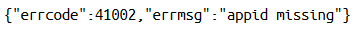

符合HTTP协议规范的URI接口和内容协商以及异常处理的研究和实现
===

## 摘要
搜索引擎（如Google，百度），社交网络（如微信，微博），购物网站（如淘宝）这些已经成为人们生活中不可或缺的一部分。在互联网普遍存在并以病毒版扩展的背后，HTTP协议起着支撑性的作用。然而在互联网迅速发展的今天，很多应用并没有完全遵循HTTP协议的规范，这样并不会带来多少好处反而会使得应用变得复杂，难于和其他系统交互。本文通过对HTTP相关协议的简单介绍，选取HTTP协议中的URI和内容协商以及异常处理这三个有代表性和实际意义的方面进行研究并给出相关的实现。

## 关键字
**HTTP HTTP协议 内容协商 HTTP异常处理**

## HTTP协议的简单介绍
HTTP协议是一个基于请求/响应式的异步网络协议，它被用于分布式的，合作式的，基于文档的系统。这个协议主要用在互联网上，尤其是浏览器，比如Firefox，Internet Explorer，Google Chrome等。协议的内容非常简单：客户端发送一个由HTTP方法构成的报文到达服务端被调用后，返回给客户端一系列变量构成的响应头部和一个可选的定位到的资源构成的主体（HTML，纯文本，XML，JSON甚至是二进制数据）。
比如我们要访问Google，那么我们的浏览器可能会发送如下的HTTP请求头信息。GET方法将会在服务端被调用，Host是访问的域名或者IP地址，"/"是我们感兴趣的路径（资源），HTTP/1.1是协议的版本，其余的都是请求头部信息。


从服务端返回的报文非常类似，包括使用HTTP协议的版本，一个响应码和一句简短地解释响应码的状态信息，其余的便是一系列可选的响应头部和一个可选的响应主体。下面便是发送之前的请求后服务端可能返回的响应。


响应码是200，状态信息是"OK"，这意味着请求被成功地处理并且客户端收到了响应的数据。HTTP协议定义了非常多的响应码，比如``200("OK")``, ``404("NOT FOUND")``, ``500("Internal Server Error")``等等，这些响应码对客户端应用的编程非常重要。客户端得到的数据类型是HTML，这个可以从Content-Type得知。

## 规范性的URI接口
HTTP定义了一组方法（GET,POST等）来操作资源（系统中的信息和数据），但是不符合规范的URI现在仍随处可见。比如删除一本图书有的应用会在URI中添加一个额外操作参数（如/books/1/delete去删除id为1的图书显示的添加了delete)，又或者删除一本图书却使用的不恰当的方法（比如使用默认的GET方法）。实际上我们可以使用HTTP协议已经定义好了几个方法去设计URI，每个方法都有其目的和特殊的意义：

**GET**: 只读操作，通常用于请求服务端的某个（组）资源。它是幂等和安全的操作，幂等意味着不管客户端尝试发送多少次请求，每次请求的结果都是一样的，安全意味着GET操作不会改变服务端的状态。

**POST**: POST方法用于向服务端发送数据，它既不幂等也不安全，会改变服务端的状态，通常用于发送表单数据。

**PUT**: PUT方法请求写入数据到服务端，它通常表示一个插入或者修改的操作。PUT是幂等的，当使用PUT方法时，客户端知道会有一个资源实体被创建或者改变，发送多次同样PUT请求（请求主体也相同）不会改变资源的状态。比如，不管保存多少次修改后的word文档，保存编辑内容的word文档逻辑上还是同一个文档。

**DELETE**: 请求服务器删除一个（组）资源，DELETE也是幂等的。

对于web应用，实际上不指定相应的HTTP METHOD依然能够实现相关的业务逻辑。但是使用规范的HTTP METHOD有以下两方面的优势：

1. 简单性
因为每个URI对应唯一的一个资源，采用这种方式，可以能够简单，直接地看出这个URI将会对资源的状态做出怎样的改变，从来不必要的在URI上额外的加上操作信息，并且对于URI的设计有良好的指导意义。

2. 可扩展性
使用HTTP定义的方法，这样客户端就拥有了预测HTTP行为的能力，能够带来可观的性能提升，GET方法是最能够体现这一点的。当浏览同一个网页的时候，一个非常明显的感觉就是第二次之后的访问速度比第一次快很多。这是因为GET方法是幂等和安全的，由于多次请求同一个URI返回的结果都是一样的，这样浏览器会缓存了第一次访问的一些资源，节省带宽的同时也大大加快了访问速度。对于PUT和DELETE方法而言，由于他们都是幂等的，这样无论是客户端还是服务端都无须处理重复的请求，这样也就降低了程序编写的复杂度。

## HTTP规范的内容协商研究与实现
传统的互联网通常都是桌面浏览器发送请求，服务端响应请求后发送一个HTML回到客户端，再由客户端将其渲染为一个页面。但是，随着移动互联网和HTML5的发展，以上做法对于移动终端存在着以下一些问题：

1. 屏幕大小有限并且尺寸不一 
2. 计算能力不如桌面终端，耗费资源（电池续航能力） 
3. 流量限制，资费，html标记无意义且占据了大多数的数据

现在通常的解决方案是根据客户端的不同而选择返回同一数据但是不同类型的结果，比如我们看到了桌面网页版，移动终端网页版，android版，ios版的不同类型的QQ空间，优酷网等，这是移动互联网发展的趋势，越来越多的大型网站都推出了这种能够适应各种不同终端的应用。

不同的终端需要适配编写不同的客户端是无法避免的，但是在服务端的业务逻辑在不同的终端上应该基本上是一致的，服务端只需要针对同一个业务逻辑提供唯一的一个接口供不同终端上的客户端调用即可。好处在于易扩展，结构清晰不冗余，易于维护等。
由于客户端应用都是基于HTTP协议通过URI请求服务端的资源，简单的把需求归结为：针对不同终端上的应用，发送同一个URI但是可以得到客户端想要的内容类型。

比如，桌面客户端需要HTML格式的数据，但是android/ios客户端需要JSON格式的数据，第三方的应用也可能需要xml格式的数据等等，不管有多少种类型的数据，服务端只有一个URI接口供其调用。HTTP协议中的内容协商协议为处理这种情况提供了很好的建议。

客户端发送HTTP请求时，可以通过设置Content-Negotiation头部来告诉服务端自己感兴趣的资源类型。通常有四个可选头部可以设置：

1. Accept 告诉服务端客户端期待接受什么类型的资源
2. Accept-Language 告诉服务端期待何种语言的资源
3. Accept-Charset 告诉服务端期待何种字符集的资源
4. Accept-Encoding 告诉服务端期待何种字符编码的资源

服务端在处理完请求后，将会根据客户端置Content-Negotiation头部的内容返回不同类型的资源，如果服务端不存在该类型数据则返回默认的类型（如HTML）或者抛出406("Not Acceptable")的错误状态码。通过这种方式，就可以很好的解决前面遇到的3个问题。不同终端期待不同类型的资源，移动终端可能需要JSON类型的资源，因为JSON是一种轻量级数据交换语言，且具有较好的易读性，数据量很小，非常适合移动终端使用，那么移动客户端发送HTTP请求时只需要设置"Accept: application/json"即可（字符编码的这里不做进一步介绍，但需要注意）。

目前各种流行的服务端编程语言都有Content-Negotiation相关实现，这里以基于JAVA语言的SpringMvc框架实现（省略包名）：

```java
@Configuration
@EnableWebMvc
public class WebMvcConfig extends WebMvcConfigurerAdapter {
  @Override public void configureContentNegotiation(ContentNegotiationConfigurer configurer) {
    configurer.favorPathExtension(true).favorParameter(false).ignoreAcceptHeader(false); // 启用通过请求头部判别类型
  }

  public ContentNegotiationManager contentNegotiationManager() {
    Map<String, MediaType> mediaTypes = new HashMap<String, MediaType>(2);
    Charset utf8 = Charset.forName("utf-8"); // 定义字符集
    mediaTypes.put("json", new MediaType("application", "json", utf8));
    mediaTypes.put("jsonp", new MediaType("application", "javascript", utf8)); // 分别添加json和jsonp类型的试图
    HeaderContentNegotiationStrategy header = new HeaderContentNegotiationStrategy(); // 使用请求头部判断内容类型策略
    return new ContentNegotiationManager(header);
  }

  @Bean public ContentNegotiatingViewResolver contentNegotiatingViewResolver() {
    ContentNegotiatingViewResolver viewResolver = new ContentNegotiatingViewResolver();
    viewResolver.setOrder(1);
    viewResolver.setContentNegotiationManager(contentNegotiationManager());
    List<View> defaultViews = new ArrayList<View>(2);
    defaultViews.add(new MappingJackson2JsonView());
    defaultViews.add(new JsonpView()); // 将具体的试图类型添加进来
    viewResolver.setDefaultViews(defaultViews);
    return viewResolver;
  }
}
```

## 规范的异常处理的研究与实现 
异常（或者错误，以下同）是一个系统很难避免的，尤其是基于HTTP的应用，客户端和服务端之间的差别很大，而且传输过程也是不可预料的，对异常处理的好快直接影响到系统的鲁棒性以及客户端编程的复杂度。

在web开发的早些时候甚至是到了现在，通常只是简单的返回一个错误的信息（没有设置错误状态码）然后在客户端上显示给用户。这样做看起来也确实达到了目的，但是深入的理解HTTP协议和客户端编程后，这样的做法是不自然，不合逻辑的，因为没有遵循HTTP协议的规范。

下面来看一个不太自然的例子，我们以调用微信公众API接口为例，由于没有经过微信授权，所以必定出错。请求头信息如下：


微信服务端返回的响应头信息及内容主体如下：





前面已经介绍了HTTP下客户端请求服务端资源的过程，服务端返回的报文中包含一个状态码，这个状态码便是服务端和客户端交互的关键。客户端收到服务端返回的报文后首先会分析这个状态码而不是马上就解析响应体的内容。如果状态码是200-299，便说明这个请求时成功的；300-399说明这个资源需要重定向，这也是为什么有时候访问的URI和最终显示在地址栏的URI不一致的原因，400-499，说明请求出现了错误；500-599说明服务端发生了错误。具体的错误状态码表可以在这里找到：http://tools.ietf.org/html/rfc2616#section-10
没有以上的一些观点，那么就很可能写出前面提到的不自然错误处理。即使HTTP请求出现了错误，服务端仍然返回200（默认）-299的状态码加上一句错误信息给客户端。在客户端编程处理得到的结果时，解析到请求时成功了的，却依然还要向用户提示错误，这是不合逻辑的。按照人们的理解，应该是返回一个错误的状态码再加上一些可选的异常信息，这样客户端的编程就比较自然合乎逻辑了，客户端（浏览器）正确的理解这个结果，做出一些优化等。

下面来看一个做得比较正确的例子，我们试图获取新浪微博的公共微博数据，由于我们没有新浪授权的令牌，这样显然会出错。

请求头信息如下：


微博服务端返回的响应头信息及内容主体如下：


可以看到，新浪服务端返回的报文里状态码是400("Bad Request")，并且在内容主体中还写下了一个JSON的错误详情。

我们使用JAVA平台的Servlet来实现以上的介绍的错误处理：

```java
/**
 * 异常处理
 * @param response {@link javax.servlet.http.HttpServletResponse}
 * @param errorCode HTTP error code
 * @param ex 具体的异常
 * @throws IOException
 */
public void handleException(HttpServletResponse response, int errorCode, Exception ex) throws IOException {
  // 清除缓存
  response.addHeader("Content-Type", "text/plain; charset=utf-8");
  response.addHeader("Cache-Control", "no-cache, no-store, must-revalidate");
  response.addHeader("Pragma", "no-cache");
  response.addHeader("Expires", "0");
  // 根据Exception写错误信息码
  response.sendError(errorCode);
  // 将异常中的信息写到输出流
  response.getOutputStream().write(ex.getLocalizedMessage().getBytes());
}
```

## 结束语
互联网在不断的发展，对于web技术架构的要求也越来越高，但是经典的HTTP协议仍然支撑着web的发展。我们需要重新理解HTTP协议，将实际中出现的问题对应到协议中来寻找解决方法。符合HTTP协议规范的URI接口和内容协商以及异常处理的研究和实现表明这种方式对于web的开发，维护，可扩展性能够带来良好的实践。


## 参考文献
1. Roy Fielding, 2000, Architectural Styles and the Design of Network-based Software Architectures, http://www.ics.uci.edu/~fielding/pubs/dissertation/top.htm
2. HTTP : The Definitive Guide, 2002, by David Gourley and Brian Totty, 978-1-56592-509-0
3. RESTful Java with JAX-RS 2.0, Second Edition, by Bill Burke, 978-1-449-36134-1
4. RESTful Web APIs, 2013, by Leonard Richardson and Mike Amundsen, 978-1-449-35806-8
5. REST, 维基百科，http://zh.wikipedia.org/wiki/REST
6. Hypertext Transfer Protocol -- HTTP/1.1, http://tools.ietf.org/html/rfc2616
7. Spring Framework Reference Documentation, http://docs.spring.io/spring/docs/4.0.3.RELEASE/spring-framework-reference/htmlsingle/

---
Copyright longkai 2013-2014

Licensed under a Creative Commons Attribution 4.0 International License.

### EOF
```yaml
background: /assets/images/xida.jpg
date: 2013-12-17T12:17:20+08:00
hide: false
location: Nanning
summary: 一篇小论文
tags:
- Campus
- Paper
weather: ""
```
