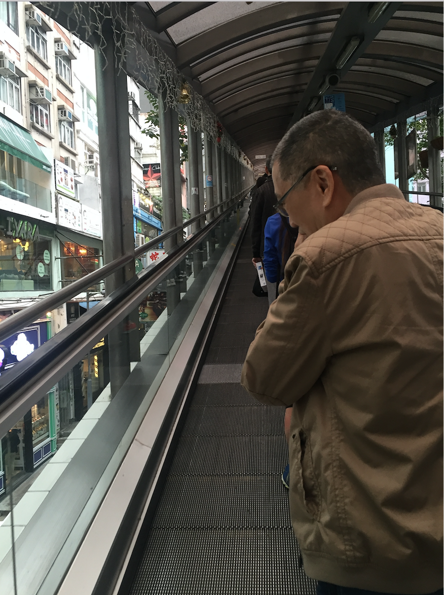

并发的香港
===


#### Before the Start
上周末和同学在香港玩了两天。

本文内容基于几个旅途见闻的思考：**人口稠密且高度繁忙的香港，如何保其持良好的运作的？**

这是个并发的世界，分享给打算去玩的朋友 :)

#### 过关时
> 过关的时候人相当多，大厅人满为患，这时工作人员打开了负一楼的通关通道转移了相当一部分游客，大厅压力骤减。

这个栗子：当一个或若干个 routine（可以理解为线程，以下同）的工作负载很大时，可以考虑增设更多的 routine 去处理。

> 接下来，我和同学分别排到了两个看起来长度一样的队列中，看看谁比谁先过关（是不是很无聊😝）。同学先比我过关，但是又能怎样呢，还不是要再等我😄。

这个栗子：如果我和同学站在同一队伍中，那么先过关的同学必然会阻塞（因为他要等待另一个同学过关后再一块走）。站在不同的队伍中理论上会比站在同一队伍中节约时间（队伍一样长，假设每个游客的通过时间基本一样），所以这实际上是两个 routine 之间的同步问题：速度快的 routine（先过关的同学）会阻塞等待速度较慢的 routine（后过关的同学），然后同步进行下一步（一同去玩）。

#### 地铁里
> 地铁站乘客流量巨大，不仅出入闸口非常之多，体积普遍非常之大。

这个栗子：足够多的 routine 再配备足够大的内存，保证了高负载的大型系系统的良好运转。

> 出入闸口的时刻，请预先掏出地铁卡，不要等到了闸口才找，这样会挡住后面的乘客们（大家都很忙的）。

这个栗子：如果一个操作（这里指乘客掏出地铁卡出入地铁）需要较长的时间，这个时候应该将其挂起（吊打！）或者放到其他的 routine（先到角落里去找你的卡！），千万不要阻塞了后续 routine 出入闸口。

#### 电梯上
> 乘扶手电梯时，如果你不赶时间，请往右边站，留出左边的位置给赶时间的人。



这个栗子：所有不忙的操作（不赶时间的乘客）都不该阻塞忙的操作（赶时间的游客）。这就好比图形界面程序，绝不能阻塞 UI routine，所有忙的操作都扔到其他 routine 中处理，留给用户一个流畅的体验；留出电梯左边的通道给赶时间的人有一种很和谐的感觉 :)

#### 过马路
> 在香港，很少很少有人闯红灯，不论是行色匆忙的行人还是快速行驶的汽车都遵守着生命线。每当嘟嘟声连续不断的时候，人走；嘟嘟声断断续续的时候，车走。非常有秩序。

这个栗子：这也可以理解为 routine 间的通信问题。routine1（汽车们）routine2（行人们）同一时刻只能有一个进行，另一个则被阻塞。两者之间需要通信，告之对方谁谁阻塞了，谁谁可以运行了。

如果把道路看做是一块内存数据，通过「嘟嘟声」来进行通信，保证了在给定的时间内，只有一个 routine 有权限访问它，实际上体现了 Golang 的[哲学][1]：

> Do not communicate by sharing memory; instead, share memory by communicating.

#### One More Thing
以上，纯属胡扯，如有雷同，文明旅游 :)

PS: 感谢@Liger 同学的审阅

#### EOF
```yaml
background: /assets/images/default.jpg
date: 2016-01-20T18:28:43+08:00
hide: false
license: cc-40-by
location: Hong Kong
summary: 上周末和同学在香港玩了两天，本文内容基于几个旅途见闻的思考
background: elevator@full.jpg
tags:
- Programming,Thoughts
weather: a bit cold
```

[1]: https://blog.golang.org/share-memory-by-communicating
