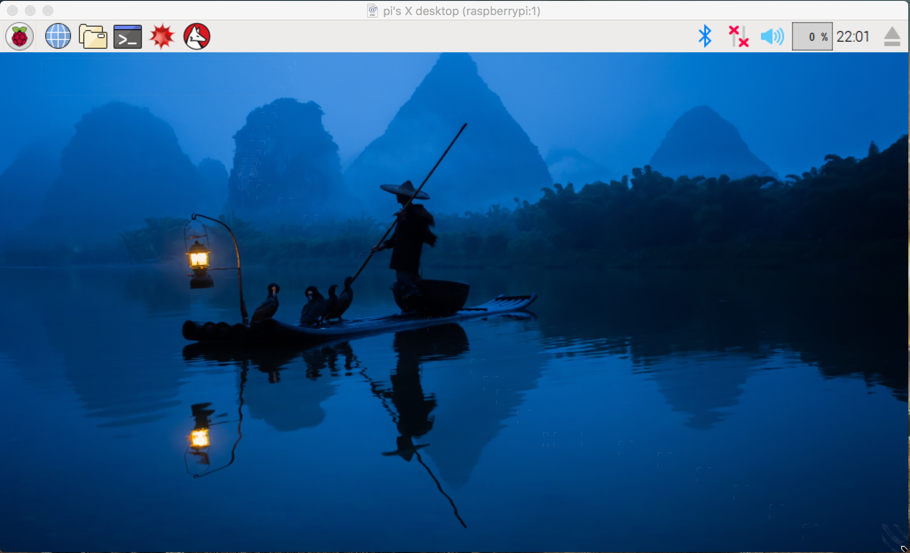

Get Started with Raspberry Pi 3
===
You may have heard about *Raspberry Pi* from time to time. What's it? According to [Wikipedia][wiki],

> The Raspberry Pi is a series of credit card-sized single-board computers developed in the United Kingdom by the Raspberry Pi Foundation to promote the teaching of basic computer science in schools and developing countries.

It's so popular. There're a lot of cool stuffs you can do with Raspberry Pi. Learning programming, providing service as a server, playing with hardware, connecting with other real world device, etc.

Sounds interesting? So I bought one from *element14*, one of the certificated providers.

By the way, it's weird that it was *made in china* but have to pay the import tax even thought I live in China!

This is my very first little tiny Pi :)


Let's play with it!

## Pre-requisite
Besides a Pi, you must at least have,

- a little familiar with Linux command-line environment
- an SD card with a reader
- a USB cable(Android compatible)

## Flashing OS to SD card
Download your favorite OS from [raspberrypi.org][os](I chose *Raspbian* since it's official supported). Plugin card reader to your computer then writing the image to SD card with this [guide][installation guide]. After completion, insert it into Pi, then booting Pi with the usb cable.

## Network Settings
It bootstrapped, We need to login into the system. **Note, the network IS NOT a must**. You can connect other cables to your monitor, like HDMI, USB-to-Serial, etc. However, I find the network easy for me to go.

Figuring out the Pi's IP address with your router, then ssh login into as `ssh pi@your-pi-ip`, the default password is `raspberry`.

Edit `/etc/network/interfaces` with your favorite editor.

```sh
pi@raspberrypi:~ $ cat /etc/network/interfaces
auto lo
iface lo inet loopback

allow-hotplug eth0
auto eth0
iface eth0 inet dhcp
  #address 192.168.1.232/24

allow-hotplug wlan0
iface wlan0 inet static
  address 192.168.1.233/24
  gateway 192.168.1.1
  dns-nameservers 223.5.5.5
  wpa-conf /etc/wpa_supplicant/wpa_supplicant.conf

allow-hotplug wlan1
iface wlan1 inet manual
  wpa-conf /etc/wpa_supplicant/wpa_supplicant.conf
```

For the convenient, I choose WIFI only with static IP. Then put your WIFI information to `/etc/wpa_supplicant/wpa_supplicant.conf`.

```sh
pi@raspberrypi:~ $ cat /etc/wpa_supplicant/wpa_supplicant.conf
network={
  ssid="name"
  psk="password"
}
```

Finally, restart network with `sudo /etc/init.d/networking restart` and you are done!

## GUI Desktop
Despite the terminal interface, Raspbian acts as a Graphic User Interface Environment by default. It provides a lot of common software, like libre office, chromium, programming development toolkits, even *games*! It's worth a try.

As I said early, you can connect your monitor to Pi with a cable. Since I don't have one, I choose screen sharing service, or [VNC][vnc] to use the GUI right from my computer.

VNC is turn off by default you need to enable it. Run `sudo raspi-config`, then apply Advanced Options -> VNC -> YES -> Finish, respectively.

Raspbian provides VNC server itself, so the things you need to do is installing VNC-view on your computer and connect both.

The default VNC server is provided by [RealVNC][realvnc], you'd better install its *viewer* on your computer. However, if you use macOS, the *Screen Sharing* app provided by itself, with which you need to `sudo apt-get install tigervnc` on your pi(then connect with port 5901). Either way it's okay:)

Here is my desktop, the wallpaper is my hometown:)



## What's Next?
With Pi, you can do a lot of stuffs. My favorite is connecting it with other hardware... Right now, I would like to build a Time Machine backup service. Stay tune! 

## Remaining issues
The network performance is laggy. The ping could be range from 1ms to 2000ms, orz...I suppose it's a router problem or the result of Pi's cheap network interface. Whatsoever, let it run first.

With cables you can have a stunning speed comparing with ssh or VNC, it's worth a try to connect Pi with a cable. What if you have no access of internet?

## Other Resources
http://tigervnc.org document about tiger VNC
https://www.raspberrypi.org contains a huge resources about Pi, blogs, community, forums, more.

Finally, with the slogan of Pi,

> Teach, learn and make with Raspberry Pi

### EOF
```yaml
date: 2016-11-02T20:43:46+08:00
summary: Teach, learn and make with Raspberry Pi
weather: a bit of cold
license: cc-40-by
location: cn
background: rpi-gui.png
tags:
  - Raspberry Pi
```

[wiki]: https://en.wikipedia.org/wiki/Raspberry_Pi
[os]: https://www.raspberrypi.org/downloads/
[installation guide]: https://www.raspberrypi.org/documentation/installation/installing-images/README.md
[vnc]: https://en.wikipedia.org/wiki/Virtual_Network_Computing
[RealVNC]: https://www.realvnc.com
