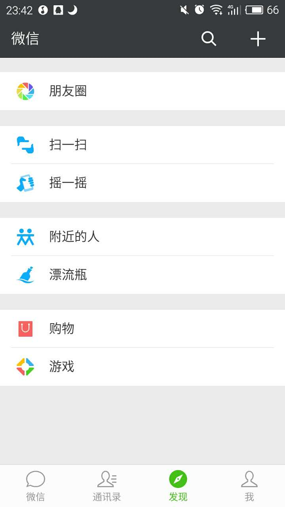
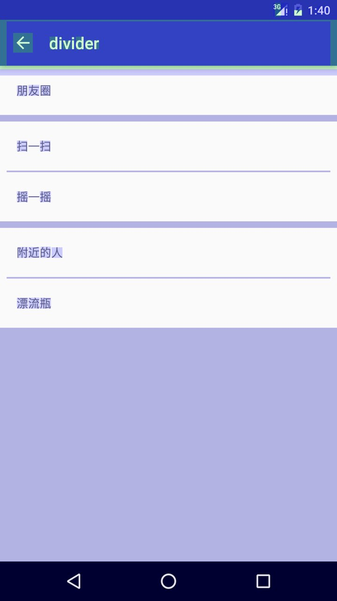

Hacking Android Divider
===

> Keep clam, profile your code, and always remember, perf(performance) matters.
>
> -- Android Performance Patterns 

## 基础
- 理解[overdraw][1]
- 理解[自定义控件基础][2]

## 目标
1. 没有 overdraw
2. 没有多余的 view(不使用 view 来作为 divider), the less, the better
3. 灵活, 比如支持 section divider，不同样式（设置高度，drawable, padding等），从简单的 ViewGroup 到 RecyclerView 等

## 场景
在产品需求中常常会有列表加上分割线这样的界面，通常容易想到的解决方案大概有如下几种：

1. 如果是 LinearLayout（推荐使用``android.support.v7.widget.LinearLayoutCompat``）可以设置 ``setShowDividers(int)`` ``setDividerDrawable(Drawable)`` 和 ``setDividerPadding(int)``
2. 如果是 ListView 可以设置 ``setDivider(Drawable)`` ``setDividerHeight(int)`` 
3. 如果是 RecyclerView（代替 ListView）那么可以加入 ``ItemDecoration``

So far so good，然而上述3种场景有一个共同的问题：无法实现目标3；也就是说所有的 divider 都长一个样。假设我们要实现一个类似微信的**发现**界面：



可以看到，这里的 item 被逻辑上分了组（section），组与组之间的 divider 比较粗，并且组内部的 item 之间也有较细的 divider（这 divider 水平方向还有 margin）; last but not leas，最底部到 tab 的那一大片区域也可以认为是一个 divider。

上述3种方案均无法实现，所以我们需要另想办法。

## 直观的方案
这个其实并不难实现。直观地看，可以用 ``View`` 来作为 divider，给 view 设置 background，height，margin 即可实现高度不一且包含 margin 的 divider 了；至于底部那一大片区域......给 items 的 parent view 设置背景（这样做甚至不需要给粗细的 divider view 设置背景了）？

这样做显然是可以的，但是这样简单的思路却有着较为复杂的实现。

首先，违背了目标2。这样做的结果就是 divider view 的个数比 item view 的个数还要多！越少的 view 意味着很多，比如占用的内存少，更快的 GPU 绘制（60fps），单单是一个``android.view.View``就有着超过2w行的代码你受得了......

其次，给 parent view 设置背景违背了目标1。这里的麻烦在于底部那块的高度在运行时才知道，所以你没法直接在 layout xml 中搞定它。如果产品放过你那就没什么事了......如果不是（赶紧请她杯咖啡），那直观的的解决方案就是给 parent view 整个设置一个 divider 的背景。然而当你设置了之后，你会发现**整个 item view 的背景也变成了 divider 的颜色**！于是，又直观给每个 item view 设置一个白色的背景。OK，搞定；OK，3x+ 的 overdraw（1x parent 背景，2x item 背景，3x item 的内容，......）。

最后，上述两点导致代码复杂很多，综上各点利弊需要做出权衡（**trade-off**）。

## Hacking 方案
> We keep telling people, you should try to create custom views whenever you can because you can make them a lot easier to write and much more efficient than the ones that we have(android ui toolkit). For instance, if you are trying use all the different widgets that we have in the UI Toolkit to create a really complex UI and it doesn't quite work, you can write a custom view instead. It's going to be easier. You might spend less time writing that Java code than trying to come up with the magic XML incantation that's going to do what you want. And it's also going to be more efficient.
>
> -- Romain Guy, Android Framework Engineer

That exacly what I mean! 通过之前的利弊分析，采用自定义控件来做这件事完全能够满足目标1，2，3，具体的实现可以参考下面的核心代码，代码非常简短（RecyclerView 可以通过 ItemDecoration 并且免去了自己实现 measure 和 layout 过程），主要思路如下：

1. 实现一个类似 vertical 的 LinearLayout，添加 LayoutParams 支持 divider，padding，height 等
2. 在 ``ViewGroup.dispatchDraw(Canvas)`` 用 item view 的 LayoutParams 和 canvas 绘制 divider
3. 计算 item views 累积的高度与视图区域的高度差来绘制底部区域的 divider
4. 在 layout xml 中布局 item view 并设置第1步定义的 LayoutParams

最终开启了 overdraw debug 的效果如下：



可以看到，除了 toolbar 外整个 UI 最多只有1x 的 overdraw :)

```java
// DividerVerticelLayout.java
public class DividerVerticalLayout extends ViewGroup {
  private Drawable divider;

  public DividerVerticalLayout(Context context) {
    this(context, null);
  }

  public DividerVerticalLayout(Context context, AttributeSet attrs) {
    super(context, attrs);
    TypedArray typedArray = context.obtainStyledAttributes(attrs, R.styleable.DividerVerticalLayout, 0, 0);
    divider = typedArray.getDrawable(R.styleable.DividerVerticalLayout_android_divider);
    if (divider == null) {
      TypedArray ta = context.obtainStyledAttributes(new int[]{android.R.attr.listDivider});
      divider  = ta.getDrawable(0);
      ta.recycle();
    }
    typedArray.recycle();
  }

  @Override protected ViewGroup.LayoutParams generateDefaultLayoutParams() {
    ViewGroup.LayoutParams origin = super.generateDefaultLayoutParams();
    return new LayoutParams(origin);
  }

  @Override protected boolean checkLayoutParams(ViewGroup.LayoutParams p) {
    return p instanceof LayoutParams;
  }

  @Override public ViewGroup.LayoutParams generateLayoutParams(AttributeSet attrs) {
    return new LayoutParams(getContext(), attrs);
  }

  @Override protected void onMeasure(int widthMeasureSpec, int heightMeasureSpec) {
    int width = 0;
    int height = 0;
    final int size = getChildCount();
    for (int i = 0; i < size; i++) {
      View view = getChildAt(i);
      if (view.getVisibility() != GONE) {
        LayoutParams lp = (LayoutParams) view.getLayoutParams();
        measureChildWithMargins(view, widthMeasureSpec, 0, heightMeasureSpec, 0);
        height += lp.topMargin + view.getMeasuredHeight() + lp.bottomMargin + lp.dividerHeight;
        width = Math.max(width, view.getMeasuredWidth() + lp.leftMargin + lp.rightMargin + lp.dividerHeight);
      }
    }
    width += getPaddingLeft() + getPaddingRight();
    height += getPaddingTop() + getPaddingBottom();
    setMeasuredDimension(resolveSize(width, widthMeasureSpec), resolveSize(height, heightMeasureSpec));
  }

  @Override protected void onLayout(boolean changed, int l, int t, int r, int b) {
    if (!changed) {
      return;
    }
    final int size = getChildCount();
    int xOffset = getPaddingLeft();
    int yOffset = getPaddingTop();
    for (int i = 0; i < size; i++) {
      View view = getChildAt(i);
      if (view.getVisibility() != GONE) {
        LayoutParams lp = (LayoutParams) view.getLayoutParams();
        view.layout(xOffset+ lp.leftMargin, yOffset + lp.topMargin,
            xOffset+ lp.leftMargin + view.getMeasuredWidth(), yOffset + lp.topMargin + view.getMeasuredHeight());
        yOffset += lp.topMargin + view.getMeasuredHeight() + lp.bottomMargin + lp.dividerHeight;
      }
    }
  }

  @Override protected void dispatchDraw(Canvas canvas) {
    super.dispatchDraw(canvas);
    if (divider == null) {
      return;
    }

    final int size = getChildCount();
    View bottomChild = null;
    for (int i = 0; i < size; i++) {
      View view = getChildAt(i);
      if (view.getVisibility() != GONE) {
        LayoutParams lp = (LayoutParams) view.getLayoutParams();
        if (lp.dividerHeight > 0) {
          divider.setBounds(getLeft() + lp.dividerPadding, view.getBottom() + lp.bottomMargin, getRight() - lp.dividerPadding, view.getBottom() + lp.bottomMargin + lp.dividerHeight);
          divider.draw(canvas);
        }

        bottomChild = view;
      }
    }

    if (bottomChild == null) {
      return;
    }

    LayoutParams lp = (LayoutParams) bottomChild.getLayoutParams();
    int delta = getHeight() - bottomChild.getBottom() + lp.bottomMargin + lp.dividerHeight;
    if (delta > 0) {
      int tmp = bottomChild.getBottom() + lp.dividerHeight + lp.bottomMargin;
      divider.setBounds(getLeft(), tmp, getRight(), getHeight());
      divider.draw(canvas);
    }
  }

  public static class LayoutParams extends MarginLayoutParams {
    private int dividerHeight;
    private int dividerPadding;

    public LayoutParams(Context c, AttributeSet attrs) {
      super(c, attrs);
      TypedArray typedArray = c.obtainStyledAttributes(attrs, R.styleable.DividerVerticalLayout_LayoutParams);
      try {
        dividerPadding = typedArray.getDimensionPixelOffset(R.styleable.DividerVerticalLayout_LayoutParams_android_dividerPadding, 0);
        dividerHeight = typedArray.getDimensionPixelOffset(R.styleable.DividerVerticalLayout_LayoutParams_dividerHeight, 0);
      } finally {
        typedArray.recycle();
      }
    }

    public LayoutParams(int width, int height) {
      super(width, height);
    }

    public LayoutParams(MarginLayoutParams source) {
      super(source);
    }

    public LayoutParams(ViewGroup.LayoutParams source) {
      super(source);
    }
  }
}
```

```xml
<!-- attrs.xml -->
<declare-styleable name="DividerVerticalLayout">
  <attr name="android:divider" />
</declare-styleable>

<declare-styleable name="DividerVerticalLayout_LayoutParams">
  <attr name="android:dividerPadding" />
  <attr name="dividerHeight" format="dimension" />
</declare-styleable>
```

```xml
<!-- layout_discovery.xml -->
<android.support.v4.widget.NestedScrollView
    xmlns:android="http://schemas.android.com/apk/res/android"
    xmlns:app="http://schemas.android.com/apk/res-auto"
    android:fillViewport="true"
    android:layout_width="match_parent"
    android:layout_height="match_parent">

  <com.xiaolongtongxue.divider.DividerVerticalLayout
      android:layout_width="match_parent"
      android:layout_height="match_parent">

    <TextView
        android:text="朋友圈"
        app:dividerHeight="8dp"
        style="@style/text_item" />

    <TextView
        android:text="扫一扫"
        android:dividerPadding="8dp"
        app:dividerHeight="2dp"
        style="@style/text_item" />

    <TextView
        android:text="摇一摇"
        app:dividerHeight="8dp"
        style="@style/text_item" />

    <TextView
        android:text="附近的人"
        app:dividerHeight="2dp"
        android:dividerPadding="8dp"
        style="@style/text_item" />

    <TextView
        android:text="漂流瓶"
        style="@style/text_item" />
  </com.xiaolongtongxue.divider.DividerVerticalLayout>
</android.support.v4.widget.NestedScrollView>
```

## Acknowledgment
- 题图来自 Google Android Team
- 谢谢几位同学对本文的审阅

## EOF
```yaml
background: perf-matters.jpg
date: 2016-04-11T22:12:17+08:00
hide: false
license: cc-40-by
location: Shenzhen
summary: '1. no overdraw; 2. no extra views; 3. flexible(padding, height, section,
  ViewGroup, RecyclerView etc.); #performance-matters.'
tags:
- Android
weather: rainy
```

[1]: https://www.youtube.com/watch?v=T52v50r-JfE
[2]: https://www.youtube.com/watch?v=NYtB6mlu7vA
