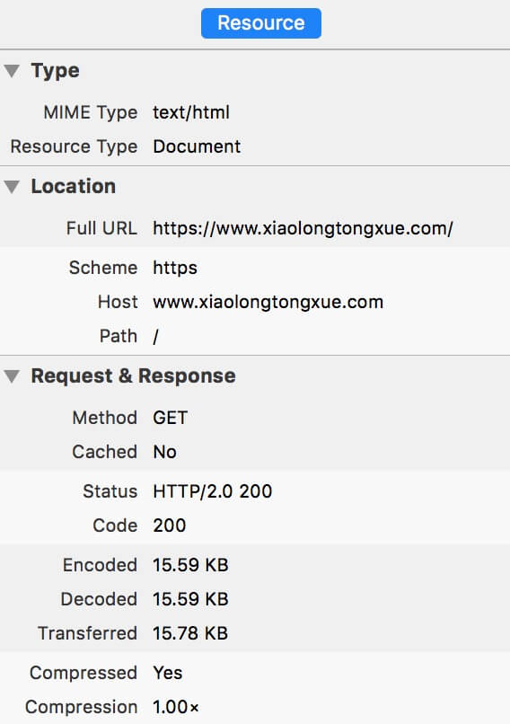

拥抱 HTTP/2
===
> Behind every successful web transaction lurks the Hypertext Transfer Protocol(HTTP), the language by which web clients and servers exchange documents and information.    -- HTTP, The Definitive Guide

很多人可能不知道 tcp/udp/ip 是什么鬼，但很可能知道 http，因为网址基本上都以 http 开头。HTTP 伴随着互联网的发展也走过了几十个年头，从1991年最初提出的 HTTP/0.9 到90年代末提出也是现在使用最广泛的 HTTP/1.1；我们也经历从没有电脑到有电脑再到智能手机，从单纯地浏览网页到语音图片视频，从最开始的 IE 到火狐，谷歌，edge 甚至现在各种各样的 app。每天都在变化，潜移默化的改变我们的生活，而 HTTP 协议本身并没有改变。不得不说 HTTP（以及底层的tcp/ip）简直不能再棒。

然而，也该到改变的时候了。

## SPDY
SPDY（发音：speedy）是 Google 最初开发的 **开放网络传输协议**。她最主要的目标是减少网页加载的等待时间并且增强安全性。通过压缩，多路复用和优先级来缩短时间。HTTP/2 协议便主要基于 SPDY，在 2015年2月 HTTP/2 标准通过了之后，Google 已经声明会支持标准并废弃 SPDY。

SPDY 并不是要取代 HTTP，她只是修改了 http 的请求与响应的方式。这意味着所有已经存在的服务端应用并不要作出修改而只需增加 SPDY 模块（一般来说，服务端应用指的是用程序语言写的后端，要做修改是的 web 应用服务器，比如 nginx，apache 等）。

关于 SPDY 的内容这里并不赘述，感兴趣的朋友可以看看[维基百科][1]或其他相关资料。

## HTTP/2
HTTP/2 是 HTTP 协议的第二个主要版本。她基于 SPDY 协议，由 HTTP 工作小组开发（翻译得真变扭......）。她是 HTTP/1.1 后的第一个新版本，在2015年2月17号通过标准。基本上所有的主流浏览器都在2015年底增加了 HTTP/2 的支持。

她的主要目标如下：

- 允许客户端或者服务端选择使用 HTTP/1.1，HTTP/2 甚至其他非 HTTP 协议
- 与 HTTP/1.1 的兼容性
- 通过一下方式降低网页加载的等待时间：
  - 压缩 HTTP 请求头部
  - 服务端 push 技术
  - 请求管道化
  - 修复 HTTP 1.x 存在的 [head-of-line][2] 问题
  - 通过多路复用一个 tcp 连接发起多次请求
- 支持更宽泛的应用程序，比如桌面/移动浏览器，web api，代理服务器，cdn 等

具体的也不赘述了，都是翻译自[维基百科][3]的......

截至至16年2月，据 W2Techs 的统计，全世界流量排名前1千万的网站中支持 HTTP/2 的占6.7%。很高兴，我的 https://www.xiaolongtongxue.com 也于2016年3月28晚上支持 HTTP/2 啦！试了一下，比以前快了一些；注意，这不是幻觉，注意，这不是幻觉！



## 拥抱变化
以前上软件工程课的时候，时常听到「拥抱变化」这个词；现在工作了，更加确信这句话，没有什么是不会变化的，应该以积极的态度去面对变化。上上周看完了吴军博士的 [硅谷之谜][4] 里面揭露硅谷成功的科学方法论，其中最重要的一条：[控制论][5]。我感觉这和拥抱变化是一个意思。

在牛顿力学中，任何复杂的东西都可以分解成细小的部分，通过分析计算，再整合到原来复杂的问题中从而将问题解决（有点像高中物理的整体法与隔离法）。牛顿定律是第一、二次工业革命的钥匙。然而，在信息时代，牛顿定律并不适用了（并不是没用了，而是不适合在信息时代快速发展的场景，然而她还是绝大多数原理的基础）。

在第二次世界大战末期，德国研发并且向英国投放了几十枚导弹。德国的导弹工程师运用力学运动原理经过对所有可能发生的情况进行精密地测算，然而并没有命中，反而差之千里。战后这一部分工程去了美国参与了后来阿波罗登月的计划。这一次，是控制论让飞船到了月球。在飞船行进的过程中，根据综合遇到的情况以及周边的情况来预测下一步的行动，而不是直接计算所有可能出现的问题。

这个故事，告诉我们，赶紧支持 HTTP/2 吧 :)

## One More Thing
在支持之前，一定要做好准备和测试。一些软件，其实还没有达到 stable 的状态，比如我使用的 nginx，但这并不妨碍尝试，其实这倒是个挺好的 testing 机会。

推荐一个非常好用的资源，来自 ff 的 [mozilla][6]。

Happy hacking.

### EOF
```json
{
  "tags": ["Web"],
  "render_option": 0,
  "date": "2016-03-29T02:55:36+08:00",
  "weather": "fine but a bit cold",
  "summary": "Let's support HTTP/2.",
  "location": "Shenzhen",
  "background": "http.jpg"
}
```

[1]: https://en.wikipedia.org/wiki/SPDY
[2]: https://en.wikipedia.org/wiki/Head-of-line_blocking
[3]: https://en.wikipedia.org/wiki/HTTP/2
[4]: http://book.douban.com/subject/26665230
[5]: https://en.wikipedia.org/wiki/Cybernetics
[6]: https://mozilla.github.io/server-side-tls/ssl-config-generator/
