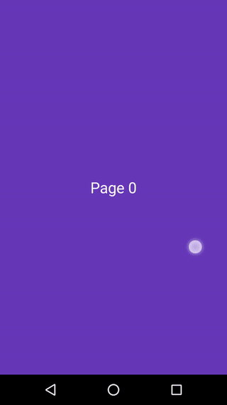

Android ViewPager Tips 1: 循环滑页，自动滑页及其手势冲突
===

#### Before the Start
新年了，说好的计划今年写的50篇 blog 呢，到现在还没有写一篇。想起来，也不禁有些惭愧，其实老早就琢磨着写些东西的，理想状况就像陶渊明在[《五柳先生传》][1]里说的那样，

> 好读书，不求甚解，每有会意，便欣然忘食

时常写些东西，不求写得很好，但是每当发现好的东西，灵感到来时，就应该写写。

话不多说，写些什么呢？算上自己在学校学习和发布 Android 应用到工作了从事 Android 开发到现在，也快有3年的时间了，在这期间，还是积累和研究了不少东西的。这些东西，随着时间的推移，不是忘了就是细节上的东西模糊了。反倒是要重新思考写一遍或者再去 Google 查阅，时间浪费了不说，在查阅的过程中，其实发现很多东西都来自别人 blog 的分享。嗯，多写些东西，利己利人。

那么第一篇，就从今天在工作上写的一个控件效果开始，[ViewPager][2] 的循环滑页及其额外的相关技巧，这是第一部分，完整的代码可以在[Gist][4]找到 :)

#### 循环滑页


ViewPager 是应用中常见的控件，经常会用在 banner 上，用来提示一些专题啦，头条等等，吸引用户的注意，具体的用法就不多说了。这个控件默认情况下已经很好用了，写好相应的 ``Adapter`` 后其余的手势滑页等效果控件都帮你做好了。但是有一个问题，当页面处于边界``{0, count - 1}``时，他就没法滑动了。如果这时候产品要求**滑动到最后一页的时候仍然能够继续向右滑到第一页**，就得自己想办法了。

本质上，ViewPager 的 Adapter 是一个线性列表结构，通过重载``Adapter.getCount()``确定一共有多少页，再通过``Adapter.instantiateItem(ViewGroup container, int position)``来加载第 position 页的布局，其中 position 位于 ``[0, count)`` 区间中。

看到这里，最初我的想法是构造一个环状的数据结构，当当前页为页尾的时候，下一页自然就是页头了，然而并没有用。因为确定了页数之后，ViewPager 滑页的机制就是判断下一页是否在 ``[0, count)`` 中，不在该区间的也就没有意义了。

换一个思路，既然页数是确定的，那么要实现一个可以循滑到下一页的效果，可以认为这个页数是无限大的，也就是滑动区间为 ``[0, ∞)`` , 然后以页数 count 来分段，即 ``[0, count), [count, 2×count), ..., [n×count, (n+1)×count)``

那么问题来了，**如何在程序中表示一个无限大的数呢？极限中经常说，取一个足够大的数，然后xxx**。由于**Adapter.getCount()**返回值为 int, int 的最大值是``2^31 - 1``，大概是地球人的1/3，也就是21亿左右，这个数字从实际场景来说，基本上可以认为是无限大了。如果用户真的不间断的滑这么多页，恭喜他，他可以去申请吉尼斯世界记录了 :)

把思路1和2结合起来，不难得出以下核心代码：

```java
public class InfiniteAdapter extends Adapter {
  private final int count = REAL_COUNT;

  @Override public int getCount() {
    return Integer.MAX_VALUE;
  }

  @Override public Object instantiateItem(ViewGroup container, int position) {
    final int i = position % REAL_COUNT;
    // use i to manipulate layout ...
  }
}
```

另外，想要在一开始实现第一页继续向左滑动到最后一页，原理也一样，只需把初始的页 n×count 的 n 设为足够大即可，这里就不继续展开了。

BTW, 其实还有另一种思路（我没有实践过），不需要把 count 设置为无限大，可能还是要比实际的 count 大1吧，然后利用 ViewPager 的另一个方法 ``setCurrentItem(int, boolean)``偷偷地将页数跳转回到第一页，因为第二个参数可以取消滑动时的动画。然而这个思路实现起来比之前的稍稍麻烦了一些，并且也存在副作用。因为本质上 ViewPager 是一个线性结构，并且还有一个优化，就是当前为第 n 页的时候会预先加载 n+1 页，这样给用户一种比较快的感觉。如果从最后一页突变到第一页，必然不会比上一种方式好。感谢@Liger 同学的提醒。

#### 自动滑页


记得刚毕业的时候，公司就要求在首页的 banner 上实现一个定时自动滑页的效果，也就是用户即使用户没有滑页，那么应用也能够自动滑页。这个效果也是非常常见的了，也不难实现，当时我是实现了这个效果，但是没有实现循环滑页的效果，以至于滑动最后一页后，突变到第一页，挺怪的，顺带说一下，玩过不少 Android 的应用类似的场景都是突变到第一页的...

定时自动播放，定时，看到这词，最直接的做法就是使用 Java 标准库的 [Timer][3] 类来定时播放了。我最开始也是这样做的，it works。然而，这个类有诸多缺陷。首先 UI 线程同步问题，接着初始化后不能 reset 状态，又得重新 new 一个，代码不易维护的同时也带来了另一个更严重的问题，内存泄露。``Timer``这个类我记得是在文档中说过，不会及时地释放内存。这里先引出下一个主题，**用户主动滑页和自动滑页的冲突问题：当用户手势滑页的时候需要屏蔽或者说暂停自动滑页，否则就自动**。这个时候如果仍然使用``Timer``的话，那么就得不间断的 new Timer，内存泄露的问题就越来越严重。

幸运的是，Android 自带了解决问题的办法，这个方法每个开发者都应当知道，``Handler.postDelay(Runnable, long)``方法，我最喜欢用这个方法去处理闪屏页的定时跳转问题。并且，任意的 ``View`` 都有一个 ``Handler`` 用来处理 UI 线程同步的问题。所以我们不需要额外的构造 ``Handler`` 而直接调用 ``View.postDealy()`` 以及 ``View.removeCallbacks()`` 方法来实现。具体来说，就是在 ``postDelay()`` 的 ``Runnable`` 中继续调用 ``postDelay()``，从某种意义上说这也算是一种递归吧，最后**记得在 Activity 或者 View 中的相关回调调用 ``removeCallbacks()``，否则可能会存在内存泄露或者无意义的 CPU 消耗**。

用代码来说：

```java
private Runnable mTimer = new Runnable {
  @Override public void run() {
    mViewPager.setCurrentItem(mViewPager.getCurrentItem() + 1);
    mViewPager.postDelay(this, DELAY_MILLIS);
  }
}

// on populating layout or somewhere, start timer
private void populateLayout() {
  // ...
  mViewPager.postDelay(mTimer, DELAY_MILLIS);
}

// remove timer in some cases, such as on View.onDetachFromWindow()...
@Override protected void onDetachedFromWindow() {
  super.onDetachedFromWindow();
  // ...
  mViewPager.removeCallbacks(mTimer);
}
```

#### 手势和自动滑页的冲突


这个问题前面已经提及了，解决办法其实也很简单，就是**当用户在于 ViewPager 交互的时候停止播放，否则自动播放**。好像，当时并没有很好的解决这个问题...今天刚好遇到这个问题，就写了一个，直接上代码吧 :)

```java
/**
 * A customized view pager which listens when user is interacting with itself.
 */
public class InteractingListenViewPager extends ViewPager {
  public InteractingListenViewPager(Context context) {
    super(context);
  }

  public InteractingListenViewPager(Context context, AttributeSet attrs) {
    super(context, attrs);
  }

  @Override public boolean onTouchEvent(MotionEvent ev) {
    switch (ev.getAction()) {
      case MotionEvent.ACTION_DOWN:
      case MotionEvent.ACTION_MOVE:
        if (interactingListener != null) {
          interactingListener.on();
        }
        break;
      case MotionEvent.ACTION_UP:
      case MotionEvent.ACTION_CANCEL:
        if (interactingListener != null) {
          interactingListener.off();
        }
        break;
    }
    return super.onTouchEvent(ev);
  }

  private InteractingListener interactingListener;

  public void setInteractingListener(InteractingListener interactingListener) {
    this.interactingListener = interactingListener;
  }

  public interface InteractingListener {
    /** user is interacting with the view pager */
    void on();

    /** user has no interactions with the view pager */
    void off();
  }
}
```

使用方式也很简单:

```java
mViewPager.setInteractingListener(new InteractingListenViewPager.InteractingListener() {
  @Override public void on() {
    mViewPager.removeCallbacks(mTimer);
  }

  @Override public void off() {
    mViewPager.postDelayed(mTimer, DELAY_MILLIS);
  }
});
```

#### One More Thing
欢迎阅读并留言，敬请期待下一篇关于 ViewPager 的技巧 :)

最后非常感谢@Liger @小戴 同学的审阅。

#### EOF
```yaml
background: /assets/images/default.jpg
hide: false
license: cc-40-by
location: Shenzhen
summary: ""
tags:
- Android
weather: a little warm
date: 2016-01-07T02:50:41+08:00
```


[1]: http://baike.baidu.com/link?url=QMeakKDuiC946nRTN0ZnQXhoin0a8-nLeoqEG1zy6T8NAjIV3Hx6o2neNxtVcJ3M4pm6TkMd7RNtB8V6riUI-K
[2]: http://developer.android.com/reference/android/support/v4/view/ViewPager.html
[3]: http://developer.android.com/reference/java/util/Timer.html
[4]: https://gist.github.com/longkai/14e477378ab1bb7355b3
