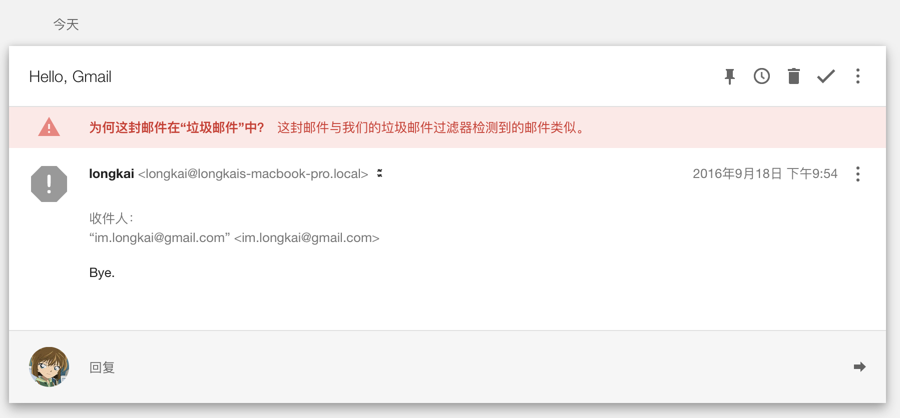

Why We Can Send to Gmail in China
===
It's been years many network services blocked in China. You cannot visit those well known global sites like Google, Twitter, etc. However, have you ever noticed despite Gmail is blocked, we can still send mails to Gmail using any domestic mail service provider?

You may think of the providers have their **overseas proxy servers**, which is definitely okay. However, in this essay, we will see **sending mail directly from computer without a proxy** is OK. Through the relationship between HTTP and SMTP, followed by DNS MX record, by watching the packets flow giving a closed look at how things going, finally.

**TL;DR** the specific SMTP port and DNS MX record IP packets bypass the firewall.

## An Interesting Test
Let's send to Gmail right from terminal. You can use any mail clients you like, however, only with the terminal we can dig into what really happens with packet filter in the later section.

```sh
$ mail im.longkai@gmail.com
Subject: Hello, Gmail
Bye.
.
```

Note the final `.` followed a newline, which is the terminator of mail(think of C's null-terminated string).

Then, sign in your Gmail(which requires a proxy if you're in China). Since our mail is nothing but a test we find it in spam,



Take a look at the sender's address, which is the combination of `whoami@hostname`.

But, wait, why? At the very beginning I just played the `mail` command for fun, no realization of the positive outcome. Have we mentioned Gmail is blocked in China?

What totally blocks is the HTTP, since nearly all of us deal with mails with the Web.

> By totally we mean we don't know exactly all of the Google's IPs are blocked.

## HTTP and Gateway
We won't talk much about HTTP(i.e. the Web) which has been dominating the network traffic flow. Since its popularization many network services(i.e. protocol) are provided through a Gateway. A Gateway is something like a converter converts one protocol to another. 

Normally these components are on the server side.

```
+------+        +---------+        +--------------------------------------+
| HTTP | <----> | Gateway | <----> | other portocol(e.g. SMTP, FTP, etc.) |
+------+        +---------+        +--------------------------------------+
```

As you might guess, a FTP gateway convert FTP to HTTP, and vice-versa. The same applies to SMTP, the mail transfer protocol. Thanks to Gateway, we can use web to manipulate mails without other mail specific clients(e.g. Thunderbird, Foxmail, etc.), just a browser does everything.

Indeed, you can even think of **any web service as a gateway** program because it processes the user's requests then responses via HTTP protocol.

By the way, the mail(i.e. SMTP) is older than the Web(i.e. HTTP). Some of the web techniques are taken from the mail(e.g. base64, status code, mime, etc.). At the early stage of the network, the mail is the dominator!

Let's turn to SMTP.

## SMTP
SMTP is the work horse of the mail(if you don't count into HTTP...). Let's illustrate it quickly or if don't care feel free to skip.

Below shows an outline of SMTP using TCP/IP.

```
         +------------------+      +------------+      +- - - - - - -+      +-----+
sender   | user at terminal | ---> | user agent | ---> | mails queue | ---> | MTA | client
         +------------------+      +------------+      +- - - - - - -+      +-----+
                                                                               ↑   
                                                                               |  
                                                                           TCP | connection
                                                                               |  
                                                                               ↓  
                                                                            port 25
         +------------------+      +------------+      +- - - - - - -+      +-----+
receiver | user at terminal | <--- | user agent | <--- | mails queue | <--- | MTA | server
         +------------------+      +------------+      +- - - - - - -+      +-----+
```

Users normally deals with *user agent*, of which there are many tools to choose from(we just impose the terminal to be consistent with the preceding).

The exchange of mail using TCP is performed by a *message transfer agent(MTA)*. In the preceding test the MTA is the `mail` program. In a more practical mail the MTA is the mail service provider.

Okay, as we've got a brief picture of SMTP, by using TCP connection, we must figure out the destination's IP address before sending TCP segments. You might have already known, it's the job of DNS.

## DNS
In short DNS is the mapping of user readable address to number address, and vice-versa. Since we only focus on mail, the other types of DNS records is ignore in this section.

The `MX`, mail exchange record, used mainly to deliver mail to the destination of MTA. Say, your mail receiver's address is sb@somewhere, the MX record will be translated into the right destination IP address.

Put into the preceding example, if we want to send to `sb@gmail.com`, we need to figure out where is `gmail.com`. So the `host` command comes to play,

```sh
$ host -t mx gmail.com
gmail.com mail is handled by 5 gmail-smtp-in.l.google.com.
gmail.com mail is handled by 30 alt3.gmail-smtp-in.l.google.com.
gmail.com mail is handled by 40 alt4.gmail-smtp-in.l.google.com.
gmail.com mail is handled by 20 alt2.gmail-smtp-in.l.google.com.
gmail.com mail is handled by 10 alt1.gmail-smtp-in.l.google.com.
```

We got 5 MX records each has a number. The lower the prefer and if one fails, another will be tried. Note all of them are still domain name, another DNS resolve will be performed. Assuming the first one won't fail,

```sh
$ host gmail-smtp-in.l.google.com
gmail-smtp-in.l.google.com has address 173.194.72.26
gmail-smtp-in.l.google.com has IPv6 address 2404:6800:4008:c03::1a
```

Suppose our network only supports IPv4(which is basically true in China as of this writing), the `173.194.72.26` will be used by TCP/IP as the destination IP of MTA(i.e. Gmail).

## Packet Analytics
By using [tcpdump][tcpdump], a packet filter, we'll take a closed look at how the mail is sent. Feel free to skip if you are not into. Note the DNS packets are dropped since it add nothing to discussion.

```sh
$ sudo tcpdump -ttt 'tcp and port 25'
1. 00:00:10.968900 IP 192.168.3.4.62782 > pa-in-f26.1e100.net.smtp: Flags [SEW], seq 970097501, win 65535, options [mss 1460,nop,wscale 5,nop,nop,TS val 683832749 ecr 0,sackOK,eol], length 0
2. 00:00:00.306718 IP pa-in-f26.1e100.net.smtp > 192.168.3.4.62782: Flags [S.], seq 4265338668, ack 970097502, win 42408, options [mss 1380,sackOK,TS val 317393941 ecr 683832749,nop,wscale 7], length 0
3. 00:00:00.000043 IP 192.168.3.4.62782 > pa-in-f26.1e100.net.smtp: Flags [.], ack 1, win 4104, options [nop,nop,TS val 683833055 ecr 317393941], length 0
4. 00:00:00.282773 IP pa-in-f26.1e100.net.smtp > 192.168.3.4.62782: Flags [S.], seq 4265338668, ack 970097502, win 42408, options [mss 1380,sackOK,TS val 317394241 ecr 683832749,nop,wscale 7], length 0
5. 00:00:00.000026 IP 192.168.3.4.62782 > pa-in-f26.1e100.net.smtp: Flags [.], ack 1, win 4104, options [nop,nop,TS val 683833337 ecr 317393941], length 0
6. 00:00:00.130656 IP pa-in-f26.1e100.net.smtp > 192.168.3.4.62782: Flags [P.], seq 1:56, ack 1, win 332, options [nop,nop,TS val 317394387 ecr 683833055], length 55: SMTP: 220 mx.google.com ESMTP h131si58727336pfc.282 - gsmtp
7. 00:00:00.000026 IP 192.168.3.4.62782 > pa-in-f26.1e100.net.smtp: Flags [.], ack 56, win 4102, options [nop,nop,TS val 683833467 ecr 317394387], length 0
8. 00:00:00.000074 IP 192.168.3.4.62782 > pa-in-f26.1e100.net.smtp: Flags [P.], seq 1:34, ack 56, win 4102, options [nop,nop,TS val 683833467 ecr 317394387], length 33: SMTP: EHLO longkais-MacBook-Pro.local
9. 00:00:00.307062 IP pa-in-f26.1e100.net.smtp > 192.168.3.4.62782: Flags [.], ack 34, win 332, options [nop,nop,TS val 317394659 ecr 683833467], length 0
10. 00:00:00.000003 IP pa-in-f26.1e100.net.smtp > 192.168.3.4.62782: Flags [.], ack 34, win 332, options [nop,nop,TS val 317394661 ecr 683833467], length 0
11. 00:00:00.000001 IP pa-in-f26.1e100.net.smtp > 192.168.3.4.62782: Flags [P.], seq 56:226, ack 34, win 332, options [nop,nop,TS val 317394662 ecr 683833467], length 170: SMTP: 250-mx.google.com at your service, [113.91.173.198]
12. 00:00:00.000044 IP 192.168.3.4.62782 > pa-in-f26.1e100.net.smtp: Flags [.], ack 226, win 4096, options [nop,nop,TS val 683833773 ecr 317394662], length 0
13. 00:00:00.000132 IP 192.168.3.4.62782 > pa-in-f26.1e100.net.smtp: Flags [P.], seq 34:129, ack 226, win 4096, options [nop,nop,TS val 683833773 ecr 317394662], length 95: SMTP: MAIL FROM:<longkai@longkais-MacBook-Pro.local> SIZE=380
14. 00:00:00.277097 IP pa-in-f26.1e100.net.smtp > 192.168.3.4.62782: Flags [P.], seq 226:270, ack 129, win 332, options [nop,nop,TS val 317394970 ecr 683833773], length 44: SMTP: 250 2.1.0 OK h131si58727336pfc.282 - gsmtp
15. 00:00:00.000046 IP 192.168.3.4.62782 > pa-in-f26.1e100.net.smtp: Flags [.], ack 270, win 4095, options [nop,nop,TS val 683834050 ecr 317394970], length 0
16. 00:00:00.166009 IP pa-in-f26.1e100.net.smtp > 192.168.3.4.62782: Flags [P.], seq 270:314, ack 129, win 332, options [nop,nop,TS val 317395136 ecr 683833773], length 44: SMTP: 250 2.1.5 OK h131si58727336pfc.282 - gsmtp
17. 00:00:00.000002 IP pa-in-f26.1e100.net.smtp > 192.168.3.4.62782: Flags [P.], seq 314:359, ack 129, win 332, options [nop,nop,TS val 317395136 ecr 683833773], length 45: SMTP: 354  Go ahead h131si58727336pfc.282 - gsmtp
18. 00:00:00.000044 IP 192.168.3.4.62782 > pa-in-f26.1e100.net.smtp: Flags [.], ack 314, win 4094, options [nop,nop,TS val 683834216 ecr 317395136], length 0
19. 00:00:00.000013 IP 192.168.3.4.62782 > pa-in-f26.1e100.net.smtp: Flags [.], ack 359, win 4094, options [nop,nop,TS val 683834216 ecr 317395136], length 0
20. 00:00:00.000102 IP 192.168.3.4.62782 > pa-in-f26.1e100.net.smtp: Flags [P.], seq 129:518, ack 359, win 4096, options [nop,nop,TS val 683834216 ecr 317395136], length 389: SMTP: Received: by longkais-MacBook-Pro.local (Postfix, from userid 501)
21. 00:00:00.375189 IP pa-in-f26.1e100.net.smtp > 192.168.3.4.62782: Flags [P.], seq 359:414, ack 518, win 340, options [nop,nop,TS val 317395434 ecr 683834216], length 55: SMTP: 250 2.0.0 OK 1474215814 h131si58727336pfc.282 - gsmtp
22. 00:00:00.000004 IP pa-in-f26.1e100.net.smtp > 192.168.3.4.62782: Flags [P.], seq 414:474, ack 518, win 340, options [nop,nop,TS val 317395436 ecr 683834216], length 60: SMTP: 221 2.0.0 closing connection h131si58727336pfc.282 - gsmtp
23. 00:00:00.000001 IP pa-in-f26.1e100.net.smtp > 192.168.3.4.62782: Flags [F.], seq 474, ack 518, win 340, options [nop,nop,TS val 317395436 ecr 683834216], length 0
24. 00:00:00.000041 IP 192.168.3.4.62782 > pa-in-f26.1e100.net.smtp: Flags [.], ack 414, win 4094, options [nop,nop,TS val 683834590 ecr 317395434], length 0
25. 00:00:00.000014 IP 192.168.3.4.62782 > pa-in-f26.1e100.net.smtp: Flags [.], ack 474, win 4092, options [nop,nop,TS val 683834590 ecr 317395436], length 0
26. 00:00:00.000007 IP 192.168.3.4.62782 > pa-in-f26.1e100.net.smtp: Flags [.], ack 475, win 4092, options [nop,nop,TS val 683834590 ecr 317395436], length 0
27. 00:00:00.020528 IP 192.168.3.4.62782 > pa-in-f26.1e100.net.smtp: Flags [F.], seq 518, ack 475, win 4096, options [nop,nop,TS val 683834610 ecr 317395436], length 0
28. 00:00:00.385736 IP pa-in-f26.1e100.net.smtp > 192.168.3.4.62782: Flags [.], ack 519, win 340, options [nop,nop,TS val 317395809 ecr 683834610], length 0
```
 
We add line number each line for readability. `192.168.3.4:62782` and `pa-in-f26.1e100.net.smtp` is the local and remote socket pair, respectively. Later we will see what the remote domain means.

Line 1-5 is the classic TCP three-way-handshake connection establishment, which includes 2 retransmissions.

Line 6 server responses with 220 which is the client wants, the *greeting message*, line 7 is the client's `ACK` of line 7.

Line 8, client issues a `EHLO` command to identify itself as `longkais-MacBook-Pro.local`, line 9-10 is the `ACK`(one retransmission occurs). Then line 11 is the server's reply to line 8 which means compatible with client.

Line 13 client try send email with its address, 14 server replies with `250 2.1.0 Sender e-mail address ok.`. Then 15 is client's `ACK` of 14.

Line 16 server replies with `250 2.1.5 Recipient e-mail address ok.`. 17 server tells us `354 Enter mail, end with CRLF.CRLF`.

Follow some `ACKs`.

Line 20 is client's mail content, followed line 20 replies with `250 2.0.0 Message accepted for delivery`

Finally line 23-28 is the TCP connection termination, note there are retransmission packets.

That's exactly how the SMTP works.

## What is 1e100.net?
In the previous `tcpdump` we don't use `-p` option to show only numeric address, therefore we see the server host:port is `pa-in-f26.1e100.net.smtp`.

The well known SMTP port is 25. What's interesting is the `1e100.net` domain. At first glance, it's a quite wired name. After Googling, it says,

> 1e100.net is a Google-owned domain name used to identify the servers in our network.

> Following standard industry practice, we make sure each IP address has a corresponding hostname. In October 2009, we started using a single domain name to identify our servers across all Google products, rather than use different product domains such as youtube.com, blogger.com, and google.com. We did this for two reasons: first, to keep things simpler, and second, to proactively improve security by protecting against potential threats such as cross-site scripting attacks.

> Most typical Internet users will never see 1e100.net, but we picked a Googley name for it just in case (1e100 is scientific notation for 1 googol).

You can find it [here][1e100].

However, why `1e100.net` appears in the TCP connection? It's never shown in DNS records.

We can figure out by DNS reverse mapping,

```sh
$ host -t ptr 173.194.72.26
26.72.194.173.in-addr.arpa domain name pointer tf-in-f26.1e100.net.
```

See the `1e100.net`? Despite the full name is not same as the tcpdump outputs(e.g. records retry, DNS load balance, etc.), nevertheless, it explains perfectly.

Finally, we can draw a conclusion: **since the IP and port bypass the GFW, so we can send to Gmail in China**.

## Acknowledgment
- Many network related stuffs are learning from [W. Richard Stevens][rich]' classical text about TCP/IP protocol suite.
- The SMTP status code is reading from [here][smtp-status].
- The Gmail background image is taken from official Gmail site.

## Bibliography
- [HTTP: The Definitive Guide][http] covers the HTTP protocol.
- [RFC 2821][smtp] specifies the SMTP protocol.
- [RFC 1035][dns] discusses DNS implementation and specification.


Thanks for reading.


## EOF
```yaml
date: 2016-09-18T21:23:05+08:00
summary: You may think of the mail providers have their overseas proxy servers, which is definitely okay. However, in this essay, we will see sending mail directly from computer without a proxy is OK.
weather: rainy
license: cc-40-by
location: somewhere on earth
background: gmail.jpg
tags:
  - Hacking
  - Learning
```

[tcpdump]: http://www.tcpdump.org/
[1e100]: https://support.google.com/faqs/answer/174717?hl=en
[rich]: http://kohala.com/start/
[smtp-status]: http://www.basics.net/2011/07/27/e-mail-smtp-error-codes/
[http]: https://www.amazon.com/HTTP-Definitive-Guide-Guides/dp/1565925092
[smtp]: https://tools.ietf.org/html/rfc2821
[dns]: https://www.ietf.org/rfc/rfc1035.txt
