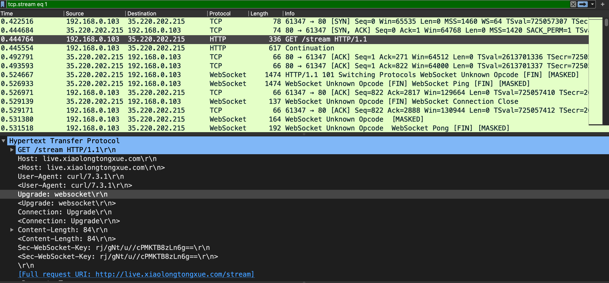
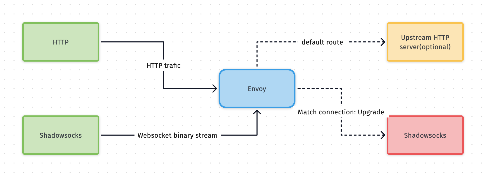

# 使用 Envoy 在 L4 和 L7 代理 Shadowsocks 流量

上一篇关于网络代理，说了太多概念的东西，今天说一些轻松的，能直接上手使用的，并且用来代理一个非常有用的网络应用，Shadowsocks。这个是干啥的呢，知道的知道，不知道的搜索一下，这里就不赘述啦。

[Envoy](https://www.envoyproxy.io/)是一个开源的边界网关和微服务代理服务器，专为云原生应用设计，这是官方的说法。他和nginx属于同一类应用，但是除了http服务路由负载，还支持更多地应用程序代理，如redis，mysql，mongo，kafka，gRPC等，以及服务指标观测，最突出的一点，是提供了完善灵活的API接口给外部动态地修改配置。这样一来，他就从众多代理服务器中脱颖而出，成了边界网关和微服务数据平面Sidecar Proxy的事实标准。Envoy是一个CNCF毕业项目，服务治理框架Istio用的便是他，关于Envoy和Istio可以看看我原来写的[一篇文章](https://www.xiaolongtongxue.com/articles/2020/istio-architecture)。

自底向上，先从L4说起吧。

## L4 代理

L4代理主要的功能是通过IP和port进行负载均衡，不涉及具体应用层数据业务，所以通用性比较高，所有传输层之上的协议都可以代理，另外配置相对来说比较简单。可以用来作为负载均衡，比如裸金属（bare metal）安装的Kubernetes集群，没有公有云提供的LoadBalancer的时候，我们会选择使用NodePort，然后将envoy作为集群外部的软负载均衡器，将集群外部流量路由到集群节点中，配置如下：

```yaml
static_resources:
  listeners:
  - address:
      socket_address:
        address: 0.0.0.0
        port_value: 80 # 监听所有网卡的80端口
    filter_chains:
    - filters:
      - name: envoy.tcp_proxy # tcp 代理
        typed_config:
          "@type": type.googleapis.com/envoy.config.filter.network.tcp_proxy.v2.TcpProxy
          stat_prefix: ingress_tcp
          cluster: istio-ingress # 被代理的集群（一组负载均衡端点）
          access_log:
          - name: envoy.file_access_log
            typed_config:
              "@type": type.googleapis.com/envoy.config.accesslog.v2.FileAccessLog
              path: /dev/stdout # 将访问日志打到标准输出
          # - name: envoy.file_access_log
          #   typed_config:
          #     "@type": type.googleapis.com/envoy.config.accesslog.v2.FileAccessLog
          #     path: /var/log/access.log
  clusters:
  - name: istio-ingress
    connect_timeout: 0.25s
    type: strict_dns # endpoint dns 解析类型
    lb_policy: round_robin # 路由策略，默认轮询
    hosts:
    - socket_address:
        address: 0.0.0.0
        port_value: 31509 # istio-ingress NodePort
    - socket_address: # 配置集群里其他的节点作为负载均衡
        address: 10.1.1.2 # 也可以填域名，和具体的dns配置有关
        port_value: 31509
```

例子虽然是Kubernetes的，但可以给任意的应用层做代理，或者负载均衡，比如nginx，mysql，redis等等。当然这样做有一个问题，上游服务器通常是拿不到源客户端的IP，当然也有办法解决，感兴趣的同学可以Google了解一下。

L4代理几乎没有多少可配置的，让我们到熟悉的L7看看。

## L7 + Shadowsocks

Envoy最常见的就是用来路由HTTP请求了，当然还有JWT鉴权，重试，熔断，流量镜像机制，这里我们只讨论路由。

路由（[RDS](https://www.envoyproxy.io/docs/envoy/latest/api-v3/config/route/v3/route_components.proto#envoy-v3-api-msg-config-route-v3-virtualhost)）的规则丰富，常见不常见的都有，比如根据`host`，URL，方法，请求头，查询参数等可以做A/B测试，还可以按照权重（weight）和上游版本做金丝雀发布（Canary Release）。

我们今天介绍一个特别的，路由Shadowsocks服务。

Shadowsocks是一个工作在7层的应用，由于是一个**非主流**协议（非HTTP，HTTPS），远端端口通常也不是80和443，所以容易被干扰（甚至是识别），造成延迟增加，丢包甚至随机无法访问。

聪明的人们也想到了对应的办法，伪装自己是一个HTTP(S)请求，也就是混淆。Shadowsocks提供了一个[插件](https://github.com/shadowsocks/simple-obfs)来做这件事，虽然已经废弃了转而推荐使用v2ray-plugin，但是原理目测一样的。由于我所使用的客户端不支持v2ray，所以这里还是以老插件为例，配置如下：

```sh
# On the client:

ss-local -c config.json --plugin obfs-local --plugin-opts "obfs=http;obfs-host=www.bing.com"

# On the server:

ss-server -c config.json --plugin obfs-server --plugin-opts "obfs=http"
```

虽然使用了插件，比如使用HTTP选项设置请求头`Host`伪装自己是发往`www.bing.com`或其他主机的包，但是IP却并不是bing的，这样的混淆程度也不高。最好的方式是数据包的目标地址和混淆的`Host`是一样的。

这意味着我们真的有一个HTTP网站（返回任意的页面或者状态码都行），然后**透过这个HTTP服务**，将混淆的Shadowsocks数据包代理到真实的ss服务中。

怎么做呢？这需要分析ss的http混淆数据包格式，是时候祭出Wireshark了，当然对这部分不感兴趣也没关系，可以直接看配置。



可以看到，从最前面的三次握手，然后接下来就是关键了，发送了一个路径为`/steam`的HTTP请求，从下面的头信息中，`Host`的确是指向我的配置的host，特别的，这是一个Websocket协议升级请求（`Upgrade: websocket`）。接下来服务器返回101状态码同意升级协议，Websockets连接就这样建立了，后续的流量都通过这个双向的管道以二进制的方式发送，因此，ss的数据包就这样随着HTTP过去了。

流程可以简化如下图：



OK，知道了原理，那怎么做websocket代理呢？Websocket建立连接有一个特征，请求头一定会有`connection: Upgrade`，所以类似A/B测试，对请求中携带这个头信息的，统统路由到真实的ss服务就OK了。当然还有几个小细节要注意，具体看下面的配置吧，

```yaml
static_resources:
  listeners:
  - address:
      socket_address:
        address: 0.0.0.0
        port_value: 80 # 监听本地所有网卡的80端口
    filter_chains:
    - filters:
      - name: envoy.http_connection_manager
        typed_config:
          "@type": type.googleapis.com/envoy.config.filter.network.http_connection_manager.v2.HttpConnectionManager
          codec_type: auto
          stat_prefix: ingress_http
          upgrade_configs:
          - upgrade_type: websocket # 支持协议升级为websocket
          route_config:
            name: local_route
            virtual_hosts:
            - name: websocket
              domains:
              - "live.xiaolongtongxue.com" # host匹配
              routes:
              - match:
                  path: "/stream" # 限制只有这个路径支持websocekt，其他的均为正常的HTTP服务
                  headers:
                  - name: connection
                    exact_match: Upgrade # websocekt协议升级必须携带的请求头
                route:
                  cluster: websocket-ss # ss服务集群
              - match:
                  prefix: "/" # 其余的请求统一走HTTP服务
                redirect:
                  https_redirect: true # tls 301
                  host_redirect: "www.xiaolongtongxue.com"
          http_filters:
          - name: envoy.router
            typed_config: {}
```

上面是我线上服务的配置，其中省略了其他的服务，集群`cluster`那一块同前面的L4。

通过这种方式，我们就达到了目的，看似混淆，实际则是通过前置一个HTTP代理，将正常的webscoekt流量代理到了ss服务，而正常的HTTP流量依旧，看起来还不错呢。

当然还有另一种方式，使用TLS混淆，这个我还没有尝试过，但是原理应该就是通过将ss的数据包放到了TLS流量里，需要提前配置一个tls证书和域名，相对来说操作难度大一些，但是有可能，性能和混淆效果要更好一些。

目测可以利用`sni`配置，将raw流量路由到tls模式的ss中，或者tls剥离后再转发，我还没试过，后续可以试一下，有试过的同学也可以分享下经验。

## Next

下一篇还会是网络相关的，敬请期待！

## EOF

```yaml
summary: 使用Envoy在L4和L7路由Shadowsocks流量
weather: rain
license: cc-40-by
location: mars
background: ./ss-websocket.png
tags: [network, envoy, shadowsocks]
date: 2020-05-12T01:46:43+08:00
```
