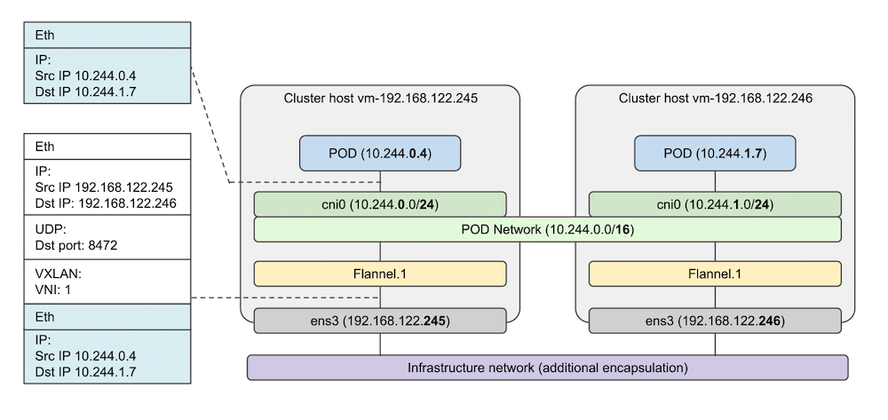

# 浅谈网络代理和 Kubernetes 网络模型

作为这一系列的第二篇，今天来谈谈作者比较感兴趣的一个主题，网络代理。

代理可以类比是现实生活中的各种中介吧，网络代理则与我们日常上网息息相关。客户端不是直接和服务端通信，而是经过中间的一个代理服务器的转发处理，这中间相当有一个用户定义的函数可以对进出的流量干点什么，一个网络请求在传输中很可能不只经过一个代理服务器。


很难想象没有代理服务器，我们的网络会是什么样子，隐私，安全，性能，以及绕过防火墙，甚至于构建大规模的分布式系统。

限于篇幅，本文介绍一些理论的东西，下一篇会实践一些这方面的有用且有趣的东西。

OK，说了这么多，先粗浅的聊聊网络模型。

我们知道，网络的实现TCP/IP是四层的，而在设计上则通常使用OSI七层模型描述。七层模型自顶向下，功能及其常见协议简要如下：

| layer | function     | protocols      |
|----- |------------ |-------------- |
| 应用层 | 某类应用具体的业务逻辑 | http，imap，ssh |
| 表示层 | 转换应用层的数据，如加密 | tls            |
| 会话层 | 会话管理     | socks5         |
| 传输层 | 两个主机间的数据传输 | tcp, udp       |
| 网络层 | 数据包在不同网络间的移动 | ip, icmp, igmp |
| 链路层 | 相邻节点间数据交换 | 以太网，Wi-Fi，蓝牙 |
| 物理层 | 网络设备和物理传输介质 | NaN            |

上层的数据向前追加下一层的协议信息封帧，一路向南，最后经过物理传输介质（比如光缆），这样数字信息就在物理世界中传输了。而我们今天谈论的主角，网络代理理论上可以工作在任一层（物理层目测不行），但是按照功能和通用性，常见的代理工作在L2/3/4/7。越往下，代理提供的功能越单一，毕竟底层了解的信息相对较少。

L2常见的代理是网桥，或者交换机，不同主机的网卡连接到同一个网桥上，主机间就可以直接连通了，网桥就是实实在在的一个代理，我们可以网桥内部增加一些代码，比如根据根据MAC的地址规则进行转发（VLAkkkaAssN），但是这样的功能比较单一，通常会配合L3一同工作。Kubernetes的flannel网络插件便是采用这种方式集群里所有的节点和容器联通。每个节点上的Pod都有一个虚拟网卡（veth）并连接到该节点上的同一个网桥（docker0，cni0）中，Pod里数据包统一通过网桥发送到fanneld（VETP设备）中，通过VXLAN内核模块，将目的MAC地址映射到目的IP地址，封帧为一个UDP数据包，通过宿主机的网卡发往目的主机。看起来像是所有的节点和容器都是2层连通的。



L3常见的代理是路由器，用来在不同的网络间转发数据包，因此路由器通常放置于两个网络的边界相互连接。L3最重要的信息便是源和目的IP地址，有了这俩信息，我们可以就可以根据路由策略把原本是A到B的转发到C上（DNAT），或者将源地址改成B（SNAT），甚至丢弃这个数据包（防火墙）。对比2层代理，3层适用范围就大多了。家里多个设备连接到路由器都可以上网（通常配合L4的NAPT使用），就使用NAT技术，这极大地缓解了IPv4地址短缺的问题（某种意义上也一再推迟了IPv6的部署）。一个比较实用的例子就是透明代理（TPPROXY），比如在路由器对非大陆的目的IP统统转发到一个中间无障碍代理服务器，这样就加速了境外网站的访问，而这对客户端是透明的，完全不需要做什么配置（当然路由配置还是要的），也意识不到其实已经走了代理。Kubernetes也有对应3层网络方案，如calico，每一个Pod都有一个虚拟IP，当节点A的IP1想访问节点B的IP2时，通过设置路由规则，将其发送到某个中间路由设备上，最后到达节点B，看起来所有的节点和Pod都是3层连通的（IP都可以ping通）。


L4常见代理有NAPT，LVS。4层重要信息有源目的端口和tcp状态，配合3层的源目的IP，就可以在内核态进行代理，或者说负载均衡了。比如目的是ip1:port1，会转发到[ip2:port2, ip3:port3, &#x2026;]中的一个。比如Kubernetes中的Service实际上就是一组Pod的负载均衡，service提供一个稳定的虚拟IP，指向一组Pod的IP（不稳定）和端口（Endpoints），每当有流量请求service的IP:port，按照轮询的方式将流量导入到某个Po中。具体则是通过kube-proxy组件在宿主机节点上设置各种iptalbes规则实现。


L7的Web则是我们最最常见的代理了，这一层是具体的应用层，持有的信息很多，可以读取消息中的内容来做下一步，根据策略可以做很多事情，因此L7代理也有很多别名，如负载均衡，缓存，WAF，TLS termination/origination，gateway，正/反向代理等。可以根据`Host`头进行反向代理（工作在服务端），也可以对明文的HTTP加上TLS的正向代理（工作在客户端），还可以对请求URL路由到其他的服务。


好了，说了这么多，优劣，用那个好呢？

越底层的性能越好，也更通用，但是由于持有信息太少了，所以扩展性和易用性不如上层。

这个问题可以类比为存储中间件，我们有关系数据库，文档数据库，缓存，消息队列，倒排索引，对象存储这些选项。每个都各有千秋，关键不在于存储工具本身，而是在于我们业务的使用方式，只用一种存储通常是不够的。

比如在一个Kubernetes集群中，我们会给service配置一个外部的load balancer，这是一个L4代理，然后在ingress gateway中，我们会使用L7代理进行各种策略，路由，TLS剥离等；而Kubernetes集群本身网络则组合使用L2或L3连通。

说的比较浅，后续有机会和时间应该会找几个角度深入地去聊聊。涉及到的东西比较多，有不对的地方欢迎提出指正。

题图均来自网络。

## EOF

```yaml
summary: 浅谈网络代理和k8s的网络，包括L2/L3/L4/L7，限于篇幅，本文只是大体介绍一些理论的东西
weather: hot
license: cc-40-by
location: mars
background: ./proxy.png
tags: [network, k8s]
date: 2020-05-08T00:52:00+08:00
```
