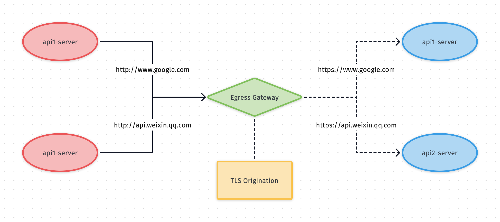

# 谈谈 TLS Termination&Origination 及其应用

今天来聊一聊 HTTP 代理服务器两个常见的功能，TLS Termination 和 Origination，关于他们的作用和对业务架构的指导，最后通过 Envoy 来展示一个加速 docker 镜像拉取的栗子。

关于这两个名词，似乎也没有标准的中文翻译，强行直译又感觉怪怪的，所以直接用英文了。

先从 Termination 开始吧。

## TLS Termination

这可能是我们用得最多的场景了。它的主要作用是，作为一个前置代理服务器接收外部到达的加密 TLS 流量，然后将其解密为 HTTP 明文，最后再将流量转发到内部的某个服务。


在实际应用中，内部的服务通常是以 HTTP 明文的方式通信，然后通过一个边界入口网关（ingress gateway）统一处理所有的 TLS 流量。这样 TLS 对所有的内部服务都是透明的，无需对每个服务去配置证书和私钥。通过一个统一的入口配置，我们还可以做很多事情，如日志，路由，路由策略等。

当然，对于一些安全级别较高的内部服务来说，未加密的流量可能是不可接受的，我们可以在 ingress 中配置 `sni` 来将加密的流量透传到该服务中。

这些相信大家都已经比较熟悉了，那么反过来呢，将上面做一个“逆操作”，也就是 TLS Origination。

## TLS Origination

作为一个代理服务器，接收内部服务的 HTTP 明文流量，然后将其加密，最后转发到一个HTTPS服务上，该服务既可以是内部，也可以是外部的，但看起来就像是一个内部的服务。流程如下，



作为与边界入口网关对立的存在，出口网关也通常放置在网络的边界。所有的出口流量都被它接管，在这个节点上我们可以统一实施一些访问控制策略，或监控，或日志等，这和 Ingres 的功能其实是一样的，最大的不同在于**将明文流量加密再转发**。

我们对向外主动请求的流量常常是不设防的，这样的**严进宽出**在安全要求较高的场合是不合适的。了解了 Egress 这个概念后，不仅仅是在安全上对我们的业务有帮助，对于业务架构的设计其实也是有所裨益的。

## 微信业务架构

考虑一个基于微信的服务，可能会有公众号，小程序，还可能会有多个小程序和公众号，更复杂一些，设计成微服务，不同的服务可能会调用同一公众号的微信接口。

那么问题来了，API `access token` 的存取就出现了竞争，我们可以做一个独立的服务，将各种token的获取，刷新和缓存封装起来，所有的服务需要用到token时直接通过`token-server`获取即可。

这种办法是可以的，虽然每次微信请求接口调用都产生了一次额外的内部rpc调用，性能上其实可以忽略不计，麻烦的是代码可能不会**简洁**，更重要的是对这些外发接口调用的监控，日志没有一个统一的地方处理。我们还可以做得更好，简单的架构如下：


在内部服务中，所有调用微信API的协议均使用HTTP，然后这些请求都会经过`wx-egress-server`，它会给请求附加合适的`access token`，通过 HTTPS 协议发往外部的微信服务器。除此以外，我们还可以增加日志便于调试，监控请求的成功率，甚至发起重试等等，这样相对原来的方案要更灵活。

说了这么多，我们来实际操作一下这俩功能。

## Docker 镜像加速

由于众所周知的原因，下载 docker 镜像通常比较慢，这严重影响了 CICD 的体验，所以国内一些云服务厂商提供了 dockerhub 加速服务。然而对于“小众”一些的镜像源，如`gcr.io`，`quay.io`基本上找不到对应的源。先前`azure.cn`做得非常好，但是很遗憾现在已经仅限于 azure 用户使用了。

自己动手，丰衣足食。一个比较好的方式是，我们在海外节点部署一个 Envoy 代理服务器，然后反向代理到对应的源服务器。这里不考虑镜像的缓存，流程简化如下：


比如我们需要使用 `gcr.io` 的 distroless 镜像 `gcr.io/distroless/base-debian10` ，可以替换为 `gcr.example.com/distroless/base-debian10`，拉取下来后可以自行修改 tag。

问题的关键就是在 Envoy 中配置我们今天的主角，TLS termination&origination，这实际上也是 [Envoy helloworld](https://www.envoyproxy.io/docs/envoy/latest/start/start) 的内容，反代 google.com .

首先配置 `listeners LDS` TLS Termination，

```yaml
listeners:
- name: listener_0
  address:
    socket_address: { address: 0.0.0.0, port_value: 443 }
  filter_chains:
  - filters:
    - name: envoy.filters.network.http_connection_manager
      typed_config:
        "@type": type.googleapis.com/envoy.extensions.filters.network.http_connection_manager.v3.HttpConnectionManager
        stat_prefix: ingress_http
        codec_type: AUTO
        route_config: # 根据host路由
          name: local_route
          virtual_hosts:
          - name: dockerhub_service
            domains: ["example.com"]
            routes:
            - match: { prefix: "/" }
              route: { host_rewrite_literal: registry-1.docker.io, cluster: service_dockerhub }
          - name: gcr_service
            domains: ["gcr.example.com"]
            routes:
            - match: { prefix: "/" }
              route: { host_rewrite_literal: gcr.io, cluster: service_gcr }
        http_filters:
        - name: envoy.filters.http.router
    transport_socket: # 配置tls
      name: envoy.transport_sockets.tls
      typed_config:
        "@type": type.googleapis.com/envoy.extensions.transport_sockets.tls.v3.DownstreamTlsContext
        common_tls_context:
          alpn_protocols: h2,http/1.1 # alpn 支持h2和http1.1
          tls_certificates:
          - certificate_chain:
              filename: "/etc/letsencrypt/live/example.com/fullchain.pem"
            private_key:
              filename: "/etc/letsencrypt/live/example.com/privkey.pem"
```

然后配置 `cluster CDS` TLS Origination，

```yaml
clusters:
- name: service_dockerhub
  connect_timeout: 0.25s
  type: LOGICAL_DNS
  # Comment out the following line to test on v6 networks
  dns_lookup_family: V4_ONLY
  lb_policy: ROUND_ROBIN
  load_assignment:
    cluster_name: service_dockerhub
    endpoints:
    - lb_endpoints:
      - endpoint:
          address:
            socket_address:
              address: registry-1.docker.io
              port_value: 443
  transport_socket:
    name: envoy.transport_sockets.tls
    typed_config:
      "@type": type.googleapis.com/envoy.extensions.transport_sockets.tls.v3.UpstreamTlsContext
      sni: registry-1.docker.io # dockerhub 镜像源的host
- name: service_gcr
  connect_timeout: 0.25s
  type: LOGICAL_DNS
  # Comment out the following line to test on v6 networks
  dns_lookup_family: V4_ONLY
  lb_policy: ROUND_ROBIN
  load_assignment:
    cluster_name: service_gcr
    endpoints:
    - lb_endpoints:
      - endpoint:
          address:
            socket_address:
              address: gcr.io
              port_value: 443
  transport_socket:
    name: envoy.transport_sockets.tls
    typed_config:
      "@type": type.googleapis.com/envoy.extensions.transport_sockets.tls.v3.UpstreamTlsContext
      sni: gcr.io
```

然后 reload 或者重启一下 Envoy，不出意外的话就可以使用自己的服务器去拉取 docker 镜像了。

作为 Envoy 的控制平面，Istio 直接就提供了 Ingress/Egress 两大服务，并通过抽象了 `virtual service` `service entry` 和 `destination rule` 便于我们更好的管理和应用这两个功能。

可见灵活运用这两个功能，尤其是 Origination 还是很有意义的。

## EOF

```yaml
summary: 今天来聊一聊 HTTP 代理服务器两个常见的功能，TLS Termination 和 Origination，关于他们的作用和对业务架构的指导，最后通过 Envoy 来展示一个加速 docker 镜像拉取的栗子。
weather: cloudy
license: cc-40-by
location: mars
background: ./docker.png
tags: [networking, envoy, tls]
date: 2020-05-25T00:05:49+08:00
```
