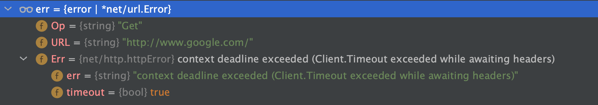
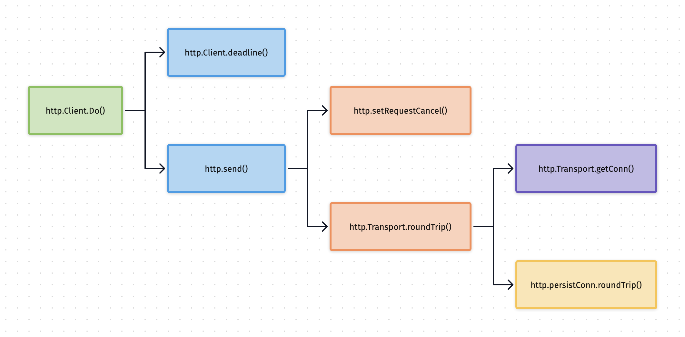

# Go 是如何处理 HTTP 请求超时和取消的

## 摘要
本文通过解决一个线上告警问题，查看了go的http库是如何实现超时和取消的，最后总结了在go里面通用的超时处理方法。

## 背景
前几天下午连续收到好几次线上API接口告警，下载文件报内部错误，简单看了下日志，是用户传过来的URL有问题，就没管了。后面又连着几次告警，于是就着手解决这个告警。

代码没啥问题，日志也没有内部错误，而是客户端的参数问题，捞了的ingress gateway访问日志一看，原来是个超时问题。

由于传过来的链接是GitHub的，由于众所周知的原因，访问不了就超时了；然后ingress gateway那边有5s的超时时间，我们不断地处在握手连接重试那会儿(SYN_SENT)，它不等我们的返回就超时了，这内部错误就是这么来的。

## 解决办法
解决办法相对简单，我们不能无限地等待，也要加上一个超时，由于ingress是5s，我们可以宽限200ms，设置超时时间为4800ms应该差不多。那么怎么在http请求中添加超时时间呢？

go的http库client里提供了`Timeout`配置选项：

```go
func main() {
	req, _ := http.NewRequest(http.MethodGet, "http://www.google.com/", nil)
	cli := http.Client{
		Timeout: time.Millisecond * 10, // Set 10ms timeout.
	}
	resp, err := cli.Do(req)
	if err != nil {
		log.Panicf("%T: %+v", err, err)
	}
	defer resp.Body.Close()
	b, _ := io.ReadAll(resp.Body)
	log.Printf("%s", b)
}
```

运行一下，由于超时时间只有10ms，访问Google都不够一次rtt所以一定会超时：

```log
2021/04/01 21:31:48 *url.Error: Get "http://www.google.com/": context deadline exceeded (Client.Timeout exceeded while awaiting headers)
panic: *url.Error: Get "http://www.google.com/": context deadline exceeded (Client.Timeout exceeded while awaiting headers)
```

可以看到panic deadline exceeded，表示超时了，而且err的类型是`*url.Error`，看看[代码定义](https://github.com/golang/go/blob/release-branch.go1.16/src/net/url/url.go#L22)：

```go
// Error reports an error and the operation and URL that caused it.
type Error struct {
	Op  string
	URL string
	Err error
}
```

通过调试，可以很清楚地看到类型定义：



Err的类型是`http.httpError`，它的定义在[这里](https://github.com/golang/go/blob/release-branch.go1.16/src/net/http/transport.go#L2494):

```go
type httpError struct {
	err     string
	timeout bool
}
```

`timeout`为true，所以可以知道这个error是因超时造成的，可是问题在于我们是使用调试模式才能看到私有的变量，我们需要怎么判定err是由于超时造成的呢？最简单的办法，将err的字符串打出来匹配一下就好了嘛，可以，但是不太靠谱，这不是科学的方式，哪天字符串变了咋办？

看了下代码，注意到`httpError`这结构体居然有几个exported公开的方法：

```go
func (e *httpError) Error() string   { return e.err }
func (e *httpError) Timeout() bool   { return e.timeout }
func (e *httpError) Temporary() bool { return true }
```

我们是不是可以利用go的接口（只要包含这个方法就算实现了接口）特性来判定呢？可以一试：

```go
type timeout interface {
	Timeout() bool
}

// ....
if err != nil {
    if t, ok := err.(timeout); ok {
        log.Printf("timeout: %t", t.Timeout())
        // handle timeout
    }
    log.Panicf("%T: %+v", err, err)
}
// ...
```

这里为了篇幅，隐去了出现过的代码（下同），我们定义了一个接口，包含一个签名一样的方法，然后通过类型断言得到接口的实现，进而知道这个error确实是超时造成的。

```log
2021/04/01 21:49:49 timeout: true
*url.Error: Get "http://www.google.com/": context deadline exceeded (Client.Timeout exceeded while awaiting headers)
```

实际上，在进一步看代码时，`url.Error`本身已经实现了`Timeout`方法，实现方式和我们[如出一辙](https://github.com/golang/go/blob/release-branch.go1.16/src/net/url/url.go#L31)：

```go
// url.go url.Error
func (e *Error) Timeout() bool {
	t, ok := e.Err.(interface {
		Timeout() bool
	})
	return ok && t.Timeout()
}
```

所以我们将error转换为url.Error，然后调用这个方法即可，通过`errors`包代码更简洁：

```go
// ...
if err != nil {
    var e *url.Error
    if errors.As(err, &e) {
        log.Printf("timeout: %t", e.Timeout())
    }
    log.Panicf("%T: %+v", err, err)
}
// ...
```

以上，便比较好地解决了超时的问题。

如果事情到这里就结束了，似乎好像也没啥特别的？让我们康康go是怎么实现超时/取消这个逻辑吧，以及，从这个过程中我们可以学到点什么。

## 超时/取消 实现

由于对网络比较感兴趣，于是趁着好奇把go的http client库看了个大概，实现还是相当复杂的，限于篇幅这里就不大段地摘录代码了，只讨论冰山一角，超时/取消是如何实现的。先上一个请求的主要调用链：



我们主要讲http/1.1的流程，http/2也差不太多，后面也会介绍，下面简单说一下每个流程与超时/取消相关的做了什么。

go源码的分支是[release-branch.go1.16](https://github.com/golang/go/tree/release-branch.go1.16)。

### `http.Client.do`

所有的请求都会走到`http.Client.do`[方法](https://github.com/golang/go/blob/release-branch.go1.16/src/net/http/client.go#L590)，它发送请求并返回响应，处理重定向，cookies和basic auth等。该函数内有个request slice，通过循环不断地对返回的3xx响应重新发起请求；接下来调用`http.Client.send`来发送请求，它会返回一个`didTimeout`用来判定是否超时，比较有意思的是，所有的错误都会封装成`url.Error`，这也就是为什么上一节会看到这个error类型的原因了。这函数调用了`http.Client.deadline`得到请求的最后期限：

```go
func (c *Client) deadline() time.Time {
	if c.Timeout > 0 {
		return time.Now().Add(c.Timeout)
	}
	return time.Time{}
}
```

可以看到，如果设置了`http.Client`的`Timeout`选项，那么最后期限就是当前时间加上超时时间，否则返回一个零时间。

### `http.send`
`http.Client.send`就干了一件事，请求前后增加cookies的处理，发送的逻辑委托给了`http.send`[方法](https://github.com/golang/go/blob/release-branch.go1.16/src/net/http/client.go#L203)，发送一个http请求。这里值得注意的是，注释明确写了调用者读完了应该关闭响应体。与超时有关的，这里有一个非常重要的函数，`http.setRequestCancel`，如果请求有deadline，它就会给请求增加一个cancel context。在go里取消请求有三种方式：

- 调用`Transport.CancelRequest`方法，已经被废弃，因为http/2的transport就不支持
- 设置`http.Request.Cancel` channel变量，也被废弃了
- 设置`http.Request.Context`

所以推荐的办法就是就是给request添加一个cancel的context了，但是，我们上一节不是通过`http.Client`来设置超时吗？我们来看一看函数具体的实现：

```go
func setRequestCancel(req *Request, rt RoundTripper, deadline time.Time) (stopTimer func(), didTimeout func() bool) {
	if deadline.IsZero() {
		return nop, alwaysFalse
	}
	knownTransport := knownRoundTripperImpl(rt, req)
	oldCtx := req.Context()

	if req.Cancel == nil && knownTransport {
		// If they already had a Request.Context that's
		// expiring sooner, do nothing:
		if !timeBeforeContextDeadline(deadline, oldCtx) {
			return nop, alwaysFalse
		}

		var cancelCtx func()
		req.ctx, cancelCtx = context.WithDeadline(oldCtx, deadline)
		return cancelCtx, func() bool { return time.Now().After(deadline) }
	}
	// deleted...
}
```

- 如果deadline是零值（client没有设置超时），那么直接返回，也就是无超时
- 如果deadline非零值，会将这个时间作为一个`context.WithDeadline`设置到request上
- 否则，如果通过request.Cancel channel来取消，实现比较复杂，会启动另一个协程，设置timer等待取消的信号，或者在这之前响应返回

可以看到，给client设置timeout最终转化为了给request设置context，所以在初始化请求的时候直接用`http.NewRequestWithContext`更直接，也是更推荐的做法。

接下来会走到`RoundTripper`。

### `http.Transport.roundTrip`
go的http库里有个很特别的接口，`RoundTripper`，Client其实并不处理http请求响应事务，具体连接怎么建立和维持，tls握手，http报文怎么写入等等全是这接口的实现做的，所有复杂的底层逻辑都在这里面。btw，roundtrip字面意思是往返，正好可以理解为http事务，一个请求接一个响应。默认实现是http/1.1和http/2，分别在`http.Transport`以及其结构体内的`altProto`中的`http.http2Transport`。如果schema是https，go会尝试优先使用http/2的roundTrip来处理请求，因为alpn发生在tls握手流程中。

我们先来看看`http.Transport.roundTrip`做了什么。它先会初始化h2协议，使用`sync.Once`有且仅有一次，然后验证请求头的合法性，最后就是关键的[地方](https://github.com/golang/go/blob/release-branch.go1.16/src/net/http/transport.go#L502)了：

```go
for {
    select {
    case <-ctx.Done():
        req.closeBody()
        return nil, ctx.Err()
    default:
    }
    // treq gets modified by roundTrip, so we need to recreate for each retry.
    treq := &transportRequest{Request: req, trace: trace, cancelKey: cancelKey}
    cm, err := t.connectMethodForRequest(treq)
    if err != nil {
        req.closeBody()
        return nil, err
    }

    // Get the cached or newly-created connection to either the
    // host (for http or https), the http proxy, or the http proxy
    // pre-CONNECTed to https server. In any case, we'll be ready
    // to send it requests.
    pconn, err := t.getConn(treq, cm)
    if err != nil {
        t.setReqCanceler(cancelKey, nil)
        req.closeBody()
        return nil, err
    }

    var resp *Response
    if pconn.alt != nil {
        // HTTP/2 path.
        t.setReqCanceler(cancelKey, nil) // not cancelable with CancelRequest
        resp, err = pconn.alt.RoundTrip(req)
    } else {
        resp, err = pconn.roundTrip(treq)
    }
    if err == nil {
        resp.Request = origReq
        return resp, nil
    }
    // ... retry
}
```

这是经典的go并发编程模型，**无限for循环加上select多路复用，要么超时返回，要么默认执行请求**，并且请求还能执行多次，前提是请求失败了能够重试。什么时候能够重试呢？比如恰好持久的tcp连接断开了或者http/2的stream数达到了上限。

关于超时，这里还有两处关键的地方。一是，`transportRequest`结构体里设置了`cancelKey`，这个值里包含了请求的结构体，transport里有个map来存储待cancel的请求。二是，`http.Transport.getConn`[方法](https://github.com/golang/go/blob/release-branch.go1.16/src/net/http/transport.go#L1324)，就是在这里获取到tcp连接的，可能是缓存的或者新创建的，这函数的关键是它会**通过select多路复用等待各种条件**：

```go
func (t *Transport) getConn(treq *transportRequest, cm connectMethod) (pc *persistConn, err error) {
	// deleted...
	cancelc := make(chan error, 1)
	t.setReqCanceler(treq.cancelKey, func(err error) { cancelc <- err })

	// Queue for permission to dial.
	t.queueForDial(w)
	// Wait for completion or cancellation.
	select {
	case <-w.ready:
		// Trace success but only for HTTP/1.
		// HTTP/2 calls trace.GotConn itself.
		if w.pc != nil && w.pc.alt == nil && trace != nil && trace.GotConn != nil {
			trace.GotConn(httptrace.GotConnInfo{Conn: w.pc.conn, Reused: w.pc.isReused()})
		}
		if w.err != nil {
			// If the request has been cancelled, that's probably
			// what caused w.err; if so, prefer to return the
			// cancellation error (see golang.org/issue/16049).
			// deleted...
		}
		return w.pc, w.err
	case <-req.Cancel:
		return nil, errRequestCanceledConn
	case <-req.Context().Done():
		return nil, req.Context().Err()
	case err := <-cancelc:
		if err == errRequestCanceled {
			err = errRequestCanceledConn
		}
		return nil, err
	}
}
```

建立连接的过程中可能产生的超时，这里就对应上了前面说的请求取消的几种方式，要么`request.Cancel`的channel ready了，要么通过context，先到先得，否则连接persist conn就会返回，然后调用连接的`roundTrip`方法，所以还真是套娃啊，一层又一层，最终所有的细节还是在底层的连接上。

go的http连接读写使用了channel的模型，读和写分别在两个loop协程中，通过发送消息来进行tcp的读写，在[连接建立](https://github.com/golang/go/blob/9baddd3f21230c55f0ad2a10f5f20579dcf0a0bb/src/net/http/transport.go#L1556)的最后：

```go
func (t *Transport) dialConn(ctx context.Context, cm connectMethod) (pconn *persistConn, err error) {
	// deleted...
	go pconn.readLoop()
	go pconn.writeLoop()
	return pconn, nil
}
```

具体实现都是一个无限for循环加select，不断阻塞等到读写消息的到来。

### `http.persistConn.roundTrip`
连接实际上也实现了`RoundTripper`接口。我们先看一看http/1.1的[实现](https://github.com/golang/go/blob/9baddd3f21230c55f0ad2a10f5f20579dcf0a0bb/src/net/http/transport.go#L2524)，限于篇幅，删掉了大量代码，保留我们感兴趣的：

```go
func (pc *persistConn) roundTrip(req *transportRequest) (resp *Response, err error) {
	// deleted...
	if !pc.t.replaceReqCanceler(req.cancelKey, pc.cancelRequest) {
		pc.t.putOrCloseIdleConn(pc)
		return nil, errRequestCanceled
	}
	// deleted...
	defer func() {
		if err != nil {
			pc.t.setReqCanceler(req.cancelKey, nil)
		}
	}()
	// deleted...
	writeErrCh := make(chan error, 1)
	pc.writech <- writeRequest{req, writeErrCh, continueCh}
	// deleted...
	cancelChan := req.Request.Cancel
	ctxDoneChan := req.Context().Done()
	for {
		select {
		case err := <-writeErrCh:
			// deleted...
		case <-pcClosed:
			// deleted...
		case <-respHeaderTimer:
			// deleted...
		case re := <-resc:
			// deleted...
			return re.res, nil
		case <-cancelChan:
			canceled = pc.t.cancelRequest(req.cancelKey, errRequestCanceled)
			cancelChan = nil
		case <-ctxDoneChan:
			canceled = pc.t.cancelRequest(req.cancelKey, req.Context().Err())
			cancelChan = nil
			ctxDoneChan = nil
		}
	}
}
```

首先会判定连接是否是有效的，如果有效则会设置canceler，这是一个[函数](https://github.com/golang/go/blob/9baddd3f21230c55f0ad2a10f5f20579dcf0a0bb/src/net/http/transport.go#L1966)，在检测到超时或者取消的时候将会被调用：

```go
func (t *Transport) cancelRequest(key cancelKey, err error) bool {
	t.reqMu.Lock()
	cancel := t.reqCanceler[key]
	delete(t.reqCanceler, key)
	t.reqMu.Unlock()
	if cancel != nil {
		cancel(err)
	}

	return cancel != nil
}

func (pc *persistConn) cancelRequest(err error) {
	pc.mu.Lock()
	defer pc.mu.Unlock()
	pc.canceledErr = err
	pc.closeLocked(errRequestCanceled)
}
```

cancel的逻辑，相当粗暴，直接将连接断掉，不过http/1.1也确实没有别的办法。那么什么时候这函数会被调用到呢？接下来会通过`writech`发送写request的请求到连接的一个wirteloop中，然后就是select等待任意一个条件满足：

- 写请求失败
- 连接断开
- 读取响应超时
- 响应返回
- request.Cancel收到了信号
- context到期

其中最后两者会就会调用到canceler将tcp连接断开。

以上就是http/1.1请求是如何超时/取消的具体实现。最后我们来看一看http/2的，代码框架其实也类似。h2连接的细节这里略过了，只看最后取消的[地方](https://github.com/golang/go/blob/9baddd3f21230c55f0ad2a10f5f20579dcf0a0bb/src/net/http/h2_bundle.go#L7535)：

```go
func (cc *http2ClientConn) roundTrip(req *Request) (res *Response, gotErrAfterReqBodyWrite bool, err error) {
	// deleted...
	for {
		select {
		case re := <-readLoopResCh:
			return handleReadLoopResponse(re)
		case <-respHeaderTimer:
			// deleted...
			return nil, cs.getStartedWrite(), http2errTimeout
		case <-ctx.Done():
			if !hasBody || bodyWritten {
				cc.writeStreamReset(cs.ID, http2ErrCodeCancel, nil)
			} else {
				bodyWriter.cancel()
				cs.abortRequestBodyWrite(http2errStopReqBodyWriteAndCancel)
				<-bodyWriter.resc
			}
			cc.forgetStreamID(cs.ID)
			return nil, cs.getStartedWrite(), ctx.Err()
		case <-req.Cancel:
			// deleted...
		case <-cs.peerReset:
			// processResetStream already removed the
			// stream from the streams map; no need for
			// forgetStreamID.
			return nil, cs.getStartedWrite(), cs.resetErr
		case err := <-bodyWriter.resc:
			// deleted...
		}
	}
}
```

这里模型还是http/1.1一样的，select等待超时条件，`request.Cancel`和context实现基本一致，所以我们只看context到期的，区别于http/1.1，http/2提供了`RST_STREM`桢来将一个stream的request给cancel掉，所以这也是它的一个优化吧，毕竟连接建立比较耗时。

## 小结
以上，带大家走马观花似的看了一下http请求的代码，如果只看超时/取消的原理，其实不难，模型其实都是一样的，通过select以及cancel channel来提前返回到底是超时还是正常的http事务，几乎所有可能超时的链路都使用了这个模型。

所以，比较有go的味道吧，不过还是推荐使用context来取消/超时，不然channel到处乱飞，可维护性比较差。在我们自己的业务代码中，也可以通过这种方式来实现超时。

超时通用的代码模型如下，业务代码放到`fn`里：

```go
type fn func(ctx context.Context) result

type result struct {
	Val interface{}
	Err error
}

func doWithTimeout(ctx context.Context, fn fn) result {
	ch := make(chan result)
	go func(ctx context.Context, ch chan<- result) {
		ch <- fn(ctx)
	}(ctx, ch)

	select {
	case <-ctx.Done(): // timeout
		go func() { <-ch }() // wait ch return...
		return result{Err: ctx.Err()}
	case res := <-ch: // normal case
		return res
	}
}

func main() {
	ctx, cancel := context.WithTimeout(context.Background(), time.Second * 10)
	defer cancel()
	result := doWithCancel(ctx, func(ctx context.Context) result {
		req, _ := http.NewRequestWithContext(ctx, http.MethodGet, "https://www.google.com/", nil)
		resp, err := http.DefaultClient.Do(req)
		return result{
			Val: resp,
			Err: err,
		}
	})
	if result.Err != nil {
		panic(result.Err)
	}
}
```

将具体的逻辑放到了一个独立的协程中，然后select等待，需要注意的是如果已经存在上下了，没有特别的理由，就基于该context追加超时，而不是像上面那样使用`context.Background()`。

最后还需要说明一下，超时虽然能够检测到，但是取消并不是*那么容易*，比如网络的不确定性，接收端很可能已经处理请求了，所以具体取消与否还是依赖于服务器存储的状态。

## EOF
```yaml
summary: 本文通过解决一个线上告警问题，查看了go的http库是如何实现超时和取消的，最后总结了在go里面通用的超时处理方法。
weather: cloudy
license: cc-40-by
location: mars
background: ./go-http-timeout.png
tags: [networking, go, http]
date: 2021-04-06T20:00:00+08:00
```