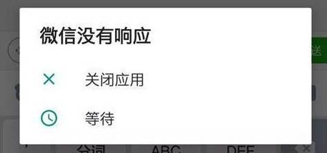
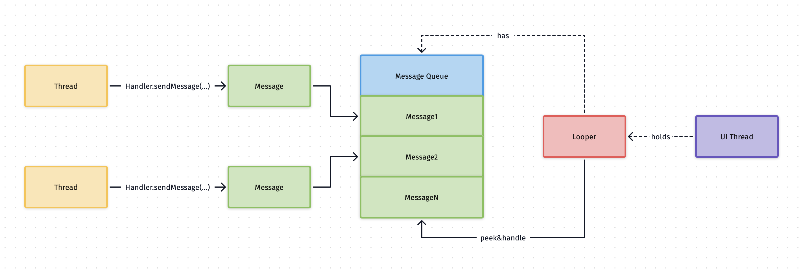

# sync loop：从业务中的 bug 到 Android 和 Kubernetes

## 摘要
前两周花了不少时间实现一篇设计文档，关于提升Kafka分区数和消费者组的可扩展性，过程中有不少东西可以和大家分享，这里先开个坑，后面再填吧hhh。

今天分享一个有意思的bug，它的解决办法，以及引申出来的一种编程模型，最后通过两个著名项目的核心部分源码来谈谈它的应用，所有成功复杂的项目应该有一个简单的模型支撑。

## 从一个bug的前世今生说起
代码在本地跑完单测和集成环境测试，CI/CD到测试集群后，前端同学一天晚上突然和我报bug，说有问题概率性发生：一个任务的又回到了原来的状态。正常的状态是这样的(不考虑失败)：

```
开始 -> 预执行中(A) -> 预执行完(B) -> 执行中(C) -> 执行完(D) -> 结束
```

一个job跑完了ABC，预期是D，反而又回到了B，一脸懵逼。

仔细捞了日志排查，发现几条可疑的时间线：

> 声明一下，由于deployment后面更新了，测试环境下pod日志没有做持久化，原来的日志已经找到不到了，以下日志为人工修改后的，但顺序确实是这样的，实在抱歉。

```log
2021-03-26T13:22:50.125+0800    INFO    report/reporter.go   ModifyJobHostsStatus    {"application": "streaming", "job_id": "job-1", "sub_job_id": "job-1-181742212", "result": "JobStatus:B IsTotal:true", "err": null}
2021-03-26T13:22:50.160+0800    INFO    report/reporter.go   ModifyJobHostsStatus    {"application": "streaming", "job_id": "job-1", "sub_job_id": "job-1-459752457", "result": "JobStatus:D IsTotal:true", "err": null}
2021-03-26T13:22:50.387+0800    INFO    report/reporter.go   ModifyJobHostsStatus    {"application": "streaming", "job_id": "job-1", "sub_job_id": "job-1-499568190", "result": "JobStatus:D IsTotal:true", "err": null}
2021-03-26T13:22:50.846+0800    INFO    report/reporter.go   ModifyJobHostsStatus    {"application": "streaming", "job_id": "job-1", "sub_job_id": "job-1-545892844", "result": "JobStatus:B IsTotal:true", "err": null}
```

在我们的业务里，一个job*可能*会按照地域划分个若干个子job跑在不同的集群上，最后上报汇总所有子job的的执行结果得到最终job的执行状态。可以看到任务`job-1`有两个子任务，分别是`job-1-181742212`和`job-1-545892844`。状态时间线依次为，B，D，D，B，所以又回到了老状态。

业务参考了TCP连接的断开流程，会有两次fin的回调，间隔10s（可以理解为`TIME-WAIT`的2MSL，为了尽可能在这段时间内接收到缺失/无序的数据然后持久化）。也就是说上一次预执行任务结束后，在10s内快速地进行下一次执行，然后下一次的也会在这10s内快速地结束。恰好在下一次“调度”到上报状态的时候，就会可能存在同一个job两种状态的上报，调度handler函数是在goroutine的形式进行（为了不阻塞调度goroutine）。所以这就是概率性发生的原因了，两次执行间隔很短，出现这bug的概率就越大，我们的测试job通常都很快执行完。

我们都知道goroutine的执行顺序和时间是不确定的，所以也就有了以上状态顺序错乱穿插的问题。

好了，破案了，问题怎么该解决呢？

我们希望**多个协程按顺序地跑在另一个独立的协程里**，这么做是为了不阻塞调度协程。

很简单，直接干就是了：

```go
go func() {
    f1()
    f2()
    // ...
    fn()
}()
```

这种做法的前提是*我们知道执行的任务和数量以及顺序*，某种意义上可以认为是静态的吧，我们需要一个动态的fifo的队列，生产者往里面加任务，然后在一个单一消费者协程里不断地取，执行。

幸运的是，go天生支持这种并发编程模型，通过*channel*内建在语言层面，其他的语言则很可能需要库来实现。

```go
// in a consumer goroutine
for {
    select {
        case data := <- ch:
          // do with data
    }
}

// in producers goroutine
ch <- makeData()
```

在一个无限循环中，通过`select`关键字，不断地阻塞，等待ch发过来的数据唤醒，然后处理数据。这是我见过最简洁的代码了，非常优雅地实现了一个消费者生产者。

由于go里面函数也是一等公民，把处理函数通过channel发过去执行就好了，go的channel是fifo的，单一消费者协程里，执行的顺序是肯定是确定的。

以下是实现代码，利用了range channel的特性，代码可以更简洁。

```go
type HandlerFn func(ctx map[string]interface{})

type SyncLooper struct {
	ch chan HandlerFn
}

func (s *SyncLooper) loop() {
	ctx := map[string]interface{}{}
	for fn := range s.ch {
		fn(ctx)
	}
}

func NewSyncLooper() *SyncLooper {
	l := &SyncLooper{
		ch: make(chan HandlerFn, 16),
	}
	go l.loop()
	return l
}

func (s *SyncLooper) Sync(fn HandlerFn) { s.ch <- fn }

func (s *SyncLooper) Stop() { close(s.ch) }
```

然后在使用上，屏蔽了channel的细节，直接调用`Sync()`往里面追加函数以及`Close()`停掉循环即可。

```go
looper := NewSyncLooper()
looper.Sync(func(ctx map[string]interface{}) {
    // ...
})
// sync ...

// when no longer use
looper.Close()
```

注意到ctx变量，可以理解是一个消费者协程全局变量，在函数里可以安全的读写，不需要使用锁。

最后看一看修复后的效果，以下日志为真实日志（已脱敏）：

```log
2021-03-28T18:40:54.550+0800    INFO    report/reporter.go   ModifyJobHostsStatus    {"application": "streaming", "job_id": "job-2", "sub_job_id": "job-2-189116685", "result": "JobStatus:A", "err": null}
2021-03-28T18:40:57.214+0800    INFO    report/reporter.go   ModifyJobHostsStatus    {"application": "streaming", "job_id": "job-2", "sub_job_id": "job-2-71219021", "result": "JobStatus:B IsTotal:true", "err": null}
2021-03-28T18:41:11.835+0800    INFO    report/reporter.go   ModifyJobHostsStatus    {"application": "streaming", "job_id": "job-2", "sub_job_id": "job-2-296060654", "result": "JobStatus:C", "err": null}
2021-03-28T18:41:13.588+0800    INFO    report/reporter.go   ModifyJobHostsStatus    {"application": "streaming", "job_id": "job-2", "sub_job_id": "job-2-375740013", "result": "JobStatus:D IsTotal:true", "err": null}
```

ABCD, nice.

## Android UI 线程同步
做过客户端开发的同学都知道，不管是Android还是iOS，界面相关的东西，控件，图形文本，触摸手势交互，动画特效，用户能够感知到的，基本都是跑在主线程的，通常也会叫做`UI Thread`。一般认为，每秒60桢(frame per second, fps)的刷新率会感到足够流畅丝滑了，可以简单认为每秒钟界面会画60次。当然现在2021年了，高端的Android机器都有120桢了，然而苹果还是万年60桢和lighting充电口hhh（iPad Pro可不是手机）。

**客户端的用户体验是建立在流畅性上的**，所以需要尽可能达到60fps。粗略算一下，每`1/60~=0.0167s`界面就会绘制一次，能够在ui线程里跑我们自己代码的时间应该尽可能小于这时间，如果超过了，绘制流程会跳过这次，也就是所谓的掉帧，表现出来的就是一个字，卡。更近一步，如果长时间阻塞住ui线程（大概是5s），系统会主动kill掉你的app([ANR](https://developer.android.com/topic/performance/vitals/anr?hl=zh-cn))。这和*闪退*都是不能容忍的，用户很可能卸载你的app。用过Android的同学们大概率见过类似这样的弹窗：



0.0167s还是很短的，一次网络请求很可能就超过1s了。所以一个关键就是**把耗时操作放到其他线程去**，网络io，本地io，密集计算等，当数据到内存后再传到ui线程里，我记得iOS默认网络请求都是异步的（这也许是早期Android比iOS卡顿的原因之一）。当然UI本身也有很多优化点，比如扁平化ui层级，控件recycle，更先进的layout算法等，这些都超出了本文讨论范围。

那么问题来了，当一个耗时的网络请求拿到了数据（比如hello，world串），可以直接更新到界面上到textview文本控件上吗？答案是不可以。

现代ui框架基本上设计都是线程不安全的，这和后端通常要求函数并发安全很不一样。一个很重要的原因是，如果让控件线程安全，代码写起来太复杂了，处处都需要锁（比go的`if err != nil { }`多得多得多）。想一想，光是Android里的`android.view.View`这个所有视图的基类就有[15354](https://android.googlesource.com/platform/frameworks/base/+/a175a5b/core/java/android/view/View.java)行代码了，Android框架代码可能至少都有百万行以上吧，客户端代码通常比后端复杂，有相当多的状态要维护，这代码还怎么写？

所以ui相关的东西都是线程不安全的，异步线程的数据需要同步到ui线程，你可能已经想到了，这不是和我们上一节说的模型一样嘛。

确实是，Android app启动后会在`main()`函数启动一个looper(封装了一个无限循环)，也叫main looper，我们所有ui的代码都跑在这个looper里，looper持有一个message queue，然后通过[Handler](https://developer.android.com/reference/android/os/Handler)绑定当前线程里的looper，将数据以消息的形式通过handler发送到queue里，looper不断地取消息执行。模型是一样的，looper就是一个无限循环，handler有点像go的channel，channel内部实现是包含了一个环形队列存储数据。



了解Java的同学可以看看[androidos.Looper.java](https://android.googlesource.com/platform/frameworks/base/+/master/core/java/android/os/Looper.java#154)的代码，刨去无关的，关键代码简化后是这样的：

```java
public static void loop() {
        final Looper me = myLooper();
        final MessageQueue queue = me.mQueue;
        for (;;) {
            Message msg = queue.next(); // might block
            try {
                msg.target.dispatchMessage(msg);
                dispatchEnd = needEndTime ? SystemClock.uptimeMillis() : 0;
            } catch (Exception exception) {
                // ...
                throw exception;
            } finally {
                // ...
            }
            msg.recycleUnchecked();
        }
    }
```

看到了熟悉的无限for循环，其中，`myLooper()`获取当前线程的looper，`msg.targer`是handler，可以理解为消息就是处理函数，就是我们上一节的`handlerFn`，因为在java中函数不是一等公民。

看一个handler的一般用法：

```java
private class MyXXXHandler extends Handler {
    @Override public void handleMessage(Message msg) {
        switch(msg.what) {
        case ACTION_1:
          // ...
          break;
        case ACTION_2:
          // ...
          break;
        default:
          // ...
          break;
        }
    }
}

// usage
Handler handler = new MyXXXHandler(Looper.getMainLooper());

Message msg = handler.obtainMessage();
message.obj = "my_data...";
message.what = ACTION_1;
mHandler.sendMessage(msg);
```

关键函数是`handleMessage()`，我们发送的消息就是在这里得到处理的，message通过what和obj可以携带标识和数据。

很久没写客户端了，虽然Android/iOS SDK每年都更新很多东西，这些编程模型大概率还是不会变的。

让我们回到后端。

## k8s 控制器模式
k8s后端同学都比较熟悉了，就不介绍它是什么了，我们来说一说它的一个核心功能和实现。

k8s最常见的食用方式就是`kubectl apply -f deploy.yaml`，在yaml中声明我们的编排的API对象；哪天更新了yaml，还是同样的配方，k8s就会将编排对象的状态达到我们预期的状态（比如把deployment对象的replicas从2改到3）。用户体验很棒，实现应该很复杂吧？

答案是是，也不是。说复杂，那肯定，k8s实现了那么多的编排特性，光是项目规模就让人吃惊了；说不是，是因为实现的原理，或者说模型很简单。

我们都知道，k8s[架构组件](https://kubernetes.io/docs/concepts/overview/components/)主要有api-server, scheduler，controller-manager和kubelet，还有etcd。今天我们来谈谈实现刚才说的那个功能的主角，controller-manager。

在k8s中，用**一种API对象管理另一种对象**，我们称之为*控制器模式*，比如deployment实际上是一个控制器，它控制是什么呢，pod（其实并不是，后面会说），比如通过replicas控制pod的数量，使用strategy来控制pod的更新策略，利用revisionHistoryLimit来控制历史版本的数量，等等。通过组合，控制器也可以控制其他的控制器，没错，就是俄罗斯套娃，statefulSet就控制了deployment，k8s里的API资源都是这么玩的。实际上，deployment控制的不是pod，而是控制replicaSet，然后replicaSet控制Pod。组合还是比继承强大啊。

```yaml
apiVersion: apps/v1
kind: Deployment
metadata:
  name: shadowsocks-rust
spec:
  selector:
    matchLabels:
      app: shadowsocks-rust
  strategy:
    rollingUpdate:
      maxSurge: 25%
      maxUnavailable: 25%
  replicas: 3
####################################### 我是分割线
  template:
    metadata:
      labels:
        app: shadowsocks-rust
    spec:
      volumes:
      - name: config
        configMap:
          name: ss
      containers:
      - name: shadowsocks-rust
        image: teddysun/shadowsocks-rust
        volumeMounts:
        - name: config
          mountPath: /etc/shadowsocks-rust
        ports:
        - name: ws
          containerPort: 80
```

在上面的栗子中，在yaml中声明API对象时，spec就是控制器的声明，而template就是被控制的API对象的声明，妙啊。

那这些控制器是怎么实现的呢？答案你应该也从知道了，和我们前两节说的模型是一样的，控制循环，在k8s通常叫做*Reconcile*，调协，也是在一个无限for循环中搞事情。直接上[源码](https://github.com/kubernetes/kubernetes/blob/74f72c47380340e8f267428822957237dedceead/pkg/kubelet/kubelet.go#L1852)：

```go
// syncLoop is the main loop for processing changes. It watches for changes from
// three channels (file, apiserver, and http) and creates a union of them. For
// any new change seen, will run a sync against desired state and running state. If
// no changes are seen to the configuration, will synchronize the last known desired
// state every sync-frequency seconds. Never returns.
func (kl *Kubelet) syncLoop(updates <-chan kubetypes.PodUpdate, handler SyncHandler) {
	klog.InfoS("Starting kubelet main sync loop")
	// The syncTicker wakes up kubelet to checks if there are any pod workers
	// that need to be sync'd. A one-second period is sufficient because the
	// sync interval is defaulted to 10s.
	syncTicker := time.NewTicker(time.Second)
	defer syncTicker.Stop()
	housekeepingTicker := time.NewTicker(housekeepingPeriod)
	defer housekeepingTicker.Stop()
	plegCh := kl.pleg.Watch()
	const (
		base   = 100 * time.Millisecond
		max    = 5 * time.Second
		factor = 2
	)
	duration := base
	// Responsible for checking limits in resolv.conf
	// The limits do not have anything to do with individual pods
	// Since this is called in syncLoop, we don't need to call it anywhere else
	if kl.dnsConfigurer != nil && kl.dnsConfigurer.ResolverConfig != "" {
		kl.dnsConfigurer.CheckLimitsForResolvConf()
	}

	for {
		if err := kl.runtimeState.runtimeErrors(); err != nil {
			klog.ErrorS(err, "Skipping pod synchronization")
			// exponential backoff
			time.Sleep(duration)
			duration = time.Duration(math.Min(float64(max), factor*float64(duration)))
			continue
		}
		// reset backoff if we have a success
		duration = base

		kl.syncLoopMonitor.Store(kl.clock.Now())
		if !kl.syncLoopIteration(updates, handler, syncTicker.C, housekeepingTicker.C, plegCh) {
			break
		}
		kl.syncLoopMonitor.Store(kl.clock.Now())
	}
}
```

由于代码不是很长，就不删了，注释说得很清楚了这函数是干啥的了，它会通过channel watch状态，如果看到任何地改变，就会执行一次同步，将desire state（用户提交的yaml）同步到running state（集群中实际运行时状态）。

里面也是有个无限for循环的，然后关键的处理在syncLoopIteration[方(https://github.com/kubernetes/kubernetes/blob/74f72c47380340e8f267428822957237dedceead/pkg/kubelet/kubelet.go#L1926)中：

```go
// syncLoopIteration reads from various channels and dispatches pods to the
// given handler.
// ..... deleted comments
func (kl *Kubelet) syncLoopIteration(configCh <-chan kubetypes.PodUpdate, handler SyncHandler,
	syncCh <-chan time.Time, housekeepingCh <-chan time.Time, plegCh <-chan *pleg.PodLifecycleEvent) bool {
	select {
	case u, open := <-configCh:
		// Update from a config source; dispatch it to the right handler
		// callback.
		if !open {
			klog.ErrorS(nil, "Update channel is closed, exiting the sync loop")
			return false
		}

		switch u.Op {
		case kubetypes.ADD:
			klog.V(2).InfoS("SyncLoop ADD", "source", u.Source, "pods", format.Pods(u.Pods))
			// After restarting, kubelet will get all existing pods through
			// ADD as if they are new pods. These pods will then go through the
			// admission process and *may* be rejected. This can be resolved
			// once we have checkpointing.
			handler.HandlePodAdditions(u.Pods)
		case kubetypes.UPDATE:
			klog.V(2).InfoS("SyncLoop UPDATE", "source", u.Source, "pods", format.Pods(u.Pods))
			handler.HandlePodUpdates(u.Pods)
		case kubetypes.REMOVE:
			klog.V(2).InfoS("SyncLoop REMOVE", "source", u.Source, "pods", format.Pods(u.Pods))
			handler.HandlePodRemoves(u.Pods)
		case kubetypes.RECONCILE:
			klog.V(4).InfoS("SyncLoop RECONCILE", "source", u.Source, "pods", format.Pods(u.Pods))
			handler.HandlePodReconcile(u.Pods)
		case kubetypes.DELETE:
			klog.V(2).InfoS("SyncLoop DELETE", "source", u.Source, "pods", format.Pods(u.Pods))
			// DELETE is treated as a UPDATE because of graceful deletion.
			handler.HandlePodUpdates(u.Pods)
		case kubetypes.SET:
			// TODO: Do we want to support this?
			klog.ErrorS(nil, "Kubelet does not support snapshot update")
		default:
			klog.ErrorS(nil, "Invalid operation type received", "operation", u.Op)
		}

		kl.sourcesReady.AddSource(u.Source)
	// delete code...
	return true
}
```

这里，先找到是哪种类型，对比先前的状态，是add，update还是delete等，然后分发给对应的处理函数，完成这轮调协。

以上就是控制器实现的核心原理了。需要注意的是，和客户端开发类似，在控制循环里也最好不要执行耗时操作，阻塞sync loop，拖慢集群。

## 小结
我们从一个小的模型出发，解决我们的业务bug，再到客户端和服务器两个大型开源项目看到，模型的威力是巨大的。在我们的业务代码里，除了使用锁来同步状态，其实可以考虑使用这种sync loop的形式，本质上也是一个消费者生产者模型吧。

它的优势是简化了编程模型，使得共享变量的同步变得简单了。也符合go的[哲学](https://golang.org/doc/effective_go#sharing)：

> Do not communicate by sharing memory; instead, share memory by communicating.

当然它也不是万能的，锁也是必不可少的，这不channel的实现里就有mutex锁么。对于简单的共享变量的保护，用锁会方便点；同时对于那些粒度比较细的操作，比如在一个函数里需要执行多次锁，这样可以给人很明确地概念这里需要锁，减少并发编程的错误。如果不明白流程，使用sync loop有些时候bug出现会比较隐晦。

对于那些完全不想把共享变量暴露到外面的情况，用sync loop就好一些，外部根本不可见这变量，也就无从竞争？

sync loop用在编程模型上可以解决类似Android和k8s这种**调度**（绘制，控制器）类的问题，解决得也非常好。

最后，在一个单一的gorouitne，将共享变量隐藏起来，通过channel来同步，会显得比较idiomatic吧hhh。

> 其实两种方式结合在一起用也挺不错的，go的http库源码就经常这样干。

## 参考
- [Android looper](https://developer.android.com/reference/android/os/Looper)
- [Android handler](https://developer.android.com/reference/android/os/Handler)

## EOF
```yaml
summary: 今天分享一个有意思的bug，它的解决办法，以及引申出来的一种编程模型，最后通过两个著名项目的核心部分源码来谈谈它的应用，所有成功复杂的项目应该有一个简单的模型支撑。
weather: cloudy
license: cc-40-by
location: Tencent Building
background: ./android-k8s.jpeg
tags: [networking, go, android, k8s]
date: 2021-04-08T20:00:00+08:00
```