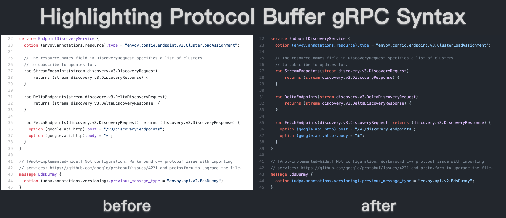

# 给GitHub做了点微小的贡献和思考



不知道你有没有注意到，现在在GitHub上查看*Protocol Buffer*源码时，含有*gRPC*的部分已经能显示高亮了。

什么，难道不应该是这样吗？或许你觉得这是理所当然的，也许你很少在GitHub上浏览`.proto`源码，这个功能确实是最近才加上的。并且，刚好，这个特性是我加上去的。

## 缘由
最近的工作内容有很大一部分是将一些组件云原生化，涉及到不少开源的东西，比如Helm，Grafana，Envoy等，大体上是将他们先用Helm打包，然后通过定义CRD集成到Operator中，再写一些运维相关的逻辑。

由于不少东西也不熟悉，所以这个过程中，需要经常查阅他们的文档，甚至是代码，时而会发现一些拼写错误，或者不合理可以改进的地方，以及少数体验上的问题。于是顺手就在GitHub上提issue或者pr。这篇讨论的就是其中感受最深的一个。

gRPC是目前在云原生领域使用比较广泛的技术了，很多项目通过proto来定义服务的接口，然后通过网关接收外部的RESTful-JSON的请求调用。所以想要调用某个服务的API，查看他proto的gRPC就比较直接。

某天在GitHub查看Envoy的xDS接口的`.proto`文件时，突然发现那块代码居然没有高亮，全是一团黑漆漆的，对比编辑器里有语法高亮的看起来太难受了，都2021年，怎么就没人注意到呢？于是就在GitHub官方的[linguist](https://github.com/github/linguist)仓库上提了一个feature request的[issue](https://github.com/github/linguist/issues/5334)。

没过多久，GitHub的人就给了回复。比较详细的解释了原因，由于GitHub上有众多的语言需要高亮，他们都是利用社区已有的语法高亮代码来做，也就是说每个语言都有一个对应开源的语法高亮的仓库，而GitHub做的就是一个支持各种语言的框架和syntax repo list维护的工作，定期更新。而proto的语法高亮仓库，已经很久没有更新，不活跃了。并且建议我去拿[vscode的语法高亮](https://github.com/zxh0/vscode-proto3)更新下，做做贡献。

给这位大佬点赞，反馈快，信息量很足，给明了指引。看了下文档，写得很清晰，虽然我不懂*ruby*，但是跟着文档，不需费多大劲也能完成，于是当天晚上就加了加班，把[pr](https://github.com/github/linguist/pull/5336)发了出去。

很快，第二天大佬就[`lgtm`](https://www.jianshu.com/p/238a1e1f4037)把pr合并了，并且告诉我刚好错过了4月的月更，需要到下个月了。

于是最近大家看到了更新后的效果。

## 一些思考
我们都说Github的体验很好，除了它几乎已经是所有开源项目托管的地方，以及网页细节做得好，还有很大一部分原因是在对待开发者这件事上。如果仅仅是作为`git push`和`git clone`的一个远程仓库，那GitHub肯定不是今天的GitHub。

GitHub在的远程托管的基础上，做了很多对开发者友好的工具，软件开发流程整个生命周期几乎都有，而且细节上体验上都很好，甚至是你还可以通过API接口来满足个性化的需求。

比如README Markdown的渲染，我一直觉得，是GitHub把Markdown这种写作方式给流行了起来，到目前为止，它所渲染的效果也是最棒的。在此基础上，推出了GitHub pages，给了项目一个介绍，文档的静态页面，当然有的人直接拿它来做个人blog，你也可以提供自己的域名解析。更有甚者利用这个特点，来分发软件源，比如helm，maven。去年GitHub还加入了README个人主页，也是一个玩出花的功能。

还有GitHub的核心功能，*issue*和*Pull Request*，也许正是这两个功能，重新定义了现代开源软件的开发方式，让更多的人参与进来。使用者可以针对bug，功能，文档等等提出issue，然后通过pull request的方式贡献代码，code review，整个社区的人都可以参与（当然有一些我们只能边缘ob学习），CI/CD，最后merge到主仓库。GitHub做了很多细节上的优化，比如code review的diff查看，与CI/CD的集成，还有很多自动化流程的机器人，有时候参与这些*现代化*的开发方式还是有趣并且能学到很多。

最后谈谈GitHub的API，projects，issues，pull requests，actions等等功能都可以通过API调用，使得用户可以根据项目自身需要定制化集成。以前可能觉得好厉害，放到如今也算是一个产品的标配了。虽然现在很多平台都提供了API接口，但是体验怎么样，真的好用吗，符合标准习惯吗，使用心智负担高吗，文档靠谱吗，兼容性考虑了吗，真的替开发者考虑了吗？**又不是不能用**，懂的都懂。

想了想，作为一个为开发者服务的平台，除了稳定地提供平台应有的功能，不断地提升用户体验，还应该有一个更**善良**的出发点，引导用户成长，与用户共同进步。这也是腾讯的价值观，**用户为本，科技向善**的一种体现。作为平台方，在提供技术产品的同时，有责任输出一些好的标准的技术，最佳实践甚至一些工程师文化，能够让用户学到些东西；反过来，用户也能在使用过程中，提出一些改进的意见甚至贡献，这样就更好了。

GitHub API就是这样一个非常好的例子：

> GitHub announced a public API one month after the site launched. We’ve evolved this platform through three versions, adhering to RFC standards and embracing new design patterns to provide a clear and consistent interface. We’ve often heard that our REST API was an inspiration for other companies; countless tutorials refer to our endpoints.

上面这段话摘录在其官方博客[The GitHub GraphQL API](https://github.blog/2016-09-14-the-github-graphql-api/)。Github在迭代API的时候始终遵守标准和新的设计模式去提供清晰一致的接口，这启发了很多公司的API设计，很多教程都参考了他们的API。

确实如此，每次使用他们的API都有一种*愉悦*的体验，授之以鱼（解决问题），又授之以渔（提供启发）。一些命名风格，HTTP协议的细节，还有一些设计上的考量。以至于当你在设计API时，有时候也会突然想去那取经。

其实第一节的叙述，也从另一方面佐证了GitHub的成功，与开源社区（主要用户）互相成就。GitHub上绝大多数都是开源项目，然后GitHub本身也是建立在众多开源项目上的（实际上今天所有的项目都受益于开源）。就拿代码语法高亮来说，用户提出了一个合理的功能需求，它反馈很**及时**和**友好**，提供了足够有用的信息和解决方案，不是排期让内部员工去实现，而是鼓励用户（开发者）去做贡献，用户本身也是一群创作者。用户也乐于去做这件事（这里面会有成就感以及学到东西），细节体验更好了，更多用户受益了，平台自然也就越来越好了。

得开发者得天下，这就是它成功的原因吧。Linux如此，Android/iOS如此，GitHub也一样。

## EOF

```yaml
summary: 作为一个为开发者服务的平台，除了稳定地提供平台应有的功能，不断地提升用户体验，还应该有一个更**善良**的出发点，引导用户成长，与用户共同进步。
weather: fine
license: cc-40-by
location: Tencent Building
background: result.png
tags: [Open Source, Github, Thoughts]
date: 2021-06-06T21:22:34+08:00
```
