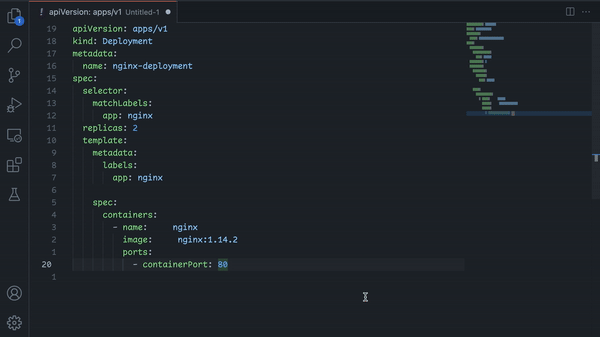

# 上架了一个 vscode 插件

插件市场的地址在[这里](https://marketplace.visualstudio.com/items?itemName=kennylong.kubernetes-yaml-formatter)，先上一下效果吧：



作为一个后端工程师，平时没少接触DevOps工具，比如 Kubernetes，Ansible Playbooks，CI/CD pipeline 等等，而这些通常使用YAML格式来作为描述语言。每天都会接触到或多或少yaml文件，不开玩笑的说，有些时候也算个YAML工程师了。

如果你也觉得是这样，那这个插件很可能对你有用。

拿k8s的YAML来举个栗子：

```yaml
apiVersion: apps/v1
kind: Deployment
metadata:
  name: nginx-deployment
spec:
  selector:
    matchLabels:
      app: nginx
  replicas: 2
  template:
    metadata:
      labels:
        app: nginx
    spec:
      containers:
      - name: nginx
        image: nginx:1.14.2
        ports:
        - containerPort: 80
```

不知道你注意到没有，对于序列（sequence）类型（`containers`和`ports`），k8s采用的是**无缩进**的风格。每当使用[kubectl](https://kubernetes.io/docs/reference/kubectl/)命令去操作（get/edit等等）资源时，都是不带缩进的。更不用说像[kustomize](https://github.com/kubernetes-sigs/kustomize)这样的工具还会[强制](https://github.com/kubernetes-sigs/kustomize/issues/3946)你这么做。

不幸的是，vscode内置的YAML格式化插件有着它自己的[哲学](https://prettier.io/docs/en/option-philosophy.html)。它**始终会缩进**并且[拒绝提供一个选项](https://github.com/prettier/prettier/issues/12385)来满足上述场景。

所以默认插件就没啥用了。我不得不自己去手动处理缩进，否则会两边风格不统一，看起来怪怪的很不舒服。

重复这过程很乏味，尝试了其他插件也无果，所以我写了这么个插件来让世界变得更美好一点点。现在你可以自由地控制想要什么样的风格。

过程中感谢好朋友[陆鹏鹏](https://github.com/iamlupeng1991)帮忙设计了icon。

当然必须还有开源社区，本质上这插件是[google/yamlfmt](https://github.com/google/yamlfmt)的一个封装，在使用的过程中发现一些问题，然后提了PR，review合并到上游，最后用Github Actions自动发布，这其中的学习和实践体验很棒。

也欢迎同学们的贡献或者建议，希望它能够帮助到你：）

## EOF

```yaml
summary: 写了个vscode插件，如果同学们平常接触k8s这类的DevOps工具比较多，应该会有帮助。 
weather: hot
license: cc-40-by
location: Guilin
background: ./cover.jpeg
tags: [k8s, vscode, DevOps]
date: 2022-09-30T19:30:00+08:00
```