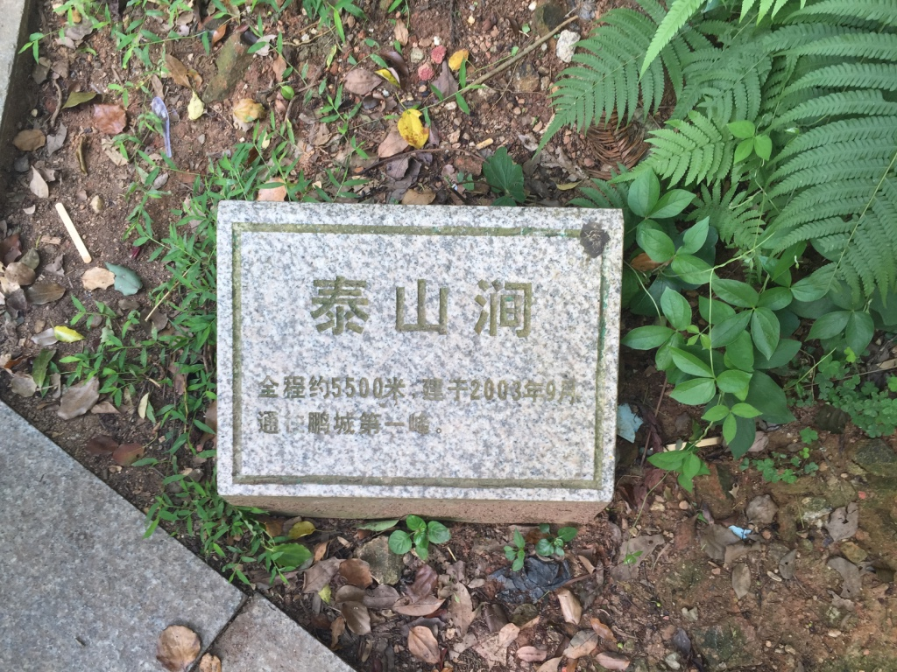
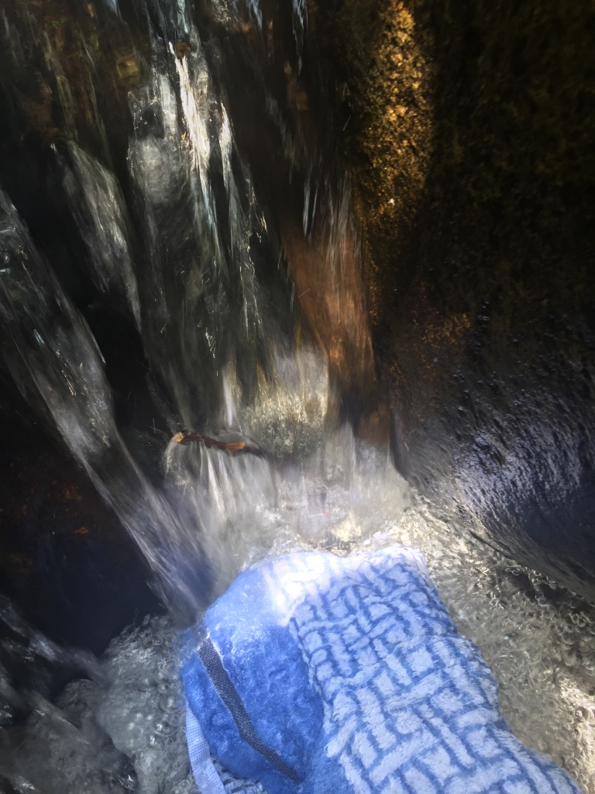
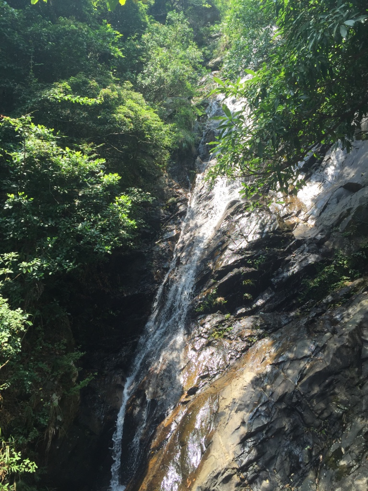
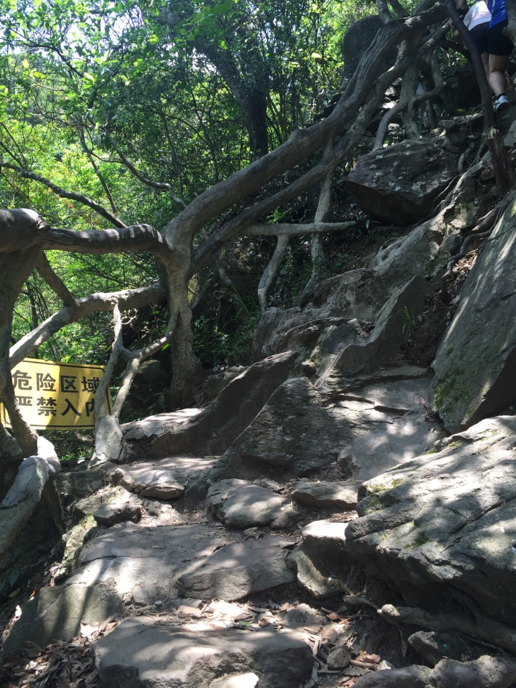
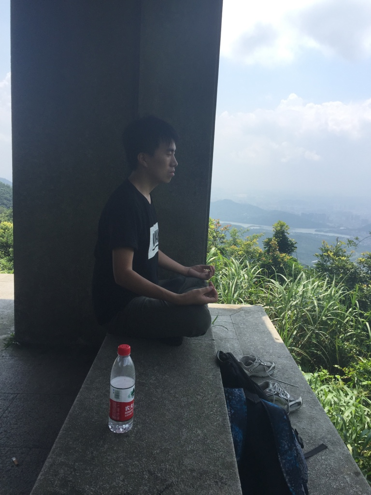
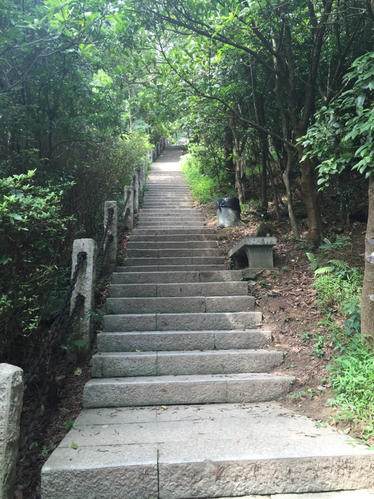
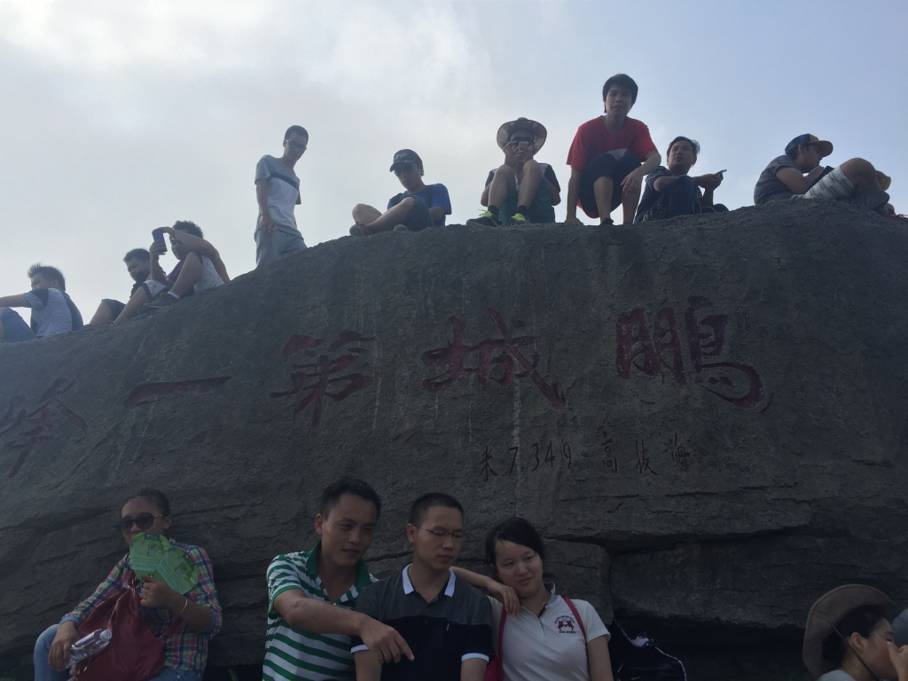
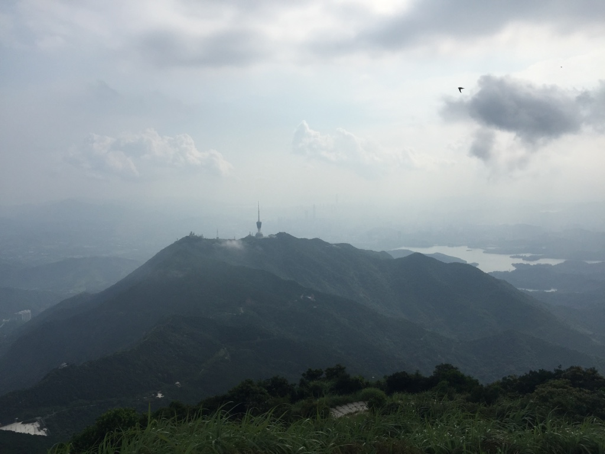
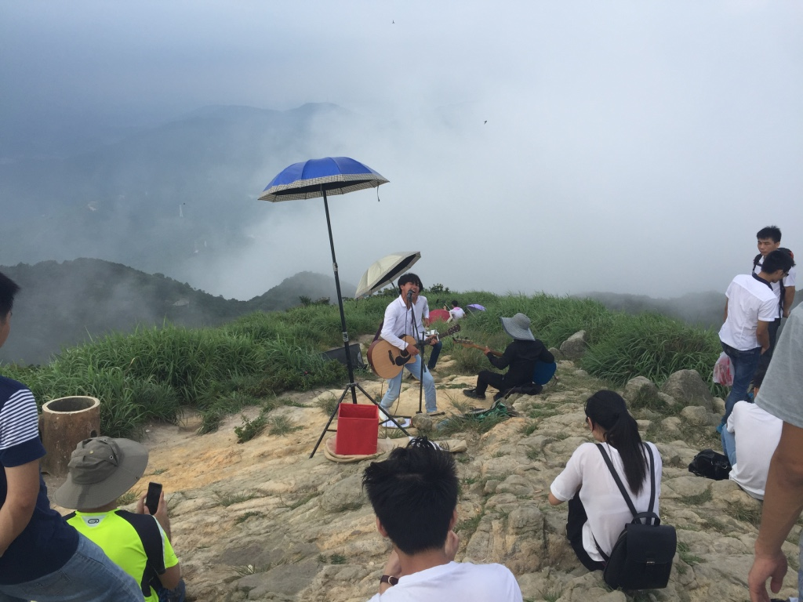
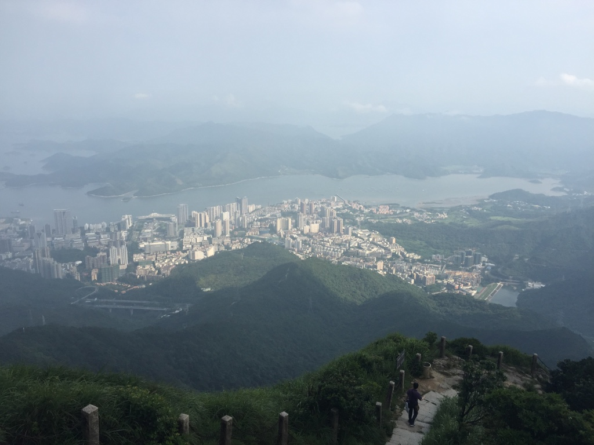

翻越大梧桐
===
上周日，天气一如既往的炎热。来深圳整整一年了，我和朋友们终于踏上了去往梧桐山的路上。

不打算写什么游记啥的，post几张图和大伙分享吧！

> 梧桐山的大门（好像是北门吧），我们是坐211公交去的，有点偏

> 泰山涧，我们就是沿着这个开始走（灰常长，但是没有难度），-> 葫芦径 -> 好汉坡 -> 大梧桐

> 炎炎夏日，出来山里玩玩水真清凉！！！

> 走累了，借着溪水洗把脸，吃个果子，真舒服啊！！！

> 一路听着水流声，很亲近

> 最难走的路是这样的。。

> 在这个亭子上，吹着风，睡了一个小时- -

> 开始爬好汉坡，大概三百米的海拔，全程几乎都是上行，没有什么平缓的道路

> get there, finally!

> 对面的小梧桐

> 山顶的摇滚，帅！

> 谁能告诉我，那时哪儿？

**世界那么大，我想每周都出去玩，if I could I would**

--
2015-07-05

