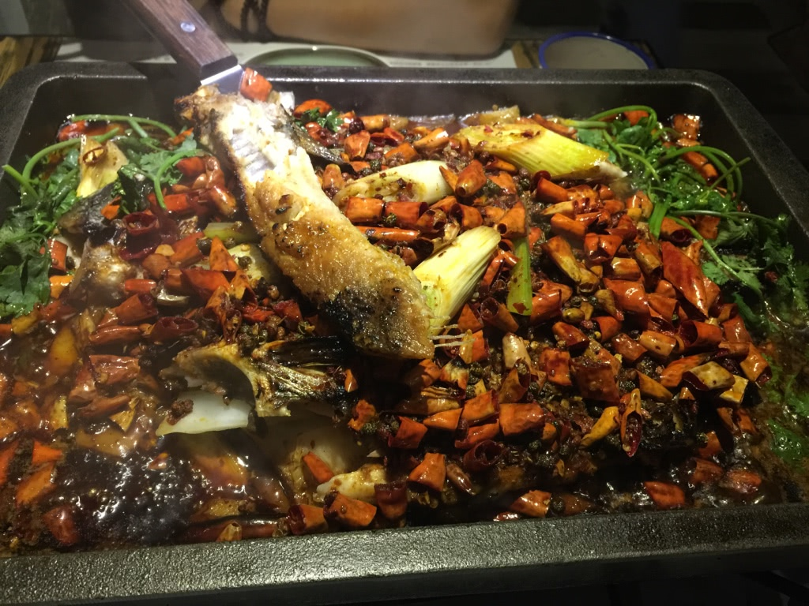

越过山丘
===
Hi，上个周末很开心。小龙萌生了一个 wild thoughts，好像姗姗来迟，又从未走远，悄悄生根萌芽。至于是什么，咳咳，这是国家机密，到时候大伙就知道了，可能很快，也可能会晚一会，但不会太久。有些事现在不做，也许一辈子都不会做了！

这一切，都要感谢我几个好朋友，小遥同学，章鱼哥哥，江苏同学。对，还有 king 同学，上周末，和 king 玩得很开心，随手记个流水账吧- -

--

> 好棒的烤鱼~感谢 king 等我那么久~这家店挺文艺的。地址在西丽，叫「烤鱼小镇」，可能要找一会儿

--

> 大学毕业第一次去网吧玩- -，哈哈哈，好怀念啊。和一个中锋配合了一晚上，非常默契~另外，还有一个再拉萨火车站通宵的小前锋哥们，第二天早上6点 坐火车去湖南。最后一把，居然没钱到时间了，把队友给坑了，我的错！！！

--

> king 家的猫，死宅啊- -

--

> 慵懒的周末，约起三五好友，或者带上自己的狗去钓鱼事件非常棒的事情呢！

--

> 这是碑，你确定？

--

> 摄影技术仍需努力，之前拍的都是黑乎乎的- -

--

> 骑行，爬坡挺有挑战，风景很好，一路上很多很多骑行客！

--

> 想撸一辆车了，每个周末骑行一遭，想想好棒哎

--

> 夕阳西下，停下来也不错~

--

> 越过山丘

--

> 好棒的车，我也想要一辆

--

> 终章


**越过山丘，时不我予的哀愁**

今天无意中听到朋友提到这首这首歌，山丘，感觉挺有味道。继续，my wild thought!

### 越过山丘，词曲：李宗盛
> 想说却还没说的 还很多

> 攒着是因为想写成歌

> 让人轻轻地唱着 淡淡地记着

> 就算终于忘了 也值了

> 说不定我一生涓滴意念

> 侥幸汇成河

> 然后我俩各自一端

> 望着大河弯弯 终于敢放胆

> 嘻皮笑脸 面对 人生的难

> 也许我们从未成熟

> 还没能晓得 就快要老了

> 尽管心里活着的还是那个

> 年轻人

> 因为不安而频频回首

> 无知地索求 羞耻于求救

> 不知疲倦地翻越 每一个山丘

> 越过山丘 虽然已白了头

> 喋喋不休 时不我予的哀愁

> 还未如愿见着不朽

> 就把自己先搞丢

> 越过山丘 才发现无人等候

> 喋喋不休 再也唤不回温柔

> 为何记不得上一次是谁给的拥抱

> 在什么时候

> 我没有刻意隐藏 也无意让你感伤

> 多少次我们无醉不欢

> 咒骂人生太短 唏嘘相见恨晚

> 让女人把妆哭花了 也不管

> 遗憾我们从未成熟

> 还没能晓得 就已经老了

> 尽力却仍不明白

> 身边的年轻人

> 给自己随便找个理由

> 向情爱的挑逗 命运的左右

> 不自量力地还手 直至死方休

> 越过山丘 虽然已白了头

> 喋喋不休 时不我予的哀愁

> 还未如愿见着不朽

> 就把自己先搞丢

> 越过山丘 才发现无人等候

> 喋喋不休 再也唤不回了温柔

> 为何记不得上一次是谁给的拥抱

> 在什么时候

> 越过山丘 虽然已白了头

> 喋喋不休 时不我予的哀愁

> 还未如愿见着不朽

> 就把自己先搞丢

> 越过山丘 才发现无人等候

> 喋喋不休 再也唤不回了温柔

> 为何记不得上一次是谁给的拥抱

> 在什么时候

> 喋喋不休 时不我予的哀愁

> 向情爱的挑逗 命运的左右

> 不自量力地还手 直至死方休

> 为何记不得上一次是谁给的拥抱

> 在什么时候


### EOF
```json
{
  "tags": ["Life", "Outdoor"],
  "reserved": false,
  "date": "2015-07-13T19:38:20+08:00",
  "weather": "",
  "summary": "越过山丘，虽然已白了头；喋喋不休，时不我予的哀愁",
  "location": "Shenzhen",
  "background": "wanting.jpg"
}
```
