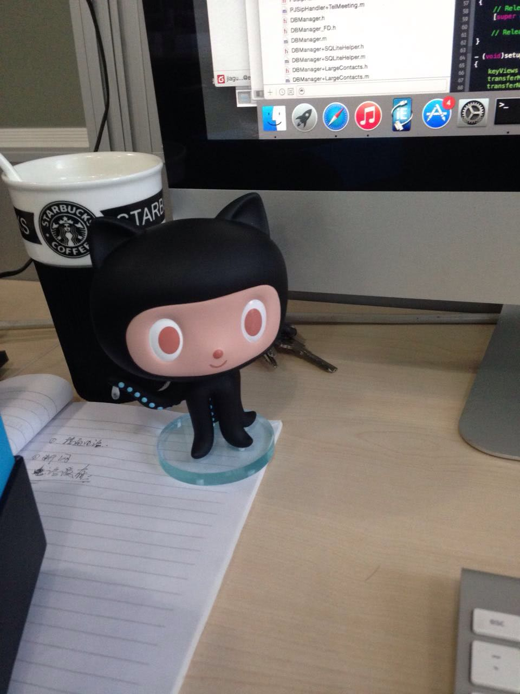

GitHub Octocat 手办团购第一轮
===


今天，抗战胜利日，组织的第二波GitHub团购下单了，借着这个机会，突然觉得，假若没有第一次团购的经历，自然也没有这一次。借着这个机会，记录一下第一次的团购那些事儿吧~

## 起源
第一次见到GitHub Octocat大概是去年刚毕业的时候，是非常Geek的一个同事在公司的微信群上发的图片和链接吧，当时他便问其他的同事，有谁感兴趣的，一起去团购一个吧？我一看到就觉得这玩意不错啊（当时还不知道手办是个啥东西...），然后就举手的，但是好像就没有人响应了，最后也就无疾而终了...

再后来，大概是今年，看到一个朋友桌子上摆放着各式各样的动漫人形玩具吧，感觉挺有意思的，整个桌子上瞬间就不单调了，而后才知道了手办这个概念。接下来，一个偶然的机会和朋友去会展中心参加了动漫展，感觉像是，又发现了一个很有意思的世界~然后，发现当时一个初音的coser挺pretty的，顿时就萌发了想要一个手办的想法。

说办就办，经过多方了解与调研，手办得是原产的才好，那里好呢，自然是岛国啦。恰好有一个同学再岛国毕业旅行吧，于是就问那个同学能否带一个回来，最后貌似是1200软妹币吧，当时我就震惊了，犹豫了一下，朋友已经飞回国了...

接下来几天连代码都写不好了，一想到代码，就想到了好像GitHub有一个类似的东西来着，于是就去官方的shop看了一下，40刀一个，并且一个国际运费都要20刀！然后随便改了改数值，发现个数越多，平均的运费就越少，于是就想到了要是有其他朋友一起购买，那不就可以省一些运费了嘛，这难道就是传说中的共享经济？

有些跑题了，总之，接下来就写了团购GitHub手办的blog，老实说，我没有想过会有几个人感兴趣甚至是参团的，甚至我觉得写出来也就是好玩儿，过几天我自个儿就去下单了。

## 助力
不出所料，在blog发出去一连几天都没有人参团，有的人不理解为啥要花钱买一个相对来说贵的东西，我也很理解他们，这其实很正常。就比如说为什么一个女生翻越艰难的山路到达山顶只是为了找到一个好的拍摄地点拍摄自己想要的照片，知道的人很理解，不知道的人其实也很好理解。

然后有一天，好朋友salt tiger微信中问我，那个团购需要需要他的帮忙在圈子里宣传一下？我说好啊，然后比较认真的态度重新修订了流程和相关的风险并且通过GitHub Pull Request的方式修改团购的那篇blog（这种协作方式真的不能再酷，甚至是有朋友后来提议直接在GitHub的issue区进行讨论并提交团购信息，WOW）并转发到了自己的网站和微博中。非常感谢！

接下来，在一周的时间内，陆陆续续不少同学表示参团。本身是没有折扣的，突然想到要不给GitHub官方发个邮件过去试试，为大伙争取一些优惠哈哈。很快，GitHub第二天就很nice的给了30%优惠的折扣码（并且，第二次也给了，LOL）。就这样，本来1000刀的，瞬间就少了300刀，那感觉还是蛮爽的。

在商量付款的时候，考虑到潜在的关税和国内邮费的问题，最后大家统一按照2^8每件的方式付款，nice。

## 到达
大概是在付款后3-4天之后GitHub开始发货，使用usps的空运过来。大概2天就到了北京，之后的时间就比较漫长了，几天都没见到物流状态的变化，大概一周后，才看到attempt delivery的状态。WOW，没有被税，好棒！淡淡的高兴之余，可是等了4，5天都没看到快递过来。后面网上查了一下，貌似usps到了国内之后，就由EMS派送了，在EMS查了一下，果然有，蛋疼的是他就是没有派送过来！

于是打了电话过去问，他们说地址上没有写联系号码就不知道怎么送，要凭本人身份证去附件的邮局自取，我也只能呵呵了。实际上后来发现，再usps的运单上，是写了我的邮件地址和手机号码的。呵呵，再一次。

总之，在七夕那天，很坑爹去邮局自提了，很大很重的一个箱子外面贴着GitHub的订单，上面明明已经写得很清楚了价格，但是还没有被税，WOW。接下来，当天晚上给团购的朋友们寄送并且多退少补余下的钱。这里不得不提顺丰，真心快！当天晚上从深圳寄出的，第二天北京的朋友就已经有收到的了。

## 尾声
收到手办后朋友们都发来晒手办的图，WOW，感觉还是蛮不错的！这里未经他们允许，擅自把图片贴在这里会不会被举报啊，嘿嘿。

由于第一次手办结束之后，陆续又有很多朋友表示继续参团，并且在第一次团购的时候有一个朋友表示少了胡须，给GitHub发邮件确认了之后他们也表示会将胡须寄出，于是也就有了今天这一次，也是第二次的团购。

谢谢大伙，谢谢在团购中给予帮助与支持的朋友们，认识你们挺好的，LOL~





### EOF
```json
{
  "tags": ["Activity"],
  "reserved": false,
  "date": "2015-09-04T01:25:24+08:00",
  "weather": "",
  "summary": "今天，抗战胜利日，组织的第二波GitHub团购下单了，借着这个机会，突然觉得，假若没有第一次团购的经历，自然也没有这一次。借着这个机会，记录一下第一次的团购那些事儿吧~",
  "location": "Shenzhen",
  "background": "octocat-6.jpg"
}
```
