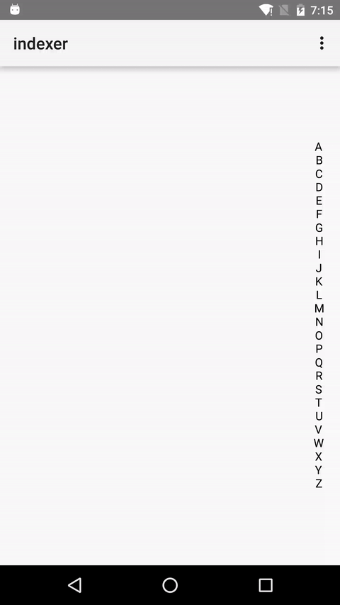

Android Indexer
===

> An indexer view like Wechat.

这是昨天在深入研究 Android 2D Text Drawing (过几天花时间写篇相关的文字) 后，一个偶然的情况下突然想写个东西实践一下吧（关于 font metrics 的），和 draw text 有关，看到微信的联系人右边的 indexer，于是也想自己去 draw 一个吧，于是就写成了一个库，还 publish 到了 jcenter 上。熟悉 Android 的朋友知道这样就可以直接通过 gradle 导入到 Android 项目里啦~

以前自己做过的项目也要求一个类似的控件，当时自己水平还不够。于是 Google 找了一个，还是比较旧的项目，自己 download 下来，copy 到自己项目里，手动组织成一个 android library 项目，非常的麻烦。

具体的实现这里就不赘述啦，可以去项目的 [Github][1] 瞅瞅源码，这个 library 只有一个类，还是比较简单是使用和扩展的，希望能帮助到有需要的同学们 :)

### Screenshot


### Usage
```groovy
// import to your build.gradle
compile 'com.xiaolongtongxue:indexer:1.1'
```

```xml
<!-- Recommand adding bits of padding since the text width may too small making touch hard -->
<com.xiaolongtongxue.indexer.IndexerView
      android:id="@+id/indexer"
      android:layout_alignParentRight="true"
      android:layout_centerInParent="true"
      android:paddingLeft="4dp"
      android:paddingRight="4dp"
      android:layout_width="wrap_content"
      android:layout_height="wrap_content" />
```

```java
// ...
IndexerView indexerView = (IndexerView) findViewById(R.id.indexer);
// put list or String[]
List<String> list = new ArrayList<>();
  for (char i = 'A'; i <= 'Z'; i++) {
  list.add(Character.toString(i));
}
indexerView.setAlphabets(list);
// or just String
indexerView.setAlphabets("ABCDEFG");

// call the listener
indexerView.setOnIndexChangeListener(new IndexerView.OnIndexerChangeListener() {
  @Override public void onIndexChange(int index, String key) {
    // do sth with index or key
  }
});

// you can also change the text size and color
indexerView.setTextColor(Color.BLACK);
indexerView.setTextSize(TypedValue.applyDimension(TypedValue.COMPLEX_UNIT_SP, 14, getResources().getDisplayMetrics()));
// ...
```

### One More Thing
其实昨天还写了一个叫做[gfdl][2]小程序，用来自动下载 Google Fonts，由于众所周知的原因，国内的网络大多数情况下无法访问 Google Fonts，而我的网站使用了几个非常漂亮的字体 =_=

感兴趣的朋友去 Github 上看看或者拿来用用，用 go 写的。

### EOF
\# Tech 
2016-03-10, Shenzhen, sudden cold

[1]: https://github.com/longkai/indexer
[2]: https://github.com/longkai/gfdl


