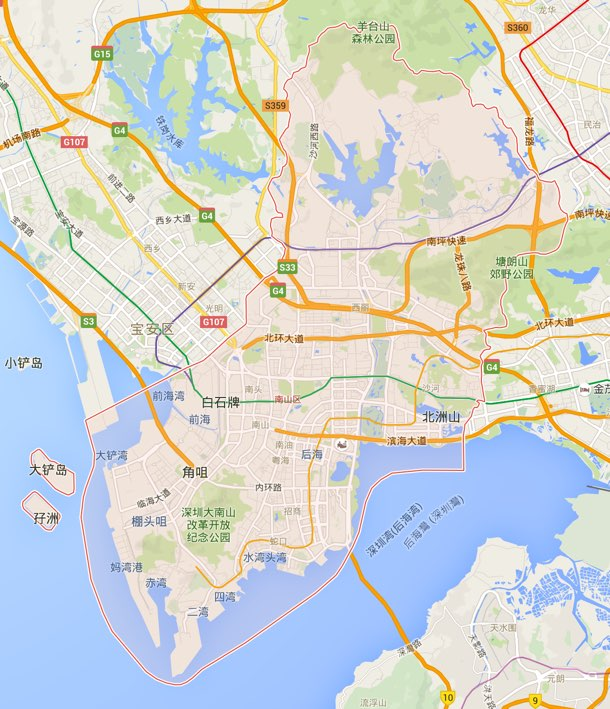
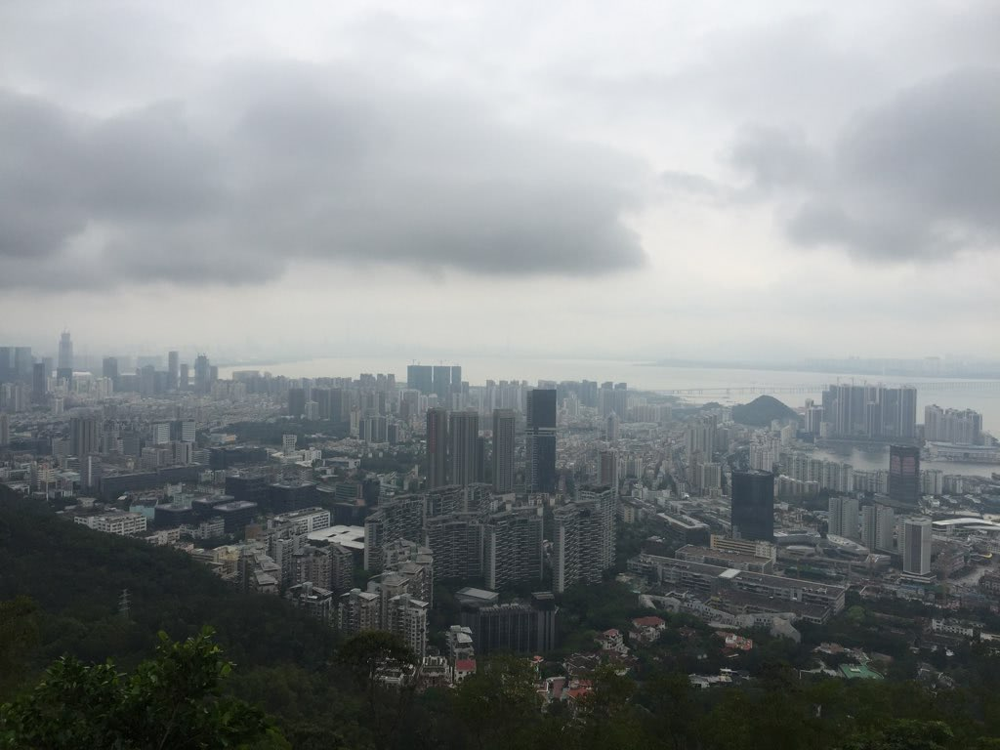

翻越南山
===

上周末和朋友约好去爬南山，已经走到了山脚下，无奈天公不作美；于是本周六再上南山。

南山区之所以为南山区，原因多半是区内有大小两座南山吧，根据[维基百科][1]的说法:

> 因辖区内拥有风光秀丽的大南山、小南山和建村历史700多年的南山村，故命名为南山区。



大南山位于南山半岛上，海拔大概有**336**米，整体有点像是个上边较长的梯形；共有3个登山口，分别是别墅登山口，海关登山口和北登山口；然而我每次上山都是从海上世界的别墅登山口上山，可能是那交通较为方便吧......

从别墅登山口的沿山路上山非常容易，台阶相对海关登山口平稳多了，而且一路上凉风习习，不间断的树荫。随着高度的爬升，渐渐就可以俯瞰到山脚下的蛇口，深圳湾以及深圳湾大桥连接的香港了。



天气依旧坑爹，2，3点暗得像是6，7点的样子，而且大雾严重影响了可见性。

在山顶待了一会，看起来就要下雨了，我们没带伞于是就沿着盘山公路朝着北登山口的盘山公路下山了。顺便说一句，这条路下行坡度较陡，走着走着真刹不住车......

下周见。

## EOF
```yaml
background: view.jpg
hide: false
license: cc-40-by
location: Shenzhen
summary: 翻越大南山
tags:
- Outdoor
weather: rainy & foggy
date: 2016-04-09T20:12:17+08:00
```

[1]: https://zh.wikipedia.org/wiki/%E5%8D%97%E5%B1%B1%E5%8C%BA_(%E6%B7%B1%E5%9C%B3%E5%B8%82)
