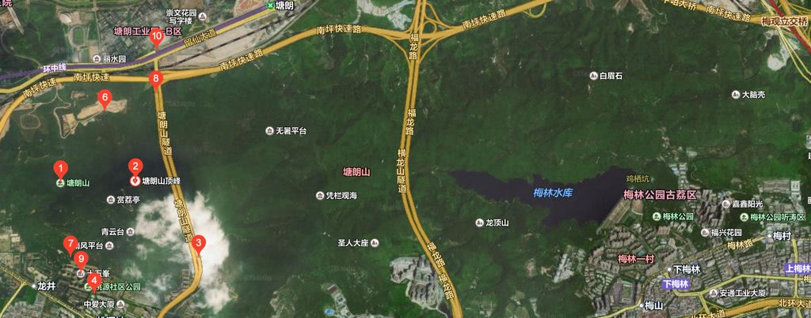
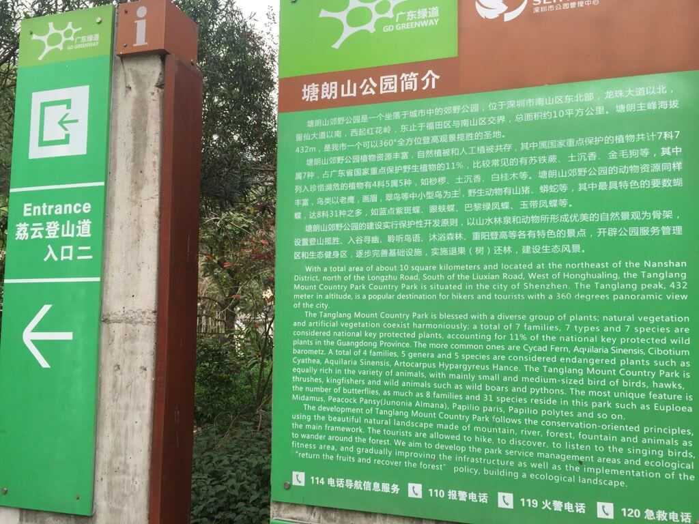
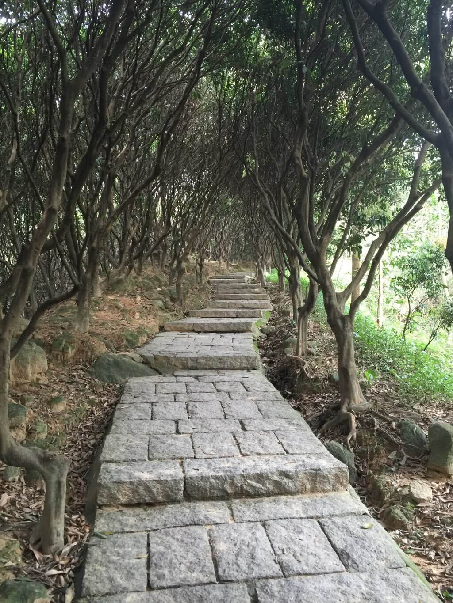
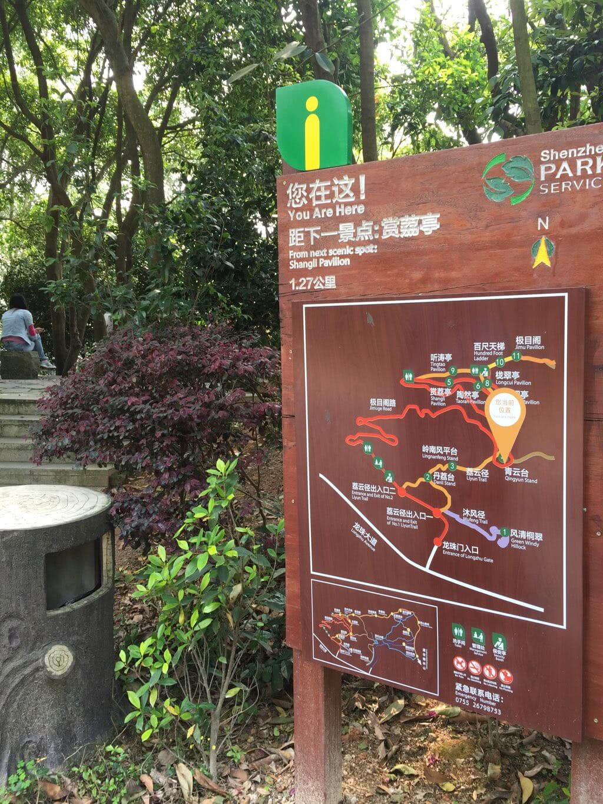
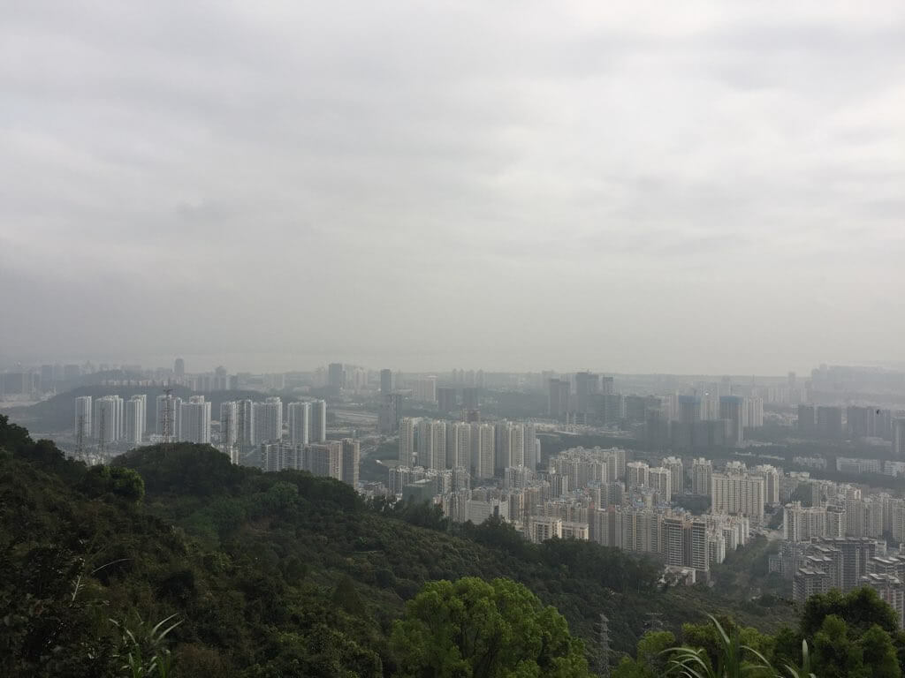

翻越塘朗山
===

> 小隐于野大隐于市 -- 东方朔

四月初的天气不错，于是找了个周六和朋友踏上了久违的户外。

大多数人看到的深圳可能是一座新兴的现代化城市，遍地而起的高楼大厦；然而，忽略了她的山青水秀，就像[引言][1]，

> 闲逸潇洒的生活不一定要到林泉野径去才能体会得到，更高层次隐逸生活是在都市繁华之中，在心灵净土独善其身，找到一份宁静。

深圳便是这样一座城市：靠海多山，深圳湾，红树林，南澳东西冲，杨梅坑，大小南山，梧桐山，...，能想到的太多了。

放下周一至周五繁忙的工作，周末找个时间，约上三五好友，踏上户外的路上，其实也挺不错的呢。

从去年下半年开始，自己和朋友陆陆续续翻越、穿越了十几个地方，今年的计划之一是把深圳大大小小十八座山都给翻越一遍。

春天到了，该出去走走了，这一次，我们去的是塘朗山。

## 塘朗山
塘朗山位于深圳中部，交通方便；登山道多，可近可远，近则2小时左右便可登顶下山，远则可以登顶后继续穿越梅林后山至梅林水库甚至更远(上一次用了快6小时......)

从地形图上看到，塘朗山及其顶峰只是占左边的一小块，右边那一片一直连绵到梅林水库甚至更远的相思林公园......考虑到冬眠有一段时间了，不胜脚力，这一次还是简单地选择了从桃源村的塘朗山公园荔云登山道上到顶峰，再顺着盘山公路下山，走走停停，总共两小时不到吧。











## By The Way
不知道写啥了，不打算写成攻略，也不想成为流水记......记录一下匆匆忙忙的生活之余吧；记忆，也是这样一点一滴形成的吧？

春天到了，也该出去走走罢！

## EOF
```yaml
background: view.jpg
date: 2016-04-03T23:12:17+08:00
hide: false
location: Shenzhen
summary: 春天到了，出去走走吧
tags:
- Outdoor
weather: humid & foggy
```

[1]: http://baike.baidu.com/link?url=kPPoRrHVLRe8kn7ziY8L2m5qxzhlxAZ34eCGqZAzXtmsyw8ryTz0_XxxMXGlQjDkYuPFE6QDE2fC1SG2s0UoLa
