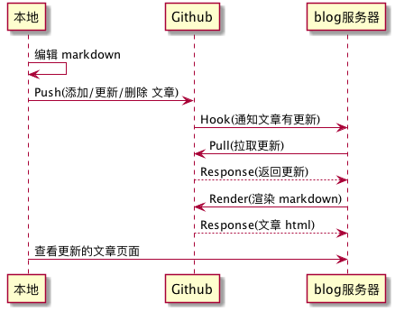

网站改版了
===

> 是先有鸡还是先有蛋呢？

高中时同桌回答说，「肯定是先有鸡后有蛋啊，不然为啥不叫蛋鸡」，蛤蛤，这是个很无聊问题，不去理会他。

我猜，大部分技术圈子的朋友可能是先知道 [Github][1] 然后才开始使用 [Git][2]；同理，也可能是从 Github 那了解到了 [markdown][3] 这种格式文本。事实大家都清楚了， Github 是建立在 Git 之上的；markdown 这种文本格式早在04年就已经出现了。

自己便是上述后知后觉的人。

## Git/Github
在大二开始学习 Java Web 开发时，尤其是看 [Spring framework][4] 的文档和下载示例时经常出现 Github 这个词。当时还不知道版本控制这个概念，看介绍好像挺厉害的样子，好多源码都可以在这个网站找到；而且一个项目的整个演化历史都可以给你记录下来，回溯学习，简直是入了宝山于是赶紧在开学第一天注册了帐号。

注册那天是12年2月13号，第一次提交代码是7月29号。时隔半年，也不记得发生了什么，可能是不知道提交啥，同时也是对 git 的不熟悉。后来去图书馆借了一本很厚的国人写的书学了下，感觉可以去练练手了。于是就去创建了一个项目，然而，没想到第一次提交是 Github 替你提交的！

```
commit 71b707ddadbbd4cd7babb6685b07559bace1b0df
Author: 龙凯 <im.longkai@gmail.com>
Date:   Sun Jul 29 02:02:37 2012 -0700

    Initial commit

diff --git a/README.md b/README.md
new file mode 100644
index 0000000..6443043
--- /dev/null
+++ b/README.md
@@ -0,0 +1,4 @@
+s2sh
+====
+
+strut2，hibernate4，jpa2，spring3的一个基本架构
\ No newline at end of file
```

现在还是这样，创建项目的时候填好项目描述并且勾选**Initialize this repository with a README**就默认在项目根目录生成一个``README.md``文件了。

当时挺好奇的，这个 README.md 文件是个什么鬼？而且神奇的是这文件自动显示在了项目主页，关键是还有样式。后来我知道了，这种文本格式叫 markdown，点开任意目录后如果该目录下存在 README.md (或者类似文件名）都会自动显示出来。

## Github/Markdown
还是因为 Spring，不得不说 Spring 真的是 Java 世界里的一股清泉。什么依赖注入，控制反转，模块化，SpringMVC 等等都比同类的框架好太多。经常看到没有 structs 的项目，没有 hibernate 的项目，但是极少看到没有 Spring 的项目，毕竟 Spring 可是形成了一个生态，可以很容易地和其他流行框架集成。大学里写的 Java Web 项目几乎没有落下过 Spring。

Spring 的文档写的特别好，当时是直接看着 Spring 的文档和 demo 学习的（毕业后就再也没有写了，现在忘得干干净净）。在这个过程中经常会和 Github 打交道，很多项目，很多文档，久而久之对文档产生了好奇。查了查 Github 官方也有[介绍][5], 发现挺好使的，于是再对照 Spring 项目的 [README][5]，认真的看了一下他是怎么写的，于是之后就在[自己项目][7]的 README 上依样画瓢。

后来发现这种格式实在是太棒了，基本上是纯文本，还可以渲染成漂亮的 html 样式，比起 word 甚至 html（所见即所得编辑器输出）好太多了，因为这些文档的源文件人类不可读并且还有兼容性问题。当时的想法，纯文本写的是**纯粹的文字**，你只需要关注文字，而不是把注意力转移到其他的地方（比如调整样式等）。

于是基本上有写字的需求，比如论文，邮件，文档等，都是先写好 markdown，理顺了之后在输出到其他的格式去（没办法，老师只要 word），这个过程还是节省了不少时间的。

大三的时候写过一个[校园信息平台][8]的项目，当时也是强行上了 markdown 编辑器，还给老师和同学们添加了一个使用帮助，然而最后还是被砍了，换了 js 的所见即所得编辑器。吐槽一下，渲染的效果并不比 markdown 好多少，还带来了很多的存储空间的浪费。

大三的暑假从北京比赛回来，去了大城市，猜测应该是人生被震惊了一下，感觉需要写点什么，于是就去 Github 上创建了一个 repo 专门用 markdown 来写字，这也是后来发布在个人 blog，微信公众平台上的「源代码」:)

## Github/Hook
这个就比较技术性了，不感兴趣的朋友不妨直接跳到下一节，直接引用 Github [官方介绍][9]：

> Webhooks allow you to build or set up integrations which subscribe to certain events on GitHub.com. When one of those events is triggered, we'll send a HTTP POST payload to the webhook's configured URL. Webhooks can be used to update an external issue tracker, trigger CI builds, update a backup mirror, or even deploy to your production server. You're only limited by your imagination.

**You're only limited by your imagination**，这话说的，也是。简单的可以理解为当你 push 代码到 Github 后的一个 callback 吧。可以在这个回调里做一些事情，比如触发一个集成测试，发布版本等等，具体看你做啥吧。

大概半年前我有一个想法，本地编辑完 markdown 文档后 push 到 Github，接着 Github 把文章自动推送到我的 blog 服务器，然后就可以在浏览器上看到了，听起来好像很不错的样子。

整个过程简化如下图：



其中渲染的也是调用 [GitHub Flavored Markdown API][10]，技术性的东西这里也就不再赘述了。

## Golang
嗯，这部分也是技术，尽量简短吧。这次后端用 [golang][11] 彻底从头开始重写了（话说之前真的有后端么......）。感谢 @salttiger 的帮助，拿到了 [Brian W. Kernighan][12] 合著的 [The Go Programming Language][13] 看了快两遍，终于熟悉这语言了。

这语言真的挺简单的，就是写起来和其他的语言感觉挺不一样，比如没有泛型，没有 try-catch-finally，经常编译不过（在其他语言看来不是语法错误），这也和自己写得 golang 程序不够多有关吧。但是至少简洁那点我是挺喜欢的。

顺带说一句，golang 的并发模型和 Android UI 线程同步的 looper，messagequenu，handler 机制非常相似，理解一个非常容易掌握另一个，过几天我也打算写一篇相关的文章（希望不跳票......）。

## Material Design
大四那年的 Google IO 2014 上，Google 提出了 Material Design，乍一看和之前的 Holo 设计简直丑爆了。可谁知等到 Android 5.0 正式发布，这个 Design 还是让我惊艳了一把，色彩鲜明，动画细腻，这个在 Google 自己的 app 上体现得很明显（Gmail，Inbox，G+ 等)。和设计师讨论了之后就在项目上或多或少应用了，个人感觉效果还是挺明显的。和国内其他的 app 相比还是有很大的不同，简而言之就是，standout 吧，蛤蛤。

这次前端用了 Google 的 [Material Design Lite][14] 库，甚至界面也是他们提供的 template 改的，毕竟我不是搞前端的蛤蛤。在编写过程中，尤其是写 JavaScript 的时候，发现写起来异常舒服，这可能和自己写了太多的静态语言有关系吧。前端现在太多工具和库了，感慨一下。

## One More Thing
这几天花了些时间总算完成了这个项目，新网站也上线了！

写在最后，感谢社区，贡献了这么好东西，让开发者可以很快的开发出更多更好的东西，更重要的学到了很多知识；同时也感谢@Bodhi 和@lu-peng-peng 同学在 js 和 UI 上给予的 帮助。一如既往，本项目的前后端代码都可以在 [Github][15] 上找到，感兴趣的可以去看看。和以往有些不同，这次以 [issue][16] 自问自答的形式来驱动开发，感觉挺有意思的，蛤蛤。

最后，骄傲地使用 Github Hook 推送本文章 :)

## EOF
```yaml
background: /assets/images/xiamen.jpg
date: 2016-03-26T21:54:48+08:00
hide: false
location: Shenzhen
summary: Golang + Github + Markdown + Hook + MaterialDesign = xiaolongtongxue.com
tags:
- Web
- Thoughts
weather: a nice day:)
```

[1]: https://github.com/
[2]: http://www.git-scm.com/
[3]: http://daringfireball.net/projects/markdown/
[4]: http://spring.io/
[5]: https://guides.github.com/features/mastering-markdown/
[6]: https://github.com/spring-projects/spring-framework/blob/master/README.md
[7]: https://raw.githubusercontent.com/longkai/springmvc-jpa-quickstart-archtype/master/README.md
[8]: http://lab.newgxu.cn/notice
[9]: https://developer.github.com/webhooks/
[10]: https://developer.github.com/v3/markdown/
[11]: https://golang.org/
[12]: https://en.wikipedia.org/wiki/Brian_Kernighan
[13]: http://www.gopl.io/
[14]: http://www.getmdl.io/
[15]: https://github.com/longkai/xiaolongtongxue.com
[16]: https://github.com/longkai/xiaolongtongxue.com/issues
