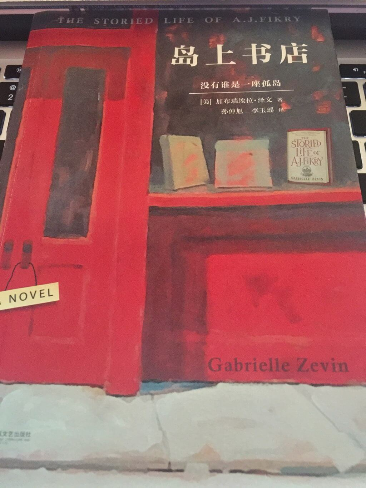

岛上书店
===

> 没有谁是一座孤岛，每本书都是一个世界



- 作者：[美] 加布瑞̇̇埃拉・泽文 (Gabrielle Zevin)
- 译者：孙仲旭，李玉瑶
- 原名：The storied life of A.J.Fikry
- ISBN：978-7-5399-7181-0
- 出版：江苏凤凰文艺出版社
- 版次：2015年5月第1版 2015年8月第3次印刷
- 字数：167k
- 阅读：2016-4-3

## 故事
> 没有书店的小镇算不上一个小镇。

大学毕业后，A.J.费里克和他美丽的妻子妮可在一座与世隔绝的小岛上开了一家书店。妮可是岛上的本地人，而 A.J. 一直和岛上的人格格不入。妮可死于一次不幸的车祸之后 A.J 一直抑郁不振，加上他独特的选书品位以及对顾客的糟糕态度，生意惨淡。

一天，出版社的新女业务员阿米莉娅上门来到岛上书店推荐当季的图书，然而 A.J. 傲慢无理的态度把阿米莉娅给气走了。晚上，A.J. 又想起了自己的妻子，在烂醉中入眠。然而早上起来的时候，他唯一的值钱的珍藏版图书不见了......生活就像孤岛一样，感觉就快要把自己喝死了。

一天晚上，他回到家里，发现一个神秘的包裹出现在书店，包裹里的是一个2岁大的女孩，遗书上写着希望女孩能在一个有书本围绕着的环境下长大。A.J. 出于对小女孩的喜爱克服困难收养了这个叫玛雅的女孩。他照顾她，也挽救了在孤岛中的自己，同时也将他自己和岛上的人连接起来。他开始认真生活，发现自己逐渐对阿米莉娅产生了好感，阅读把他们连接了起来，通过分享读书，了解阿米莉娅的喜好，心意相通，最终打动了她，她俩克服路途的阻隔以及家庭的压力终成眷属。书店业务重回正规，一个完美的妻子，聪明伶俐的女儿。与此同时，与之连接起来的一切都是非常的平淡而美好。

故事到这里只进行了一半，丢失的书哪去了？小女孩到底是谁？以及，书店最后怎么样了？

## 书评
> 是爱把一切连接起来。

不知道你曾经有过这样的感觉，当喜欢上一个东西，一个人的时候，你很可能会喜欢上与之相连接的人事物。

小的时候喜欢收集小浣熊水浒传卡片，于是对水浒传电视剧，书感兴趣，于是对四大名著感兴趣，于是对阅读感兴趣......

06世界杯，捷克 vs 美国，[罗西基][1]打入了两个精彩的世界波，开始对足球感兴趣；之后罗西基转会阿森纳，开始喜欢亨利，博格坎普；你开始熬夜看球，英超，欧冠......我相信，很多人也是知道姚明（或者乔丹）才开始喜欢 NBA，麦蒂，科比，火箭，等等等等......

上高中的时候对一个女生很有好感，当你打听到她的英语很好，于是你也努力地学英语，练习 VOA 的美语，听欧美的音乐，电影，访问 Twitter，Facebook 这些流行的网站（那时还没有墙），然后你对 Google 感兴趣，喜欢体验他们的各种产品，Gmail，Chrome, Google Calendar 不一而足到后来的 Android（这是后话了），于是你填了计算机专业的志愿......

她是 Hebe 的粉丝，于是你也开始喜欢 Hebe（后来是真的喜欢）......

大学的时候，因为阅读英语文献没有压力，学习的时候经常都是直接看外文原版，某种程度上又提升了专业能力，开始喜欢捣鼓一些有趣好玩的东西......

......

这一切，都是源于对生活的热爱（直观地说，每天总有那么几件事在支撑/驱动着你），会把更多的连接在一起，让我们发现，创造更多美好的人事物。

> 因为从心底害怕自己不值得被爱，我们独来独往；然而就是因为独来独往，才让我们以为自己不值得被爱。有一天，你不知道是什么时候，你会驱车上路。有一天不知道是什么时候，你会遇到她（他）。你会被爱，因为你今生第一次真正不再孤单。你会选择不再孤单下去。

## By The Way
这感觉，看这类型的书自己就是在找虐......

## EOF
```yaml
background: cover.jpg
date: 2016-04-06T20:30:01+08:00
hide: false
location: Shenzhen
summary: 没有谁是一座孤岛，每本书都是一个世界。第一次写「书评」（也许不算是......）
tags:
- Reading
- Bookshelf
weather: terrific good
```

[1]: http://baike.baidu.com/link?url=dtb0xbnD2BZGJRPfCa0cBfD3pVh7V_xYH_9CcEcFrvU1FdGLTnJ7NwS4X53AWTBJfbcLZQ6-SFIl9CTfbF99k4-JqNYA8mowm7nmCkFwdDLiOqvKmHQJzTYxEWkAhgHjXvgoFnSB2dD0YJyBHHDK0_
