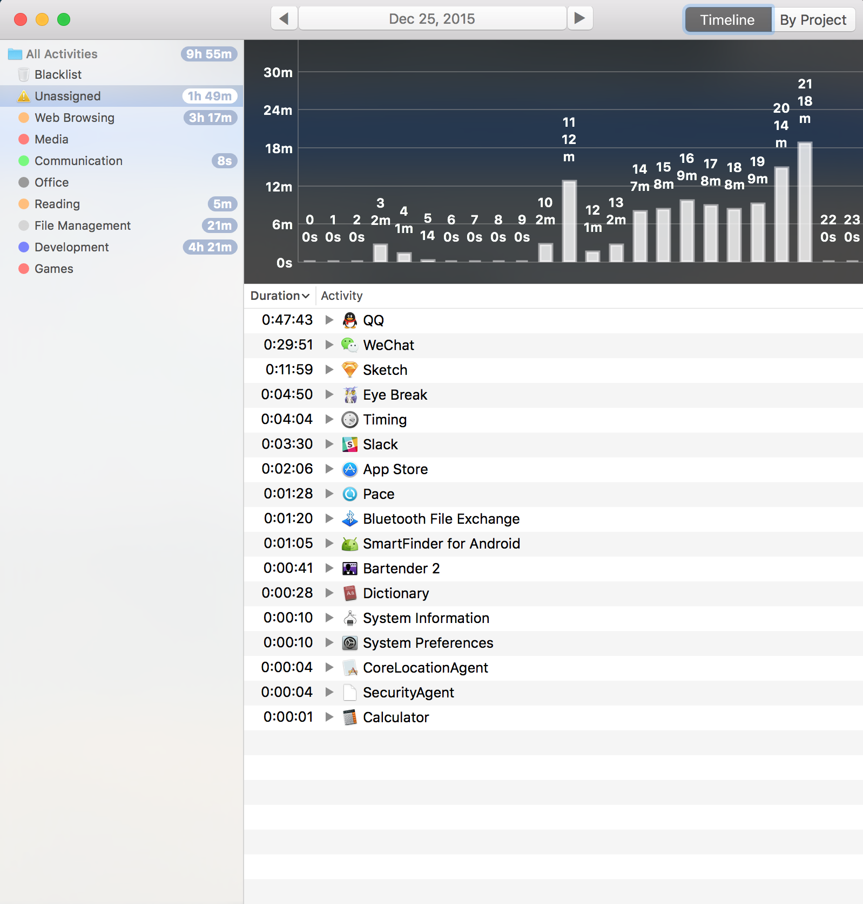

时间都去哪了？
===



#### Timing
今天，趁着西方圣诞节打折，又购买了一款Mac上的应用，叫做[Timing][1]，用来跟踪每天花在电脑上不同应用的时间。貌似每到圣诞节，老外就喜欢发版本和搞促销，猜测类似于咱们国家过年放长假了吧，赶紧完成今年的计划收拾东西准备回家陪伴家人。

关于Timing，这几天试用了一会，正是发现挺棒的才入手的。根据这几天的统计，除了花费在Developping和Reading上的时间，有相当一部分时间是用在了QQ和微信的聊天上的。然而，仔细想想这两个[IM][2]应用并没有带来多大的效率提升，大部分都是和工作和学习无关的聊天。当然，不可能也不现实一直保证百分百的工作状态，但是看到每天都把这么多时间花在这上面，还是觉得不太合理的。想到自己还有很多东西想要学，很多东西想要去做，时不我予的哀愁啊~

另一方面，在**工作和学习之中**，不可避免的要和其他人沟通，否则就闭门造车了。QQ和微信沟通的确很方便，甚至是太方便了以至于我们在不停地发送消息，这里面不可避免就产生了消息冗余，甚至聊着聊着就成了完全背离主题的闲聊了。另一方面，在消息流中，重要的消息可能就悄悄的溜走了。注意，这里的场景是在工作和学习之中。

在这种场景下，我们需要一个新的沟通协作工具。邮件是最先想到也是每天都会用到的，但是使用的过程中，感觉到太正式（这样倒可以很好的避免消息的冗余），一封邮件发送，转发，抄送，回复，来来去去，你一个我一个和盖楼一样，人一多，事情一复杂，可能真的就剪不断理还乱了。但是邮件弥补了IM软件的缺点，正式，重要的信息不会遗漏等。但是有些时候给人一种敬畏感，不能像IM那样畅快的发言，有些时候，一些想法可能就憋着了。

所以需要更好的工具，于是就想到了[Slack][3]，这个一直听闻很火但从未用过的软件，拉着两个好友一起玩了一会，UI很赞，体验很棒。事实上，以上两段感受都是在使用了Slack之后对比得出的。Slack完全也能够当成一个IM来用，但是毕竟是团队协作，拿这个来聊天着实蛋疼...发送的每条消息都可以pin住并且给予reaction，这样就能够避免了重要信息的流失。此外，还能够发附件，成员能够对其进行评论等，相对于邮件来说，不那么正式，个人感觉能更好的促成结论达成或者摩擦出更好的想法。其他的，强大简单的搜索，mention@，star，files, downloads等没有怎么玩，但是给人的感觉，就是更好的促进了沟通与协作。

以上，不知所云，简而言之，可以理解为就是用合理利用好时间，用合适的工具提高效率吧~

#### One More Thing
起初，是想写关于支持正版软件付费购买的，但是没想到一扯扯到协作沟通的软件去了，甚至是感觉倒是像给Slack做广告...诶，也许大学的时候应该修大学写作这门课的:-(

### EOF
```json
{
  "tags": ["Things"],
  "reserved": false,
  "date": "2015-12-25T21:47:57+08:00",
  "weather": "",
  "summary": "",
  "location": "Shenzhen",
  "background": "/assets/images/crossing.jpg"
}
```


[1]: https://timingapp.com "Timing - The Best Automatic Mac Time Tracking for ..."
[2]: https://en.wikipedia.org/wiki/Instant_messaging "Instant messaging"
[3]: https://slack.com/ "Slack: Be less busy"
